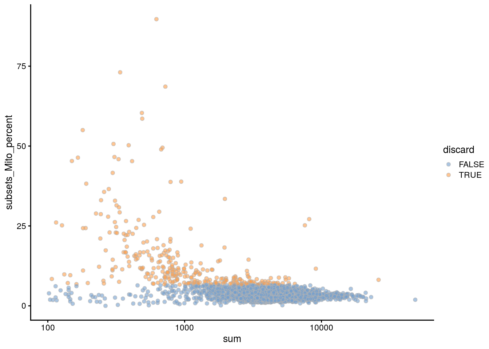
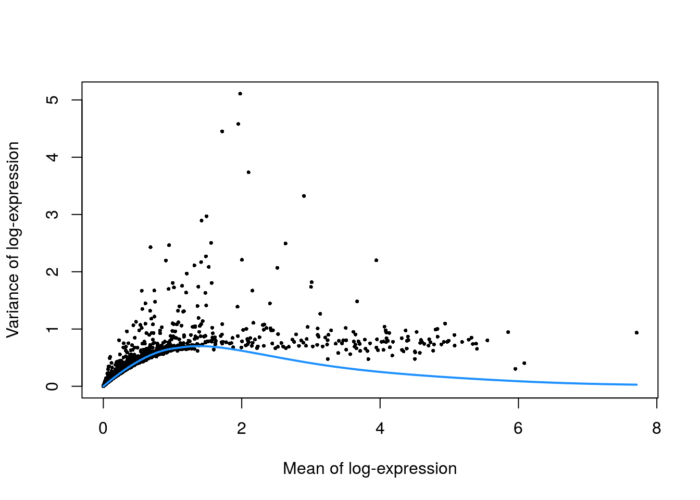
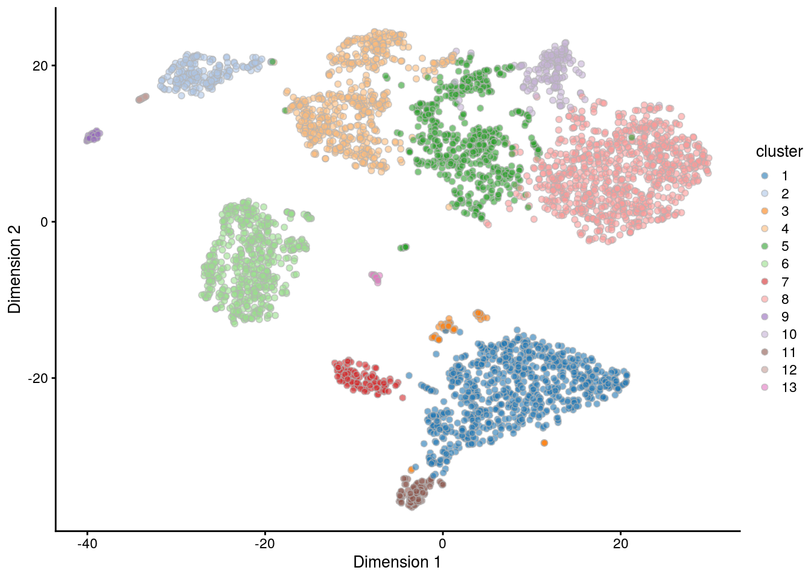
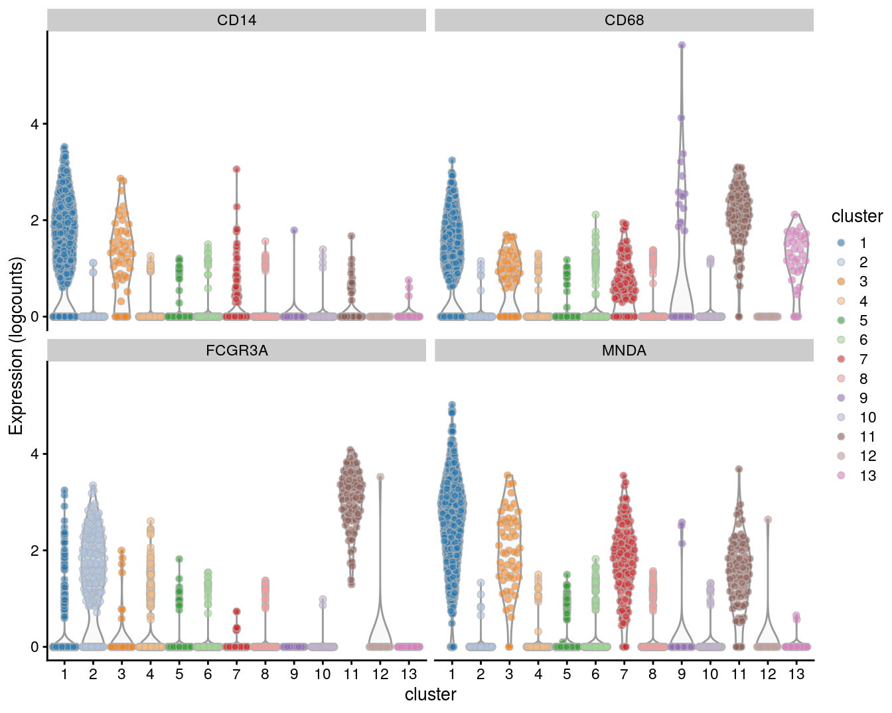

# PBMC 10X dataset (unfiltered)


## Introduction

Here, we describe a brief analysis of the peripheral blood mononuclear cell (PBMC) dataset from 10X Genomics [@zheng2017massively].
The data are publicly available from the [10X Genomics website](https://support.10xgenomics.com/single-cell-gene-expression/datasets/2.1.0/pbmc4k),
from which we download the raw gene/barcode count matrices, i.e., before cell calling from the _CellRanger_ pipeline.

## Analysis code

### Data loading


```r
library(BiocFileCache)
bfc <- BiocFileCache("raw_data", ask = FALSE)
raw.path <- bfcrpath(bfc, file.path("http://cf.10xgenomics.com/samples",
    "cell-exp/2.1.0/pbmc4k/pbmc4k_raw_gene_bc_matrices.tar.gz"))
untar(raw.path, exdir=file.path(tempdir(), "pbmc4k"))

library(DropletUtils)
fname <- file.path(tempdir(), "pbmc4k/raw_gene_bc_matrices/GRCh38")
sce.pbmc <- read10xCounts(fname, col.names=TRUE)
```

### Gene annotation


```r
library(scater)
rownames(sce.pbmc) <- uniquifyFeatureNames(
    rowData(sce.pbmc)$ID, rowData(sce.pbmc)$Symbol)

library(EnsDb.Hsapiens.v86)
location <- mapIds(EnsDb.Hsapiens.v86, keys=rowData(sce.pbmc)$ID, 
    column="SEQNAME", keytype="GENEID")
```

### Cell detection


```r
set.seed(100)
e.out <- emptyDrops(counts(sce.pbmc))
sce.pbmc <- sce.pbmc[,which(e.out$FDR <= 0.001)]
```

### Quality control


```r
unfiltered <- sce.pbmc
```

We use a relaxed QC strategy and only remove cells with large mitochondrial proportions, using it as a proxy for cell damage.
This reduces the risk of removing cell types with low RNA content, especially in a heterogeneous PBMC population with many different cell types.


```r
stats <- perCellQCMetrics(sce.pbmc, subsets=list(Mito=which(location=="MT")))
high.mito <- isOutlier(stats$subsets_Mito_percent, nmads=3, type="higher")
sce.pbmc <- sce.pbmc[,!high.mito]
```

### Normalization


```r
library(scran)
set.seed(1000)
clusters <- quickCluster(sce.pbmc)
sce.pbmc <- computeSumFactors(sce.pbmc, cluster=clusters)
sce.pbmc <- logNormCounts(sce.pbmc)
```

### Variance modelling


```r
set.seed(1001)
dec.pbmc <- modelGeneVarByPoisson(sce.pbmc)
```

### Dimensionality reduction


```r
set.seed(10000)
sce.pbmc <- denoisePCA(sce.pbmc, technical=dec.pbmc)

set.seed(100000)
sce.pbmc <- runTSNE(sce.pbmc, use_dimred="PCA")

set.seed(1000000)
sce.pbmc <- runUMAP(sce.pbmc, use_dimred="PCA")
```

### Clustering


```r
g <- buildSNNGraph(sce.pbmc, k=10, use.dimred = 'PCA')
clust <- igraph::cluster_walktrap(g)$membership
sce.pbmc$cluster <- factor(clust)
```

## Results

### Quality control statistics


```r
colData(unfiltered) <- cbind(colData(unfiltered), stats)
unfiltered$discard <- high.mito

gridExtra::grid.arrange(
    plotColData(unfiltered, y="sum", colour_by="discard") +
        scale_y_log10() + ggtitle("Total count"),
    plotColData(unfiltered, y="detected", colour_by="discard") +
        scale_y_log10() + ggtitle("Detected features"),
    plotColData(unfiltered, y="subsets_Mito_percent",
        colour_by="discard") + ggtitle("Mito percent"),
    ncol=2
)
```


```r
plotColData(unfiltered, x="sum", y="subsets_Mito_percent",
    colour_by="discard") + scale_x_log10()
```




```r
summary(high.mito)
```

```
##    Mode   FALSE    TRUE 
## logical    3922     311
```

### Normalization


```r
summary(sizeFactors(sce.pbmc))
```

```
##    Min. 1st Qu.  Median    Mean 3rd Qu.    Max. 
##    0.01    0.71    0.87    1.00    1.09   13.96
```


```r
plot(librarySizeFactors(sce.pbmc), sizeFactors(sce.pbmc), pch=16,
    xlab="Library size factors", ylab="Deconvolution factors", log="xy")
```


### Variance modelling


```r
plot(dec.pbmc$mean, dec.pbmc$total, pch=16, cex=0.5,
    xlab="Mean of log-expression", ylab="Variance of log-expression")
curfit <- metadata(dec.pbmc)
curve(curfit$trend(x), col='dodgerblue', add=TRUE, lwd=2)
```



### Dimensionality reduction


```r
ncol(reducedDim(sce.pbmc, "PCA"))
```

```
## [1] 14
```

### Clustering


```r
table(sce.pbmc$cluster)
```

```
## 
##   1   2   3   4   5   6   7   8   9  10  11  12  13 
## 785 198  56 541 529 516 128 824  45 151  92  21  36
```


```r
plotTSNE(sce.pbmc, colour_by="cluster")
```



### Interpretation


```r
markers <- findMarkers(sce.pbmc, clusters=sce.pbmc$cluster, 
    pval.type="some", direction="up")
```

We examine the markers for cluster 1 in more detail.
High expression of _CD14_, _CD68_ and _MNDA_ combined with low expression of _CD16_ suggests that this cluster contains monocytes,
compared to macrophages in cluster 11.


```r
marker.set <- markers[["1"]]
as.data.frame(marker.set[1:20,1:2])
```

```
##            p.value       FDR
## CSTA     1.14e-288 3.86e-284
## VCAN     1.34e-242 2.25e-238
## FGL2     1.57e-224 1.76e-220
## S100A12  3.72e-221 3.13e-217
## FCN1     1.86e-217 1.26e-213
## LGALS2   4.86e-210 2.73e-206
## MS4A6A   7.35e-204 3.54e-200
## CD14     1.09e-173 4.59e-170
## TYMP     6.65e-173 2.49e-169
## CLEC7A   8.62e-164 2.90e-160
## MNDA     8.15e-160 2.50e-156
## CD68     1.08e-152 3.04e-149
## CFD      1.28e-150 3.31e-147
## CFP      1.65e-141 3.96e-138
## NAMPT    2.10e-140 4.71e-137
## AIF1     1.20e-135 2.53e-132
## KLF4     3.86e-134 7.65e-131
## IFI30    4.16e-131 7.78e-128
## TNFSF13B 5.09e-130 9.02e-127
## LGALS3   6.78e-130 1.14e-126
```


```r
plotExpression(sce.pbmc, features=c("CD14", "CD68",
    "MNDA", "FCGR3A"), x="cluster", colour_by="cluster")
```


