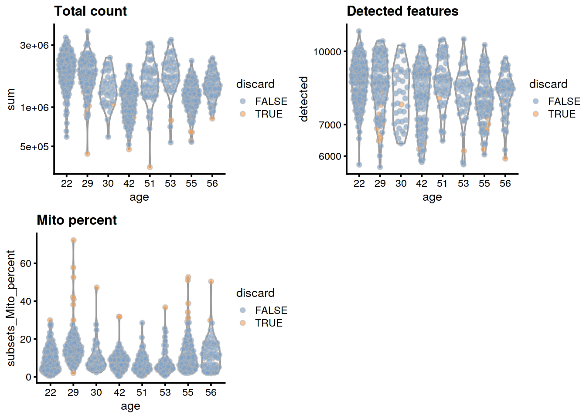
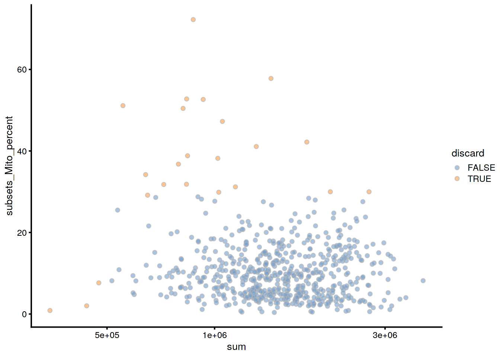
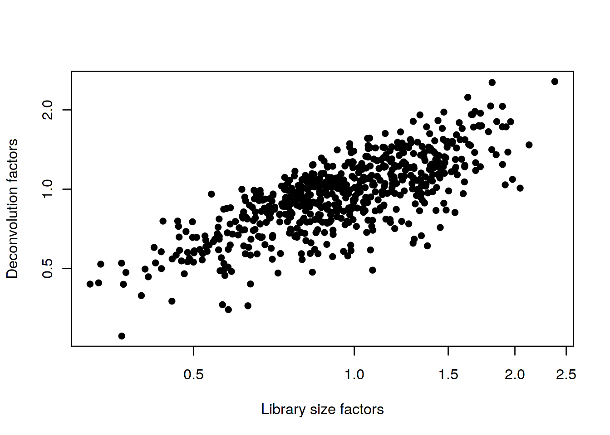
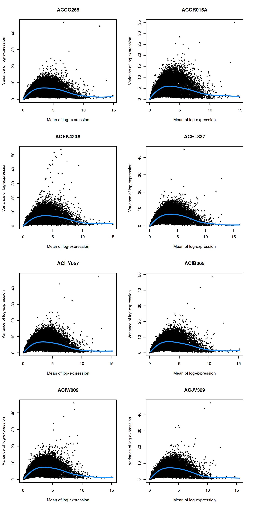
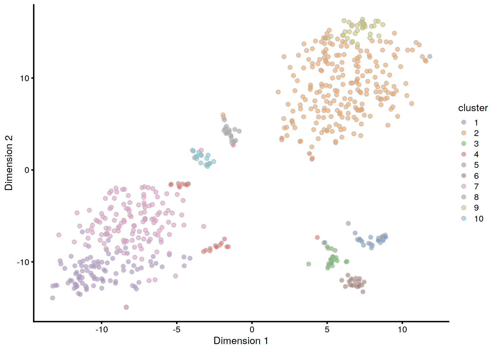
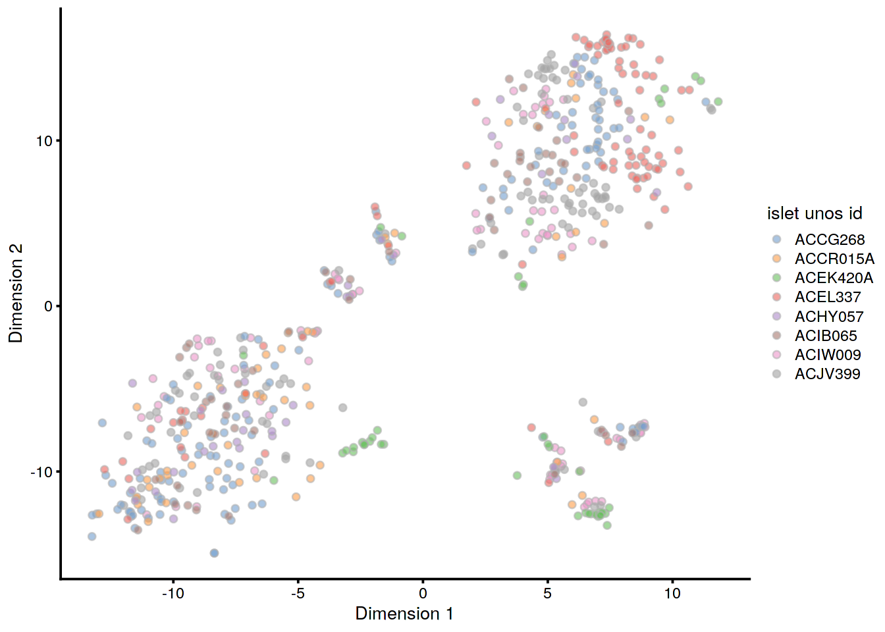

# Human pancreas dataset (Lawlor)

<script>
document.addEventListener("click", function (event) {
    if (event.target.classList.contains("aaron-collapse")) {
        event.target.classList.toggle("active");
        var content = event.target.nextElementSibling;
        if (content.style.display === "block") {
          content.style.display = "none";
        } else {
          content.style.display = "block";
        }
    }
})
</script>

<style>
.aaron-collapse {
  background-color: #eee;
  color: #444;
  cursor: pointer;
  padding: 18px;
  width: 100%;
  border: none;
  text-align: left;
  outline: none;
  font-size: 15px;
}

.aaron-content {
  padding: 0 18px;
  display: none;
  overflow: hidden;
  background-color: #f1f1f1;
}
</style>

## Introduction

This performs an analysis of the @lawlor2017singlecell dataset,
consisting of human pancreas cells from various donors.

## Analysis code

### Data loading


```r
library(scRNAseq)
sce.lawlor <- LawlorPancreasData()
```

### Gene annotation


```r
library(AnnotationHub)
edb <- AnnotationHub()[["AH73881"]]
anno <- select(edb, keys=rownames(sce.lawlor), keytype="GENEID", 
    columns=c("SYMBOL", "SEQNAME"))
rowData(sce.lawlor) <- anno[match(rownames(sce.lawlor), anno[,1]),-1]
```

### Quality control


```r
unfiltered <- sce.lawlor
```


```r
library(scater)
stats <- perCellQCMetrics(sce.lawlor, 
    subsets=list(Mito=which(rowData(sce.lawlor)$SEQNAME=="MT")))
qc <- quickPerCellQC(stats, percent_subsets="subsets_Mito_percent")
sce.lawlor <- sce.lawlor[,!qc$discard]
```

### Normalization


```r
library(scran)
set.seed(1000)
clusters <- quickCluster(sce.lawlor)
sce.lawlor <- computeSumFactors(sce.lawlor, clusters=clusters)
sce.lawlor <- logNormCounts(sce.lawlor)
```

### Variance modelling

Using age as a proxy for the donor.


```r
dec.lawlor <- modelGeneVar(sce.lawlor, block=sce.lawlor$`islet unos id`)
chosen.genes <- getTopHVGs(dec.lawlor, n=2000)
```

### Dimensionality reduction


```r
library(BiocSingular)
set.seed(101011001)
sce.lawlor <- runPCA(sce.lawlor, subset_row=chosen.genes, ncomponents=25)
sce.lawlor <- runTSNE(sce.lawlor, dimred="PCA")
```

### Clustering


```r
snn.gr <- buildSNNGraph(sce.lawlor, use.dimred="PCA")
sce.lawlor$cluster <- factor(igraph::cluster_walktrap(snn.gr)$membership)
```

## Results

### Quality control statistics


```r
colData(unfiltered) <- cbind(colData(unfiltered), stats)
unfiltered$discard <- qc$discard

gridExtra::grid.arrange(
    plotColData(unfiltered, x="age", y="sum", colour_by="discard") +
        scale_y_log10() + ggtitle("Total count"),
    plotColData(unfiltered, x="age", y="detected", colour_by="discard") +
        scale_y_log10() + ggtitle("Detected features"),
    plotColData(unfiltered, x="age", y="subsets_Mito_percent",
        colour_by="discard") + ggtitle("Mito percent"),
    ncol=2
)
```




```r
plotColData(unfiltered, x="sum", y="subsets_Mito_percent",
    colour_by="discard") + scale_x_log10()
```




```r
colSums(as.matrix(qc))
```

```
##              low_lib_size            low_n_features high_subsets_Mito_percent 
##                         3                         0                        20 
##                   discard 
##                        23
```

### Normalization


```r
summary(sizeFactors(sce.lawlor))
```

```
##    Min. 1st Qu.  Median    Mean 3rd Qu.    Max. 
##   0.277   0.767   0.964   1.000   1.189   2.561
```


```r
plot(librarySizeFactors(sce.lawlor), sizeFactors(sce.lawlor), pch=16,
    xlab="Library size factors", ylab="Deconvolution factors", log="xy")
```



### Variance modelling


```r
par(mfrow=c(4,2))
blocked.stats <- dec.lawlor$per.block
for (i in colnames(blocked.stats)) {
    current <- blocked.stats[[i]]
    plot(current$mean, current$total, main=i, pch=16, cex=0.5,
        xlab="Mean of log-expression", ylab="Variance of log-expression")
    curfit <- metadata(current)
    curve(curfit$trend(x), col='dodgerblue', add=TRUE, lwd=2)
}
```



### Clustering


```r
table(sce.lawlor$cluster, sce.lawlor$`cell type`)
```

```
##     
##      Acinar Alpha Beta Delta Ductal Gamma/PP None/Other Stellate
##   1       0     1    0     1      1        0          5       19
##   2       0     0  216     2      1        0          1        0
##   3       0     0    0     2     20        0          3        0
##   4       1    17    4     1      0        0          4        0
##   5       0    93    1     0      0        1          0        0
##   6      22     0    0     0      0        0          0        0
##   7       0   128    0     0      0        0          1        0
##   8       0     0    0    17      0        0          0        0
##   9       0     0   35     0      0        0          0        0
##   10      0     0    0     0      1       17          0        0
```


```r
table(sce.lawlor$cluster, sce.lawlor$`islet unos id`)
```

```
##     
##      ACCG268 ACCR015A ACEK420A ACEL337 ACHY057 ACIB065 ACIW009 ACJV399
##   1        7        1        1       1       0       4       9       4
##   2       41       13        7      46      10      24      28      51
##   3        1        1        4       1       2       1      12       3
##   4        1        3       14       2       0       1       4       2
##   5       39       17        1       5       8       7       5      13
##   6        0        2       13       0       0       0       5       2
##   7       30       16        1      12      12      14      17      27
##   8        4        3        3       2       2       1       1       1
##   9        8        0        0      24       1       0       0       2
##   10       4        0        0       2       3       3       6       0
```


```r
plotTSNE(sce.lawlor, colour_by="cluster")
```



```r
plotTSNE(sce.lawlor, colour_by="islet unos id")
```



## Session Info {-}

<button class="aaron-collapse">View session info</button>
<div class="aaron-content">
```
R version 3.6.1 (2019-07-05)
Platform: x86_64-pc-linux-gnu (64-bit)
Running under: Ubuntu 14.04.5 LTS

Matrix products: default
BLAS:   /home/ramezqui/Rbuild/danbuild/R-3.6.1/lib/libRblas.so
LAPACK: /home/ramezqui/Rbuild/danbuild/R-3.6.1/lib/libRlapack.so

locale:
 [1] LC_CTYPE=en_US.UTF-8       LC_NUMERIC=C               LC_TIME=en_US.UTF-8       
 [4] LC_COLLATE=C               LC_MONETARY=en_US.UTF-8    LC_MESSAGES=en_US.UTF-8   
 [7] LC_PAPER=en_US.UTF-8       LC_NAME=C                  LC_ADDRESS=C              
[10] LC_TELEPHONE=C             LC_MEASUREMENT=en_US.UTF-8 LC_IDENTIFICATION=C       

attached base packages:
[1] parallel  stats4    stats     graphics  grDevices utils     datasets  methods   base     

other attached packages:
 [1] BiocSingular_1.2.0          scran_1.14.3                scater_1.14.3              
 [4] ggplot2_3.2.1               ensembldb_2.10.0            AnnotationFilter_1.10.0    
 [7] GenomicFeatures_1.38.0      AnnotationDbi_1.48.0        AnnotationHub_2.18.0       
[10] BiocFileCache_1.10.2        dbplyr_1.4.2                scRNAseq_2.0.2             
[13] SingleCellExperiment_1.8.0  SummarizedExperiment_1.16.0 DelayedArray_0.12.0        
[16] BiocParallel_1.20.0         matrixStats_0.55.0          Biobase_2.46.0             
[19] GenomicRanges_1.38.0        GenomeInfoDb_1.22.0         IRanges_2.20.0             
[22] S4Vectors_0.24.0            BiocGenerics_0.32.0         Cairo_1.5-10               
[25] BiocStyle_2.14.0            OSCAUtils_0.0.1            

loaded via a namespace (and not attached):
 [1] Rtsne_0.15                    ggbeeswarm_0.6.0              colorspace_1.4-1             
 [4] XVector_0.26.0                BiocNeighbors_1.4.0           bit64_0.9-7                  
 [7] interactiveDisplayBase_1.24.0 codetools_0.2-16              knitr_1.26                   
[10] zeallot_0.1.0                 Rsamtools_2.2.0               shiny_1.4.0                  
[13] BiocManager_1.30.9            compiler_3.6.1                httr_1.4.1                   
[16] dqrng_0.2.1                   backports_1.1.5               assertthat_0.2.1             
[19] Matrix_1.2-17                 fastmap_1.0.1                 lazyeval_0.2.2               
[22] limma_3.42.0                  later_1.0.0                   htmltools_0.4.0              
[25] prettyunits_1.0.2             tools_3.6.1                   rsvd_1.0.2                   
[28] igraph_1.2.4.1                gtable_0.3.0                  glue_1.3.1                   
[31] GenomeInfoDbData_1.2.2        dplyr_0.8.3                   rappdirs_0.3.1               
[34] Rcpp_1.0.3                    vctrs_0.2.0                   Biostrings_2.54.0            
[37] ExperimentHub_1.12.0          rtracklayer_1.46.0            DelayedMatrixStats_1.8.0     
[40] xfun_0.11                     stringr_1.4.0                 mime_0.7                     
[43] irlba_2.3.3                   statmod_1.4.32                XML_3.98-1.20                
[46] edgeR_3.28.0                  zlibbioc_1.32.0               scales_1.0.0                 
[49] hms_0.5.2                     promises_1.1.0                ProtGenerics_1.18.0          
[52] yaml_2.2.0                    curl_4.2                      memoise_1.1.0                
[55] gridExtra_2.3                 biomaRt_2.42.0                stringi_1.4.3                
[58] RSQLite_2.1.2                 BiocVersion_3.10.1            rlang_0.4.1                  
[61] pkgconfig_2.0.3               bitops_1.0-6                  evaluate_0.14                
[64] lattice_0.20-38               purrr_0.3.3                   labeling_0.3                 
[67] GenomicAlignments_1.22.1      cowplot_1.0.0                 bit_1.1-14                   
[70] tidyselect_0.2.5              magrittr_1.5                  bookdown_0.15                
[73] R6_2.4.1                      DBI_1.0.0                     pillar_1.4.2                 
[76] withr_2.1.2                   RCurl_1.95-4.12               tibble_2.1.3                 
[79] crayon_1.3.4                  rmarkdown_1.17                viridis_0.5.1                
[82] progress_1.2.2                locfit_1.5-9.1                grid_3.6.1                   
[85] blob_1.2.0                    digest_0.6.22                 xtable_1.8-4                 
[88] httpuv_1.5.2                  openssl_1.4.1                 munsell_0.5.0                
[91] beeswarm_0.2.3                viridisLite_0.3.0             vipor_0.4.5                  
[94] askpass_1.1                  
```
</div>
