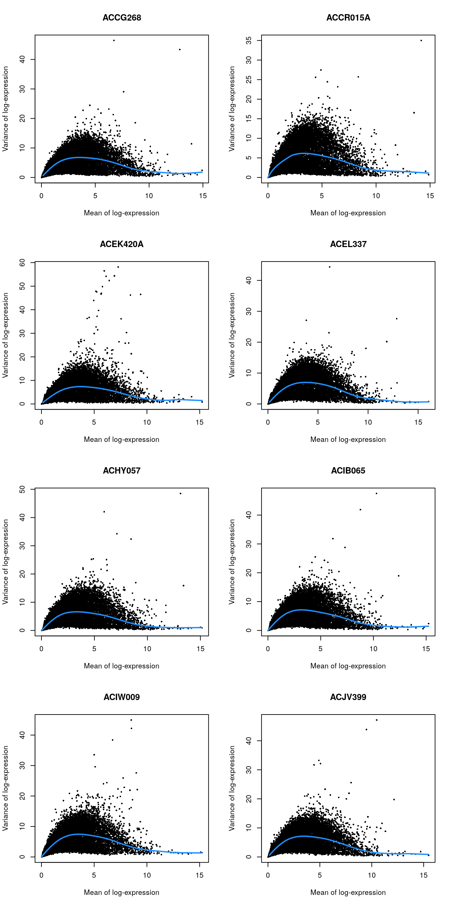

# Lawlor human pancreas (SMARTer)

<script>
document.addEventListener("click", function (event) {
    if (event.target.classList.contains("aaron-collapse")) {
        event.target.classList.toggle("active");
        var content = event.target.nextElementSibling;
        if (content.style.display === "block") {
          content.style.display = "none";
        } else {
          content.style.display = "block";
        }
    }
})
</script>

<style>
.aaron-collapse {
  background-color: #eee;
  color: #444;
  cursor: pointer;
  padding: 18px;
  width: 100%;
  border: none;
  text-align: left;
  outline: none;
  font-size: 15px;
}

.aaron-content {
  padding: 0 18px;
  display: none;
  overflow: hidden;
  background-color: #f1f1f1;
}
</style>

## Introduction

This performs an analysis of the @lawlor2017singlecell dataset,
consisting of human pancreas cells from various donors.

## Data loading


```r
library(scRNAseq)
sce.lawlor <- LawlorPancreasData()
```


```r
library(AnnotationHub)
edb <- AnnotationHub()[["AH73881"]]
anno <- select(edb, keys=rownames(sce.lawlor), keytype="GENEID", 
    columns=c("SYMBOL", "SEQNAME"))
rowData(sce.lawlor) <- anno[match(rownames(sce.lawlor), anno[,1]),-1]
```

## Quality control


```r
unfiltered <- sce.lawlor
```


```r
library(scater)
stats <- perCellQCMetrics(sce.lawlor, 
    subsets=list(Mito=which(rowData(sce.lawlor)$SEQNAME=="MT")))
qc <- quickPerCellQC(stats, percent_subsets="subsets_Mito_percent",
    batch=sce.lawlor$`islet unos id`)
sce.lawlor <- sce.lawlor[,!qc$discard]
```


```r
colData(unfiltered) <- cbind(colData(unfiltered), stats)
unfiltered$discard <- qc$discard

gridExtra::grid.arrange(
    plotColData(unfiltered, x="islet unos id", y="sum", colour_by="discard") +
        scale_y_log10() + ggtitle("Total count") +
        theme(axis.text.x = element_text(angle = 90)),
    plotColData(unfiltered, x="islet unos id", y="detected", 
        colour_by="discard") + scale_y_log10() + ggtitle("Detected features") +
        theme(axis.text.x = element_text(angle = 90)), 
    plotColData(unfiltered, x="islet unos id", y="subsets_Mito_percent",
        colour_by="discard") + ggtitle("Mito percent") +
        theme(axis.text.x = element_text(angle = 90)),
    ncol=2
)
```

<div class="figure">

<p class="caption">(\#fig:unref-lawlor-qc-dist)Distribution of each QC metric across cells from each donor of the Lawlor pancreas dataset. Each point represents a cell and is colored according to whether that cell was discarded.</p>
</div>


```r
plotColData(unfiltered, x="sum", y="subsets_Mito_percent",
    colour_by="discard") + scale_x_log10()
```

<div class="figure">

<p class="caption">(\#fig:unref-lawlor-qc-comp)Percentage of mitochondrial reads in each cell in the 416B dataset compared to the total count. Each point represents a cell and is colored according to whether that cell was discarded.</p>
</div>


```r
colSums(as.matrix(qc))
```

```
##              low_lib_size            low_n_features high_subsets_Mito_percent 
##                         9                         5                        25 
##                   discard 
##                        34
```

## Normalization


```r
library(scran)
set.seed(1000)
clusters <- quickCluster(sce.lawlor)
sce.lawlor <- computeSumFactors(sce.lawlor, clusters=clusters)
sce.lawlor <- logNormCounts(sce.lawlor)
```


```r
summary(sizeFactors(sce.lawlor))
```

```
##    Min. 1st Qu.  Median    Mean 3rd Qu.    Max. 
##   0.295   0.781   0.963   1.000   1.182   2.629
```


```r
plot(librarySizeFactors(sce.lawlor), sizeFactors(sce.lawlor), pch=16,
    xlab="Library size factors", ylab="Deconvolution factors", log="xy")
```

<div class="figure">

<p class="caption">(\#fig:unref-lawlor-norm)Relationship between the library size factors and the deconvolution size factors in the Lawlor pancreas dataset.</p>
</div>

## Variance modelling

Using age as a proxy for the donor.


```r
dec.lawlor <- modelGeneVar(sce.lawlor, block=sce.lawlor$`islet unos id`)
chosen.genes <- getTopHVGs(dec.lawlor, n=2000)
```


```r
par(mfrow=c(4,2))
blocked.stats <- dec.lawlor$per.block
for (i in colnames(blocked.stats)) {
    current <- blocked.stats[[i]]
    plot(current$mean, current$total, main=i, pch=16, cex=0.5,
        xlab="Mean of log-expression", ylab="Variance of log-expression")
    curfit <- metadata(current)
    curve(curfit$trend(x), col='dodgerblue', add=TRUE, lwd=2)
}
```

<div class="figure">

<p class="caption">(\#fig:unnamed-chunk-4)Per-gene variance as a function of the mean for the log-expression values in the Lawlor pancreas dataset. Each point represents a gene (black) with the mean-variance trend (blue) fitted separately for each donor.</p>
</div>

## Dimensionality reduction


```r
library(BiocSingular)
set.seed(101011001)
sce.lawlor <- runPCA(sce.lawlor, subset_row=chosen.genes, ncomponents=25)
sce.lawlor <- runTSNE(sce.lawlor, dimred="PCA")
```

## Clustering


```r
snn.gr <- buildSNNGraph(sce.lawlor, use.dimred="PCA")
colLabels(sce.lawlor) <- factor(igraph::cluster_walktrap(snn.gr)$membership)
```


```r
table(colLabels(sce.lawlor), sce.lawlor$`cell type`)
```

```
##    
##     Acinar Alpha Beta Delta Ductal Gamma/PP None/Other Stellate
##   1      1     0    0    13      2       16          2        0
##   2      0     1   76     1      0        0          0        0
##   3      0   161    1     0      0        1          2        0
##   4      0     1    0     1      0        0          5       19
##   5      0     0  175     4      1        0          1        0
##   6     22     0    0     0      0        0          0        0
##   7      0    75    0     0      0        0          0        0
##   8      0     0    0     1     20        0          2        0
```


```r
table(colLabels(sce.lawlor), sce.lawlor$`islet unos id`)
```

```
##    
##     ACCG268 ACCR015A ACEK420A ACEL337 ACHY057 ACIB065 ACIW009 ACJV399
##   1       8        2        2       4       4       4       9       1
##   2      14        3        2      33       3       2       4      17
##   3      36       23       14      13      14      14      21      30
##   4       7        1        0       1       0       4       9       4
##   5      34       10        4      39       7      23      24      40
##   6       0        2       13       0       0       0       5       2
##   7      32       12        0       5       6       7       4       9
##   8       1        1        2       1       2       1      12       3
```


```r
gridExtra::grid.arrange(
    plotTSNE(sce.lawlor, colour_by="label"),
    plotTSNE(sce.lawlor, colour_by="islet unos id"),
    ncol=2
)
```

<div class="figure">

<p class="caption">(\#fig:unref-grun-tsne)Obligatory $t$-SNE plots of the Lawlor pancreas dataset. Each point represents a cell that is colored by cluster (left) or batch (right).</p>
</div>

## Session Info {-}

<button class="aaron-collapse">View session info</button>
<div class="aaron-content">
```
R Under development (unstable) (2020-03-23 r78035)
Platform: x86_64-pc-linux-gnu (64-bit)
Running under: Ubuntu 18.04.4 LTS

Matrix products: default
BLAS:   /home/luna/Software/R/trunk/lib/libRblas.so
LAPACK: /home/luna/Software/R/trunk/lib/libRlapack.so

locale:
 [1] LC_CTYPE=en_US.UTF-8       LC_NUMERIC=C              
 [3] LC_TIME=en_US.UTF-8        LC_COLLATE=en_US.UTF-8    
 [5] LC_MONETARY=en_US.UTF-8    LC_MESSAGES=en_US.UTF-8   
 [7] LC_PAPER=en_US.UTF-8       LC_NAME=C                 
 [9] LC_ADDRESS=C               LC_TELEPHONE=C            
[11] LC_MEASUREMENT=en_US.UTF-8 LC_IDENTIFICATION=C       

attached base packages:
[1] parallel  stats4    stats     graphics  grDevices utils     datasets 
[8] methods   base     

other attached packages:
 [1] BiocSingular_1.3.2          scran_1.15.24              
 [3] scater_1.15.29              ggplot2_3.3.0              
 [5] ensembldb_2.11.3            AnnotationFilter_1.11.0    
 [7] GenomicFeatures_1.39.7      AnnotationDbi_1.49.1       
 [9] AnnotationHub_2.19.7        BiocFileCache_1.11.4       
[11] dbplyr_1.4.2                scRNAseq_2.1.7             
[13] SingleCellExperiment_1.9.2  SummarizedExperiment_1.17.4
[15] DelayedArray_0.13.7         BiocParallel_1.21.2        
[17] matrixStats_0.56.0          Biobase_2.47.3             
[19] GenomicRanges_1.39.3        GenomeInfoDb_1.23.14       
[21] IRanges_2.21.8              S4Vectors_0.25.14          
[23] BiocGenerics_0.33.3         BiocStyle_2.15.6           
[25] OSCAUtils_0.0.2            

loaded via a namespace (and not attached):
 [1] Rtsne_0.15                    ggbeeswarm_0.6.0             
 [3] colorspace_1.4-1              XVector_0.27.2               
 [5] BiocNeighbors_1.5.2           farver_2.0.3                 
 [7] bit64_0.9-7                   interactiveDisplayBase_1.25.0
 [9] codetools_0.2-16              knitr_1.28                   
[11] Rsamtools_2.3.7               shiny_1.4.0.2                
[13] BiocManager_1.30.10           compiler_4.0.0               
[15] httr_1.4.1                    dqrng_0.2.1                  
[17] assertthat_0.2.1              Matrix_1.2-18                
[19] fastmap_1.0.1                 lazyeval_0.2.2               
[21] limma_3.43.5                  later_1.0.0                  
[23] htmltools_0.4.0               prettyunits_1.1.1            
[25] tools_4.0.0                   igraph_1.2.5                 
[27] rsvd_1.0.3                    gtable_0.3.0                 
[29] glue_1.3.2                    GenomeInfoDbData_1.2.2       
[31] dplyr_0.8.5                   rappdirs_0.3.1               
[33] Rcpp_1.0.4                    vctrs_0.2.4                  
[35] Biostrings_2.55.7             ExperimentHub_1.13.5         
[37] rtracklayer_1.47.0            DelayedMatrixStats_1.9.0     
[39] xfun_0.12                     stringr_1.4.0                
[41] ps_1.3.2                      mime_0.9                     
[43] lifecycle_0.2.0               irlba_2.3.3                  
[45] statmod_1.4.34                XML_3.99-0.3                 
[47] edgeR_3.29.1                  zlibbioc_1.33.1              
[49] scales_1.1.0                  hms_0.5.3                    
[51] promises_1.1.0                ProtGenerics_1.19.3          
[53] yaml_2.2.1                    curl_4.3                     
[55] memoise_1.1.0                 gridExtra_2.3                
[57] biomaRt_2.43.3                stringi_1.4.6                
[59] RSQLite_2.2.0                 BiocVersion_3.11.1           
[61] highr_0.8                     rlang_0.4.5                  
[63] pkgconfig_2.0.3               bitops_1.0-6                 
[65] evaluate_0.14                 lattice_0.20-40              
[67] purrr_0.3.3                   GenomicAlignments_1.23.2     
[69] labeling_0.3                  cowplot_1.0.0                
[71] bit_1.1-15.2                  processx_3.4.2               
[73] tidyselect_1.0.0              magrittr_1.5                 
[75] bookdown_0.18                 R6_2.4.1                     
[77] DBI_1.1.0                     pillar_1.4.3                 
[79] withr_2.1.2                   RCurl_1.98-1.1               
[81] tibble_2.1.3                  crayon_1.3.4                 
[83] rmarkdown_2.1                 viridis_0.5.1                
[85] progress_1.2.2                locfit_1.5-9.4               
[87] grid_4.0.0                    blob_1.2.1                   
[89] callr_3.4.2                   digest_0.6.25                
[91] xtable_1.8-4                  httpuv_1.5.2                 
[93] openssl_1.4.1                 munsell_0.5.0                
[95] beeswarm_0.2.3                viridisLite_0.3.0            
[97] vipor_0.4.5                   askpass_1.1                  
```
</div>
