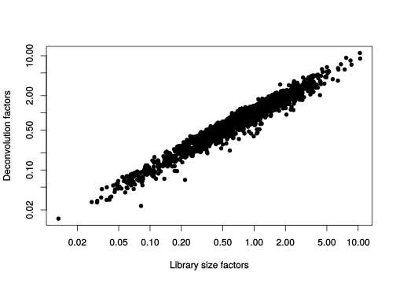
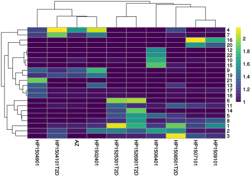
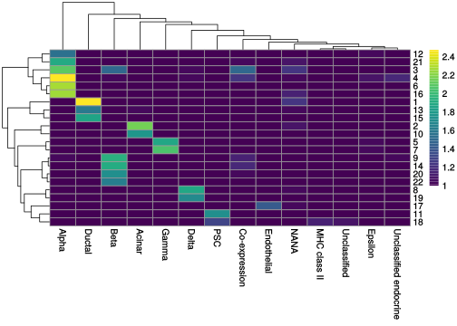
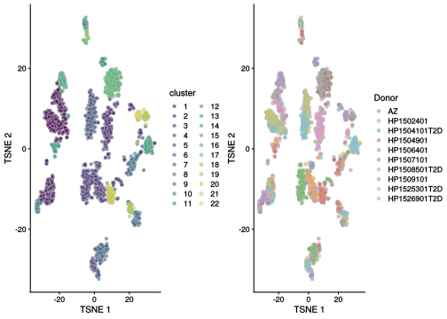

# Segerstolpe human pancreas (Smart-seq2)

<script>
document.addEventListener("click", function (event) {
    if (event.target.classList.contains("aaron-collapse")) {
        event.target.classList.toggle("active");
        var content = event.target.nextElementSibling;
        if (content.style.display === "block") {
          content.style.display = "none";
        } else {
          content.style.display = "block";
        }
    }
})
</script>

<style>
.aaron-collapse {
  background-color: #eee;
  color: #444;
  cursor: pointer;
  padding: 18px;
  width: 100%;
  border: none;
  text-align: left;
  outline: none;
  font-size: 15px;
}

.aaron-content {
  padding: 0 18px;
  display: none;
  overflow: hidden;
  background-color: #f1f1f1;
}
</style>

## Introduction

This performs an analysis of the @segerstolpe2016singlecell dataset,
consisting of human pancreas cells from various donors.

## Data loading


```r
library(scRNAseq)
sce.seger <- SegerstolpePancreasData()
```


```r
library(AnnotationHub)
edb <- AnnotationHub()[["AH73881"]]
symbols <- rowData(sce.seger)$symbol
ens.id <- mapIds(edb, keys=symbols, keytype="SYMBOL", column="GENEID")
ens.id <- ifelse(is.na(ens.id), symbols, ens.id)

# Removing duplicated rows.
keep <- !duplicated(ens.id)
sce.seger <- sce.seger[keep,]
rownames(sce.seger) <- ens.id[keep]
```

We simplify the names of some of the relevant column metadata fields for ease of access.
Some editing of the cell type labels is necessary for consistency with other data sets.


```r
emtab.meta <- colData(sce.seger)[,c("cell type", 
    "individual", "single cell well quality")]
colnames(emtab.meta) <- c("CellType", "Donor", "Quality")
colData(sce.seger) <- emtab.meta

sce.seger$CellType <- gsub(" cell", "", sce.seger$CellType)
sce.seger$CellType <- paste0(
    toupper(substr(sce.seger$CellType, 1, 1)),
    substring(sce.seger$CellType, 2))
```

## Quality control


```r
unfiltered <- sce.seger
```

We remove low quality cells that were marked by the authors.
We then perform additional quality control as some of the remaining cells still have very low counts and numbers of detected features.
For some batches that seem to have a majority of low-quality cells (Figure \@ref(unref-seger-qc-dist)), we use the other batches to define an appropriate threshold via `subset=`.


```r
low.qual <- sce.seger$Quality == "low quality cell"

library(scater)
stats <- perCellQCMetrics(sce.seger)
qc <- quickPerCellQC(stats, percent_subsets="altexps_ERCC_percent",
    batch=sce.seger$Donor,
    subset=!sce.seger$Donor %in% c("HP1504901", "HP1509101"))

sce.seger <- sce.seger[,!(qc$discard | low.qual)]
```


```r
colData(unfiltered) <- cbind(colData(unfiltered), stats)
unfiltered$discard <- qc$discard

gridExtra::grid.arrange(
    plotColData(unfiltered, x="Donor", y="sum", colour_by="discard") +
        scale_y_log10() + ggtitle("Total count") +
        theme(axis.text.x = element_text(angle = 90)),
    plotColData(unfiltered, x="Donor", y="detected", colour_by="discard") +
        scale_y_log10() + ggtitle("Detected features") +
        theme(axis.text.x = element_text(angle = 90)),
    plotColData(unfiltered, x="Donor", y="altexps_ERCC_percent",
        colour_by="discard") + ggtitle("ERCC percent") +
        theme(axis.text.x = element_text(angle = 90)),
    ncol=2
)
```

<div class="figure">

<p class="caption">(\#fig:unref-seger-qc-dist)Distribution of each QC metric across cells from each donor of the Segerstolpe pancreas dataset. Each point represents a cell and is colored according to whether that cell was discarded.</p>
</div>


```r
colSums(as.matrix(qc))
```

```
##              low_lib_size            low_n_features high_altexps_ERCC_percent 
##                       788                      1056                      1031 
##                   discard 
##                      1246
```

### Normalization

We don't normalize the spike-ins as there are some cells with no spike-in counts.


```r
library(scran)
clusters <- quickCluster(sce.seger)
sce.seger <- computeSumFactors(sce.seger, clusters=clusters)
sce.seger <- logNormCounts(sce.seger) 
```


```r
summary(sizeFactors(sce.seger))
```

```
##    Min. 1st Qu.  Median    Mean 3rd Qu.    Max. 
##   0.014   0.390   0.708   1.000   1.332  11.182
```


```r
plot(librarySizeFactors(sce.seger), sizeFactors(sce.seger), pch=16,
    xlab="Library size factors", ylab="Deconvolution factors", log="xy")
```

<div class="figure">

<p class="caption">(\#fig:unref-seger-norm)Relationship between the library size factors and the deconvolution size factors in the Segerstolpe pancreas dataset.</p>
</div>

### Variance modelling

We do not use cells with no spike-ins for variance modelling.
Donor AZ also has very low spike-in counts and is subsequently ignored.


```r
for.hvg <- sce.seger[,librarySizeFactors(altExp(sce.seger)) > 0
    & sce.seger$Donor!="AZ"]
dec.seger <- modelGeneVarWithSpikes(for.hvg, "ERCC", block=for.hvg$Donor)
chosen.hvgs <- getTopHVGs(dec.seger, n=2000)
```


```r
par(mfrow=c(3,3))
blocked.stats <- dec.seger$per.block
for (i in colnames(blocked.stats)) {
    current <- blocked.stats[[i]]
    plot(current$mean, current$total, main=i, pch=16, cex=0.5,
        xlab="Mean of log-expression", ylab="Variance of log-expression")
    curfit <- metadata(current)
    points(curfit$mean, curfit$var, col="red", pch=16)
    curve(curfit$trend(x), col='dodgerblue', add=TRUE, lwd=2)
}
```

<div class="figure">

<p class="caption">(\#fig:unref-seger-variance)Per-gene variance as a function of the mean for the log-expression values in the Grun pancreas dataset. Each point represents a gene (black) with the mean-variance trend (blue) fitted to the spike-in transcripts (red) separately for each donor.</p>
</div>

### Dimensionality reduction


```r
library(BiocSingular)
set.seed(101011001)
sce.seger <- runPCA(sce.seger, subset_row=chosen.hvgs, ncomponents=25)
sce.seger <- runTSNE(sce.seger, dimred="PCA")
```

### Clustering


```r
snn.gr <- buildSNNGraph(sce.seger, use.dimred="PCA")
sce.seger$cluster <- factor(igraph::cluster_walktrap(snn.gr)$membership)
```

We see a strong donor effect, which suggests that should have called `fastMNN()` at some point.
(But hey, we already did that for the Muraro and Grun analyses, so where's the fun in doing that again?)


```r
tab <- table(Cluster=sce.seger$cluster, Donor=sce.seger$Donor)
library(pheatmap)
pheatmap(log10(tab+10), color=viridis::viridis(100))
```

<div class="figure">

<p class="caption">(\#fig:unref-seger-heat-1)Heatmap of the frequency of cells from each donor in each cluster.</p>
</div>


```r
tab <- table(Cluster=sce.seger$cluster, Donor=sce.seger$CellType)
pheatmap(log10(tab+10), color=viridis::viridis(100))
```

<div class="figure">

<p class="caption">(\#fig:unref-seger-heat-2)Heatmap of the frequency of cells from each cell type label in each cluster.</p>
</div>


```r
gridExtra::grid.arrange(
    plotTSNE(sce.seger, colour_by="cluster"),
    plotTSNE(sce.seger, colour_by="Donor"),
    ncol=2
)
```

<div class="figure">

<p class="caption">(\#fig:unref-grun-tsne)Obligatory $t$-SNE plots of the Segerstolpe pancreas dataset. Each point represents a cell that is colored by cluster (left) or batch (right).</p>
</div>

## Session Info {-}

<button class="aaron-collapse">View session info</button>
<div class="aaron-content">
```
R Under development (unstable) (2019-12-29 r77627)
Platform: x86_64-pc-linux-gnu (64-bit)
Running under: Ubuntu 14.04.6 LTS

Matrix products: default
BLAS/LAPACK: /app/easybuild/software/OpenBLAS/0.2.18-GCC-5.4.0-2.26-LAPACK-3.6.1/lib/libopenblas_prescottp-r0.2.18.so

locale:
 [1] LC_CTYPE=en_US.UTF-8       LC_NUMERIC=C               LC_TIME=en_US.UTF-8       
 [4] LC_COLLATE=C               LC_MONETARY=en_US.UTF-8    LC_MESSAGES=en_US.UTF-8   
 [7] LC_PAPER=en_US.UTF-8       LC_NAME=C                  LC_ADDRESS=C              
[10] LC_TELEPHONE=C             LC_MEASUREMENT=en_US.UTF-8 LC_IDENTIFICATION=C       

attached base packages:
[1] stats4    parallel  stats     graphics  grDevices utils     datasets  methods   base     

other attached packages:
 [1] pheatmap_1.0.12             BiocSingular_1.3.1          scran_1.15.14              
 [4] scater_1.15.12              ggplot2_3.2.1               ensembldb_2.11.2           
 [7] AnnotationFilter_1.11.0     GenomicFeatures_1.39.2      AnnotationDbi_1.49.0       
[10] AnnotationHub_2.19.3        BiocFileCache_1.11.4        dbplyr_1.4.2               
[13] scRNAseq_2.1.5              SingleCellExperiment_1.9.1  SummarizedExperiment_1.17.1
[16] DelayedArray_0.13.2         BiocParallel_1.21.2         matrixStats_0.55.0         
[19] Biobase_2.47.2              GenomicRanges_1.39.1        GenomeInfoDb_1.23.1        
[22] IRanges_2.21.2              S4Vectors_0.25.8            BiocGenerics_0.33.0        
[25] BiocStyle_2.15.3            OSCAUtils_0.0.1            

loaded via a namespace (and not attached):
  [1] Rtsne_0.15                    ggbeeswarm_0.6.0              colorspace_1.4-1             
  [4] XVector_0.27.0                BiocNeighbors_1.5.1           farver_2.0.1                 
  [7] bit64_0.9-7                   interactiveDisplayBase_1.25.0 codetools_0.2-16             
 [10] knitr_1.26                    zeallot_0.1.0                 Rsamtools_2.3.2              
 [13] shiny_1.4.0                   BiocManager_1.30.10           compiler_4.0.0               
 [16] httr_1.4.1                    dqrng_0.2.1                   backports_1.1.5              
 [19] assertthat_0.2.1              Matrix_1.2-18                 fastmap_1.0.1                
 [22] lazyeval_0.2.2                limma_3.43.0                  later_1.0.0                  
 [25] htmltools_0.4.0               prettyunits_1.0.2             tools_4.0.0                  
 [28] igraph_1.2.4.2                rsvd_1.0.2                    gtable_0.3.0                 
 [31] glue_1.3.1                    GenomeInfoDbData_1.2.2        dplyr_0.8.3                  
 [34] rappdirs_0.3.1                Rcpp_1.0.3                    vctrs_0.2.1                  
 [37] Biostrings_2.55.4             ExperimentHub_1.13.5          rtracklayer_1.47.0           
 [40] DelayedMatrixStats_1.9.0      xfun_0.11                     stringr_1.4.0                
 [43] ps_1.3.0                      mime_0.8                      lifecycle_0.1.0              
 [46] irlba_2.3.3                   statmod_1.4.32                XML_3.98-1.20                
 [49] edgeR_3.29.0                  zlibbioc_1.33.0               scales_1.1.0                 
 [52] hms_0.5.2                     promises_1.1.0                ProtGenerics_1.19.3          
 [55] RColorBrewer_1.1-2            yaml_2.2.0                    curl_4.3                     
 [58] memoise_1.1.0                 gridExtra_2.3                 biomaRt_2.43.0               
 [61] stringi_1.4.3                 RSQLite_2.2.0                 highr_0.8                    
 [64] BiocVersion_3.11.1            rlang_0.4.2                   pkgconfig_2.0.3              
 [67] bitops_1.0-6                  evaluate_0.14                 lattice_0.20-38              
 [70] purrr_0.3.3                   labeling_0.3                  GenomicAlignments_1.23.1     
 [73] cowplot_1.0.0                 bit_1.1-14                    processx_3.4.1               
 [76] tidyselect_0.2.5              magrittr_1.5                  bookdown_0.16                
 [79] R6_2.4.1                      DBI_1.1.0                     pillar_1.4.3                 
 [82] withr_2.1.2                   RCurl_1.95-4.12               tibble_2.1.3                 
 [85] crayon_1.3.4                  rmarkdown_2.0                 viridis_0.5.1                
 [88] progress_1.2.2                locfit_1.5-9.1                grid_4.0.0                   
 [91] blob_1.2.0                    callr_3.4.0                   digest_0.6.23                
 [94] xtable_1.8-4                  httpuv_1.5.2                  openssl_1.4.1                
 [97] munsell_0.5.0                 beeswarm_0.2.3                viridisLite_0.3.0            
[100] vipor_0.4.5                   askpass_1.1                  
```
</div>
