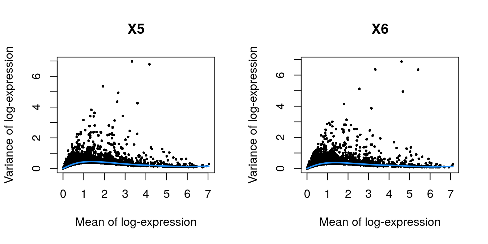
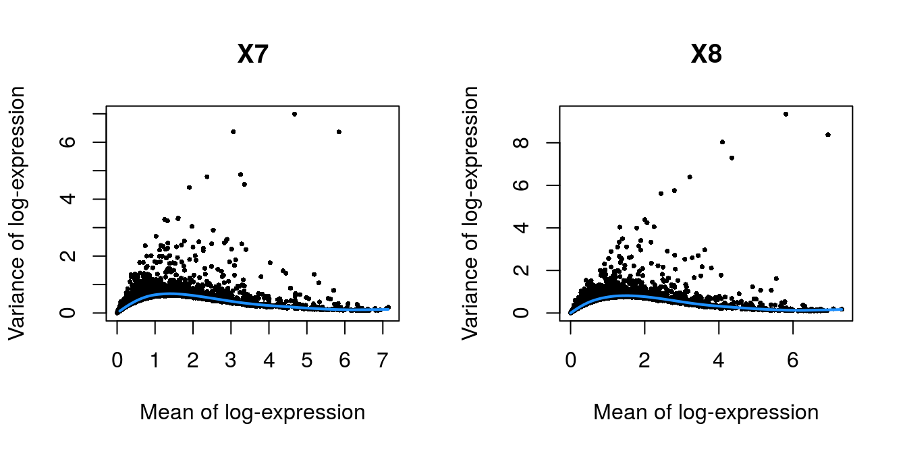
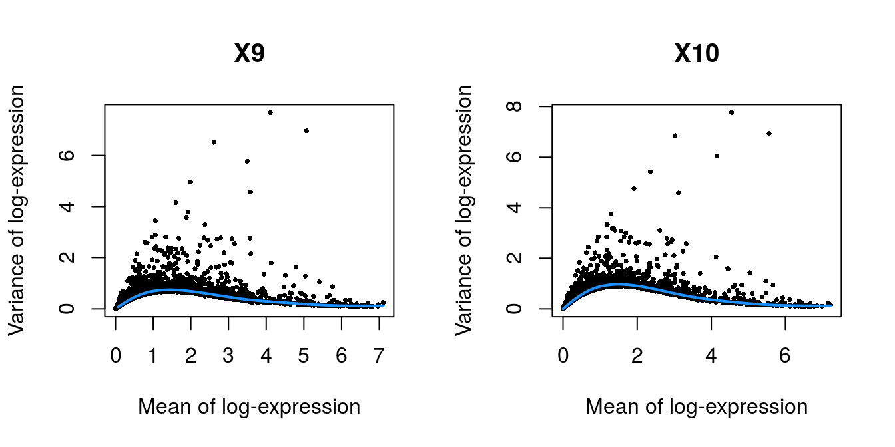
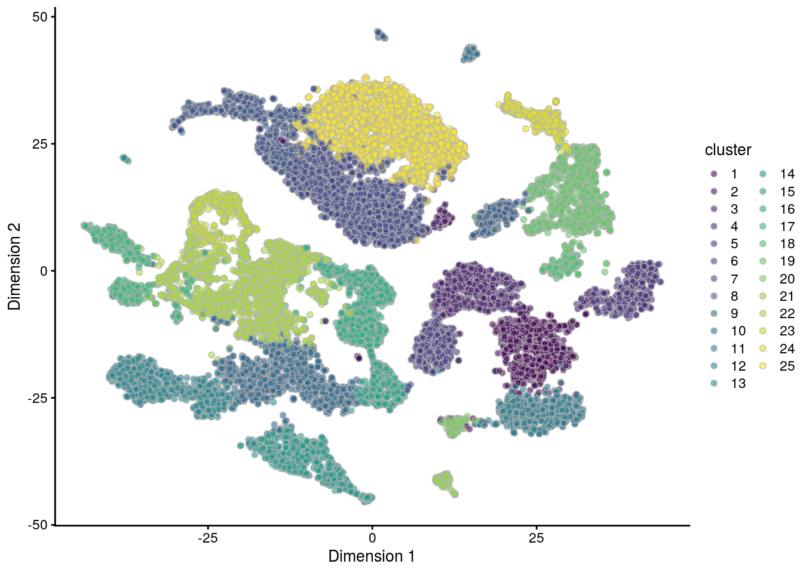
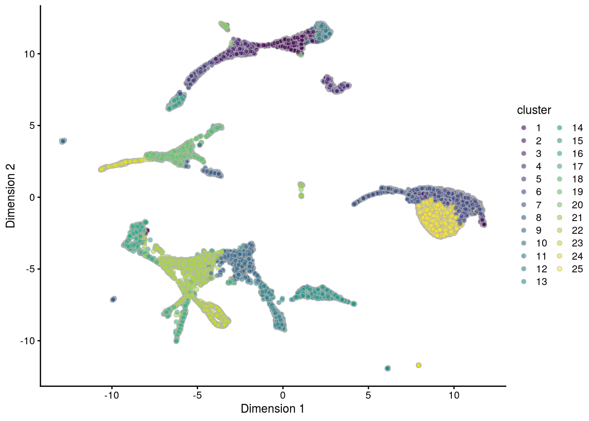

# Chimeric embryo 10X dataset


## Introduction

This performs an analysis of the @pijuan2019singlcell dataset on mouse gastrulation.
Here, we examine chimeric embryos at the E7.5 stage of development 
where td-Tomato-positive embryonic stem cells (ESCs) were injected into a wild-type blastocyst.

## Analysis code

### Data loading


```r
library(MouseGastrulationData)
sce.chimera <- WTChimeraData(samples=5:10)
sce.chimera
```

```
## class: SingleCellExperiment 
## dim: 29453 20935 
## metadata(0):
## assays(1): counts
## rownames(29453): ENSMUSG00000051951 ENSMUSG00000089699 ...
##   ENSMUSG00000095742 tomato-td
## rowData names(2): ENSEMBL SYMBOL
## colnames(20935): cell_9769 cell_9770 ... cell_30702 cell_30703
## colData names(10): cell barcode ... closest.cell doub.density
## reducedDimNames(2): pca.corrected.E7.5 pca.corrected.E8.5
## spikeNames(0):
## altExpNames(0):
```


### Feature annotation


```r
library(scater)
rownames(sce.chimera) <- uniquifyFeatureNames(
    rowData(sce.chimera)$ENSEMBL, rowData(sce.chimera)$SYMBOL)
```

### Quality control

Quality control on the cells has already been performed by the authors, so we will not repeat it here.
We additionally remove cells that are labelled as stripped nuclei or doublets.


```r
drop <- sce.chimera$celltype.mapped %in% c("stripped", "Doublet")
sce.chimera <- sce.chimera[,!drop]
```

### Normalization

We use the pre-computed size factors in `sce.chimera`.


```r
sce.chimera <- logNormCounts(sce.chimera)
```

### Variance modelling

Retaining all genes with any positive biological component, to preserve as much signal as possible across many samples.


```r
library(scran)
dec.chimera <- modelGeneVar(sce.chimera, block=sce.chimera$sample)
chosen.hvgs <- dec.chimera$bio > 0
```

### Merging

We use a hierarchical merge to first merge together replicates with the same genotype, 
and then merge samples across different genotypes.


```r
library(batchelor)
merged <- correctExperiments(sce.chimera, 
    batch=sce.chimera$sample, 
    subset.row=chosen.hvgs,
    PARAM=FastMnnParam(
        merge.order=list(
            list(
                list(1, 3), # WT (3 replicates)
                5
            ),
            list(
                list(2, 4), # td-Tomato (3 replicates)
                6
            )
        )
    )
)
```

### Clustering


```r
g <- buildSNNGraph(merged, use.dimred="corrected")
clusters <- igraph::cluster_louvain(g)
merged$cluster <- factor(clusters$membership)
```

### Dimensionality reduction

We use an external algorithm to compute nearest neighbors for greater speed.


```r
merged <- runTSNE(merged, dimred="corrected", external_neighbors=TRUE)
merged <- runUMAP(merged, dimred="corrected", external_neighbors=TRUE)
```

## Results

### Variance modelling


```r
par(mfrow=c(1,2))
blocked.stats <- dec.chimera$per.block
for (i in colnames(blocked.stats)) {
    current <- blocked.stats[[i]]
    plot(current$mean, current$total, main=i, pch=16, cex=0.5,
        xlab="Mean of log-expression", ylab="Variance of log-expression")
    curfit <- metadata(current)
    curve(curfit$trend(x), col='dodgerblue', add=TRUE, lwd=2)
}
```



### Batch correction


```r
metadata(merged)$merge.info$lost.var
```

```
##             5        6        7        8       9      10
## [1,] 0.00e+00 0.020443 0.00e+00 0.016957 0.00000 0.00000
## [2,] 0.00e+00 0.000739 0.00e+00 0.000441 0.00000 0.01547
## [3,] 3.09e-02 0.000000 2.01e-02 0.000000 0.00000 0.00000
## [4,] 9.01e-05 0.000000 8.26e-05 0.000000 0.01805 0.00000
## [5,] 4.32e-03 0.007253 4.12e-03 0.007830 0.00383 0.00779
```

### Clustering


```r
table(merged$cluster)
```

```
## 
##    1    2    3    4    5    6    7    8    9   10   11   12   13   14   15 
##  947  476  112  867  681  507 2181  424 1269  104  727 1034   58  423  872 
##   16   17   18   19   20   21   22   23   24   25 
## 1039  414 1264  698  211  160  156 1942  567 2293
```


```r
plotTSNE(merged, colour_by="cluster")
```



```r
plotUMAP(merged, colour_by="cluster")
```




