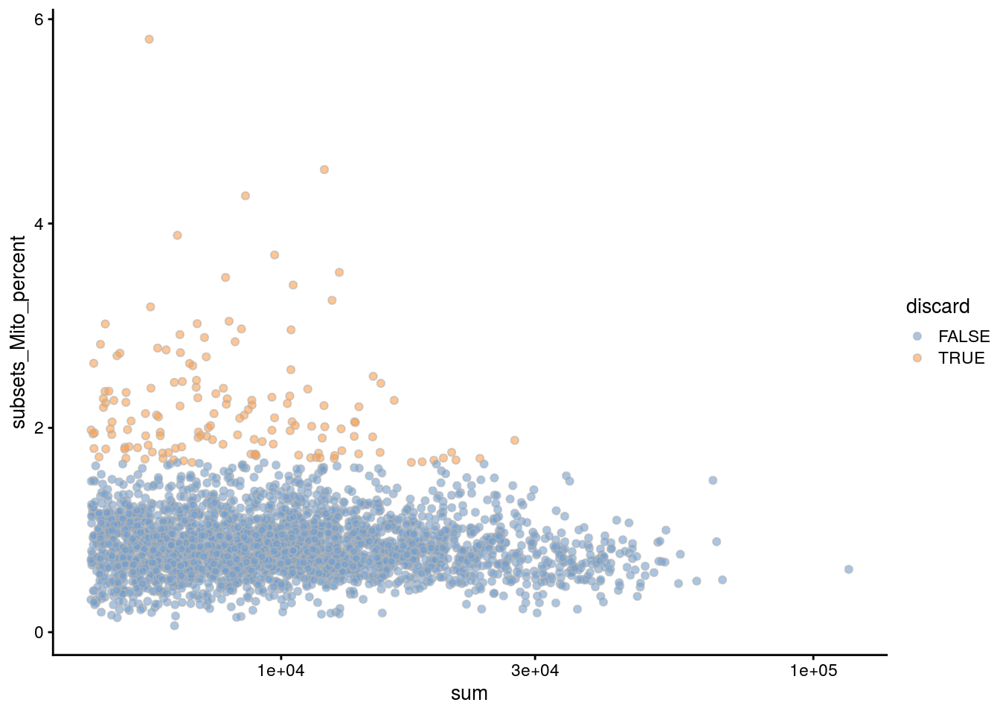
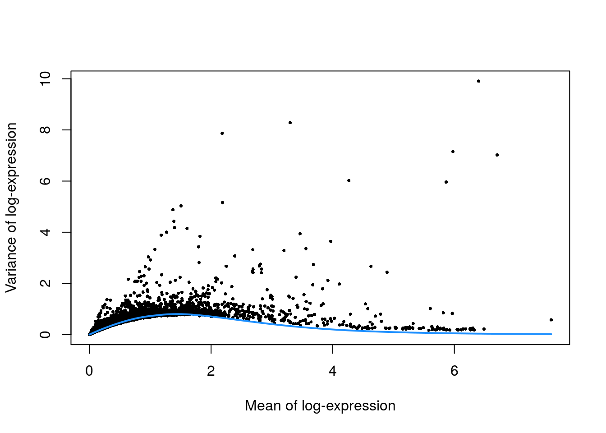
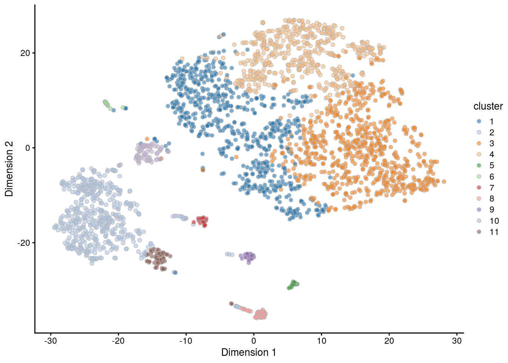

# Mammary gland dataset


## Introduction

This performs an analysis of the @bach2017differentiation 10X Genomics dataset,
from which we will consider a single sample of epithelial cells from the mouse mammary gland during gestation.

## Analysis code

### Data loading


```r
library(BiocFileCache)
bfc <- BiocFileCache()
base.path <- "ftp://ftp.ncbi.nlm.nih.gov/geo/samples/GSM2834nnn/GSM2834500/suppl"
barcode.fname <- bfcrpath(bfc, file.path(base.path, 
    "GSM2834500%5FG%5F1%5Fbarcodes%2Etsv%2Egz"))
gene.fname <- bfcrpath(bfc, file.path(base.path,
    "GSM2834500%5FG%5F1%5Fgenes%2Etsv%2Egz"))
counts.fname <- bfcrpath(bfc, file.path(base.path,
    "GSM2834500%5FG%5F1%5Fmatrix%2Emtx%2Egz"))

library(Matrix)
library(SingleCellExperiment)
gene.info <- read.table(gene.fname, stringsAsFactors=FALSE)
colnames(gene.info) <- c("Ensembl", "Symbol")
sce.mam <- SingleCellExperiment(
    list(counts=as(readMM(counts.fname), "dgCMatrix")), 
    rowData=DataFrame(gene.info),
    colData=DataFrame(Barcode=readLines(barcode.fname))
)
```

### Gene annotation


```r
library(scater)
rownames(sce.mam) <- uniquifyFeatureNames(
    rowData(sce.mam)$Ensembl, rowData(sce.mam)$Symbol)

library(AnnotationHub)
ens.mm.v97 <- AnnotationHub()[["AH73905"]]
rowData(sce.mam)$SEQNAME <- mapIds(ens.mm.v97, keys=rowData(sce.mam)$Ensembl,
    keytype="GENEID", column="SEQNAME")
```

### Quality control


```r
unfiltered <- sce.mam
```


```r
is.mito <- rowData(sce.mam)$SEQNAME == "MT"
stats <- perCellQCMetrics(sce.mam, subsets=list(Mito=which(is.mito)))
qc <- quickCellQC(stats, percent_subsets="subsets_Mito_percent", nmads=3)
sce.mam <- sce.mam[,!qc$discard]
```

### Normalization 


```r
library(scran)
set.seed(101000110)
clusters <- quickCluster(sce.mam)
sce.mam <- computeSumFactors(sce.mam, clusters=clusters, min.mean=0.1) 
sce.mam <- logNormCounts(sce.mam)
```

### Variance modelling

We use a Poisson-based technical trend to capture more genuine biological variation in the biological component.


```r
set.seed(00010101)
dec.mam <- modelGeneVarByPoisson(sce.mam)
```

### Dimensionality reduction


```r
library(BiocSingular)
set.seed(101010011)
sce.mam <- denoisePCA(sce.mam, technical=dec.mam, BSPARAM=IrlbaParam())
sce.mam <- runTSNE(sce.mam, dimred="PCA")
```

### Clustering 

We use a higher `k` to obtain coarser clusters (for use in `doubletCluster()` later).


```r
snn.gr <- buildSNNGraph(sce.mam, use.dimred="PCA", k=25)
sce.mam$cluster <- factor(igraph::cluster_walktrap(snn.gr)$membership)
```

### Marker detection


```r
markers.mam <- findMarkers(sce.mam, cluster=sce.mam$cluster,
    direction="up", lfc=1)
```

## Results

### Quality control statistics


```r
colData(unfiltered) <- cbind(colData(unfiltered), stats)
unfiltered$discard <- qc$discard

gridExtra::grid.arrange(
    plotColData(unfiltered, y="sum", colour_by="discard") + 
        scale_y_log10() + ggtitle("Total count"),
    plotColData(unfiltered, y="detected", colour_by="discard") + 
        scale_y_log10() + ggtitle("Detected features"),
    plotColData(unfiltered, y="subsets_Mito_percent", 
        colour_by="discard") + ggtitle("Mito percent"),
    ncol=2
)
```


```r
plotColData(unfiltered, x="sum", y="subsets_Mito_percent", 
    colour_by="discard") + scale_x_log10()
```




```r
colSums(as.matrix(qc))
```

```
##              low_lib_size            low_n_features 
##                         0                         0 
## high_subsets_Mito_percent                   discard 
##                       143                       143
```

### Normalization


```r
summary(sizeFactors(sce.mam))
```

```
##    Min. 1st Qu.  Median    Mean 3rd Qu.    Max. 
##    0.27    0.52    0.76    1.00    1.21   10.74
```


```r
plot(librarySizeFactors(sce.mam), sizeFactors(sce.mam), pch=16,
    xlab="Library size factors", ylab="Deconvolution factors", log="xy")     
```


### Variance modelling


```r
plot(dec.mam$mean, dec.mam$total, pch=16, cex=0.5,
    xlab="Mean of log-expression", ylab="Variance of log-expression")
curfit <- metadata(dec.mam)
curve(curfit$trend(x), col='dodgerblue', add=TRUE, lwd=2)
```



### Dimensionality reduction


```r
ncol(reducedDim(sce.mam, "PCA"))
```

```
## [1] 11
```

### Clustering


```r
table(sce.mam$cluster)
```

```
## 
##   1   2   3   4   5   6   7   8   9  10  11 
## 706 489 761 512  24  25  33  52  39  71  60
```


```r
plotTSNE(sce.mam, colour_by="cluster")
```




