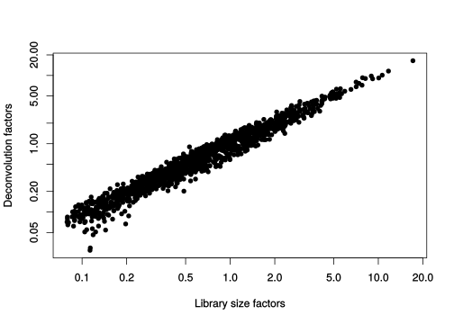
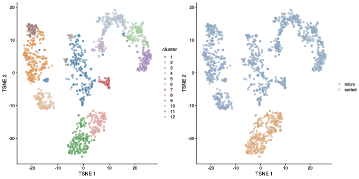
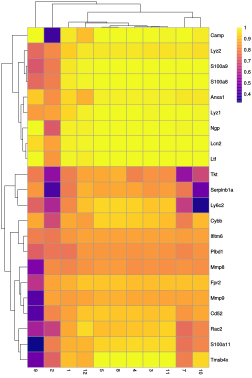

# Grun mouse HSC (CEL-seq) {#merged-hcsc}

<script>
document.addEventListener("click", function (event) {
    if (event.target.classList.contains("aaron-collapse")) {
        event.target.classList.toggle("active");
        var content = event.target.nextElementSibling;
        if (content.style.display === "block") {
          content.style.display = "none";
        } else {
          content.style.display = "block";
        }
    }
})
</script>

<style>
.aaron-collapse {
  background-color: #eee;
  color: #444;
  cursor: pointer;
  padding: 18px;
  width: 100%;
  border: none;
  text-align: left;
  outline: none;
  font-size: 15px;
}

.aaron-content {
  padding: 0 18px;
  display: none;
  overflow: hidden;
  background-color: #f1f1f1;
}
</style>

## Introduction

This performs an analysis of the mouse haematopoietic stem cell (HSC) dataset generated with CEL-seq [@grun2016denovo].

## Data loading


```r
library(scRNAseq)
sce.grun.hsc <- GrunHSCData(ensembl=TRUE)
```


```r
library(AnnotationHub)
ens.mm.v97 <- AnnotationHub()[["AH73905"]]
anno <- select(ens.mm.v97, keys=rownames(sce.grun.hsc), 
    keytype="GENEID", columns=c("SYMBOL", "SEQNAME"))
rowData(sce.grun.hsc) <- anno[match(rownames(sce.grun.hsc), anno$GENEID),]
```

After loading and annotation, we inspect the resulting `SingleCellExperiment` object:


```r
sce.grun.hsc
```

```
## class: SingleCellExperiment 
## dim: 21817 1915 
## metadata(0):
## assays(1): counts
## rownames(21817): ENSMUSG00000109644 ENSMUSG00000007777 ... ENSMUSG00000055670
##   ENSMUSG00000039068
## rowData names(3): GENEID SYMBOL SEQNAME
## colnames(1915): JC4_349_HSC_FE_S13_ JC4_350_HSC_FE_S13_ ... JC48P6_1203_HSC_FE_S8_
##   JC48P6_1204_HSC_FE_S8_
## colData names(2): sample protocol
## reducedDimNames(0):
## spikeNames(0):
## altExpNames(0):
```

## Quality control


```r
unfiltered <- sce.grun.hsc
```

For some reason, no mitochondrial transcripts are available, and we have no spike-in transcripts, so we only use the number of detected genes and the library size for quality control.
We block on the protocol used for cell extraction, ignoring the micro-dissected cells when computing this threshold.
This is based on our judgement that a majority of micro-dissected plates consist of a majority of low-quality cells, compromising the assumptions of outlier detection.


```r
library(scater)
stats <- perCellQCMetrics(sce.grun.hsc)
qc <- quickPerCellQC(stats, batch=sce.grun.hsc$protocol,
    subset=grepl("sorted", sce.grun.hsc$protocol))
sce.grun.hsc <- sce.grun.hsc[,!qc$discard]
```

We examine the number of cells discarded for each reason.


```r
colSums(as.matrix(qc))
```

```
##   low_lib_size low_n_features        discard 
##            465            482            488
```

We create some diagnostic plots for each metric (Figure \@ref(fig:unref-hgrun-qc-dist)).
The library sizes are unusually low for many plates of micro-dissected cells; this may be attributable to damage induced by the extraction protocol compared to cell sorting.


```r
colData(unfiltered) <- cbind(colData(unfiltered), stats)
unfiltered$discard <- qc$discard

gridExtra::grid.arrange(
    plotColData(unfiltered, y="sum", x="sample", colour_by="discard", 
        other_fields="protocol") + scale_y_log10() + ggtitle("Total count") +
        facet_wrap(~protocol),
    plotColData(unfiltered, y="detected", x="sample", colour_by="discard",
        other_fields="protocol") + scale_y_log10() + 
        ggtitle("Detected features") + facet_wrap(~protocol),
    ncol=1
)
```

<div class="figure">

<p class="caption">(\#fig:unref-hgrun-qc-dist)Distribution of each QC metric across cells in the Grun HSC dataset. Each point represents a cell and is colored according to whether that cell was discarded.</p>
</div>

## Normalization


```r
library(scran)
set.seed(101000110)
clusters <- quickCluster(sce.grun.hsc)
sce.grun.hsc <- computeSumFactors(sce.grun.hsc, clusters=clusters)
sce.grun.hsc <- logNormCounts(sce.grun.hsc)
```

We examine some key metrics for the distribution of size factors, and compare it to the library sizes as a sanity check (Figure \@ref(fig:unref-hgrun-norm)).


```r
summary(sizeFactors(sce.grun.hsc))
```

```
##    Min. 1st Qu.  Median    Mean 3rd Qu.    Max. 
##   0.027   0.290   0.603   1.000   1.201  16.433
```


```r
plot(librarySizeFactors(sce.grun.hsc), sizeFactors(sce.grun.hsc), pch=16,
    xlab="Library size factors", ylab="Deconvolution factors", log="xy")
```

<div class="figure">

<p class="caption">(\#fig:unref-hgrun-norm)Relationship between the library size factors and the deconvolution size factors in the Grun HSC dataset.</p>
</div>

## Variance modelling

We create a mean-variance trend based on the expectation that UMI counts have Poisson technical noise.
We do not block on sample here as we want to preserve any difference between the micro-dissected cells and the sorted HSCs.


```r
set.seed(00010101)
dec.grun.hsc <- modelGeneVarByPoisson(sce.grun.hsc) 
top.grun.hsc <- getTopHVGs(dec.grun.hsc, prop=0.1)
```

The lack of a typical "bump" shape in Figure \@ref(fig:unref-hgrun-var) is caused by the low counts.


```r
plot(dec.grun.hsc$mean, dec.grun.hsc$total, pch=16, cex=0.5,
    xlab="Mean of log-expression", ylab="Variance of log-expression")
curfit <- metadata(dec.grun.hsc)
curve(curfit$trend(x), col='dodgerblue', add=TRUE, lwd=2)
```

<div class="figure">

<p class="caption">(\#fig:unref-hgrun-var)Per-gene variance as a function of the mean for the log-expression values in the Grun HSC dataset. Each point represents a gene (black) with the mean-variance trend (blue) fitted to the simulated Poisson-distributed noise.</p>
</div>

## Dimensionality reduction


```r
set.seed(101010011)
sce.grun.hsc <- denoisePCA(sce.grun.hsc, technical=dec.grun.hsc, subset.row=top.grun.hsc)
sce.grun.hsc <- runTSNE(sce.grun.hsc, dimred="PCA")
```

We check that the number of retained PCs is sensible.


```r
ncol(reducedDim(sce.grun.hsc, "PCA"))
```

```
## [1] 9
```

## Clustering


```r
snn.gr <- buildSNNGraph(sce.grun.hsc, use.dimred="PCA")
sce.grun.hsc$cluster <- factor(igraph::cluster_walktrap(snn.gr)$membership)
```


```r
table(sce.grun.hsc$cluster)
```

```
## 
##   1   2   3   4   5   6   7   8   9  10  11  12 
## 259 148 221 103 177 108  48 122  98  63  62  18
```


```r
short <- ifelse(grepl("micro", sce.grun.hsc$protocol), "micro", "sorted")
gridExtra:::grid.arrange(
    plotTSNE(sce.grun.hsc, colour_by="cluster"),
    plotTSNE(sce.grun.hsc, colour_by=I(short)),
    ncol=2
)
```

<div class="figure">

<p class="caption">(\#fig:unref-hgrun-tsne)Obligatory $t$-SNE plot of the Grun HSC dataset, where each point represents a cell and is colored according to the assigned cluster (left) or extraction protocol (right).</p>
</div>

## Marker gene detection


```r
markers <- findMarkers(sce.grun.hsc, sce.grun.hsc$cluster, 
    test.type="wilcox", direction="up",
    row.data=rowData(sce.grun.hsc)[,"SYMBOL",drop=FALSE])
```


To illustrate the manual annotation process, we examine the marker genes for one of the clusters.
Upregulation of _Camp_, _Lcn2_, _Ltf_ and lysozyme genes indicates that this cluster contains cells of neuronal origin.


```r
chosen <- markers[['6']]
best <- chosen[chosen$Top <= 10,]
aucs <- getMarkerEffects(best, prefix="AUC")
rownames(aucs) <- best$SYMBOL

library(pheatmap)
pheatmap(aucs, color=viridis::plasma(100))
```

<div class="figure">

<p class="caption">(\#fig:unref-heat-hgrun-markers)Heatmap of the AUCs for the top marker genes in cluster 6 compared to all other clusters in the Grun HSC dataset.</p>
</div>


## Session Info {-}

<button class="aaron-collapse">View session info</button>
<div class="aaron-content">
```
R Under development (unstable) (2019-12-29 r77627)
Platform: x86_64-pc-linux-gnu (64-bit)
Running under: Ubuntu 14.04.6 LTS

Matrix products: default
BLAS/LAPACK: /app/easybuild/software/OpenBLAS/0.2.18-GCC-5.4.0-2.26-LAPACK-3.6.1/lib/libopenblas_prescottp-r0.2.18.so

locale:
 [1] LC_CTYPE=en_US.UTF-8       LC_NUMERIC=C               LC_TIME=en_US.UTF-8       
 [4] LC_COLLATE=C               LC_MONETARY=en_US.UTF-8    LC_MESSAGES=en_US.UTF-8   
 [7] LC_PAPER=en_US.UTF-8       LC_NAME=C                  LC_ADDRESS=C              
[10] LC_TELEPHONE=C             LC_MEASUREMENT=en_US.UTF-8 LC_IDENTIFICATION=C       

attached base packages:
[1] stats4    parallel  stats     graphics  grDevices utils     datasets  methods   base     

other attached packages:
 [1] pheatmap_1.0.12             scran_1.15.14               scater_1.15.12             
 [4] ggplot2_3.2.1               AnnotationHub_2.19.3        BiocFileCache_1.11.4       
 [7] dbplyr_1.4.2                ensembldb_2.11.2            AnnotationFilter_1.11.0    
[10] GenomicFeatures_1.39.2      AnnotationDbi_1.49.0        scRNAseq_2.1.5             
[13] SingleCellExperiment_1.9.1  SummarizedExperiment_1.17.1 DelayedArray_0.13.2        
[16] BiocParallel_1.21.2         matrixStats_0.55.0          Biobase_2.47.2             
[19] GenomicRanges_1.39.1        GenomeInfoDb_1.23.1         IRanges_2.21.2             
[22] S4Vectors_0.25.8            BiocGenerics_0.33.0         BiocStyle_2.15.3           
[25] OSCAUtils_0.0.1            

loaded via a namespace (and not attached):
  [1] Rtsne_0.15                    ggbeeswarm_0.6.0              colorspace_1.4-1             
  [4] XVector_0.27.0                BiocNeighbors_1.5.1           farver_2.0.1                 
  [7] bit64_0.9-7                   interactiveDisplayBase_1.25.0 codetools_0.2-16             
 [10] knitr_1.26                    zeallot_0.1.0                 Rsamtools_2.3.2              
 [13] shiny_1.4.0                   BiocManager_1.30.10           compiler_4.0.0               
 [16] httr_1.4.1                    dqrng_0.2.1                   backports_1.1.5              
 [19] assertthat_0.2.1              Matrix_1.2-18                 fastmap_1.0.1                
 [22] lazyeval_0.2.2                limma_3.43.0                  later_1.0.0                  
 [25] BiocSingular_1.3.1            htmltools_0.4.0               prettyunits_1.0.2            
 [28] tools_4.0.0                   igraph_1.2.4.2                rsvd_1.0.2                   
 [31] gtable_0.3.0                  glue_1.3.1                    GenomeInfoDbData_1.2.2       
 [34] dplyr_0.8.3                   rappdirs_0.3.1                Rcpp_1.0.3                   
 [37] vctrs_0.2.1                   Biostrings_2.55.4             ExperimentHub_1.13.5         
 [40] rtracklayer_1.47.0            DelayedMatrixStats_1.9.0      xfun_0.11                    
 [43] stringr_1.4.0                 ps_1.3.0                      mime_0.8                     
 [46] lifecycle_0.1.0               irlba_2.3.3                   statmod_1.4.32               
 [49] XML_3.98-1.20                 edgeR_3.29.0                  zlibbioc_1.33.0              
 [52] scales_1.1.0                  hms_0.5.2                     promises_1.1.0               
 [55] ProtGenerics_1.19.3           RColorBrewer_1.1-2            yaml_2.2.0                   
 [58] curl_4.3                      memoise_1.1.0                 gridExtra_2.3                
 [61] biomaRt_2.43.0                stringi_1.4.3                 RSQLite_2.2.0                
 [64] highr_0.8                     BiocVersion_3.11.1            rlang_0.4.2                  
 [67] pkgconfig_2.0.3               bitops_1.0-6                  evaluate_0.14                
 [70] lattice_0.20-38               purrr_0.3.3                   labeling_0.3                 
 [73] GenomicAlignments_1.23.1      cowplot_1.0.0                 bit_1.1-14                   
 [76] processx_3.4.1                tidyselect_0.2.5              magrittr_1.5                 
 [79] bookdown_0.16                 R6_2.4.1                      DBI_1.1.0                    
 [82] pillar_1.4.3                  withr_2.1.2                   RCurl_1.95-4.12              
 [85] tibble_2.1.3                  crayon_1.3.4                  rmarkdown_2.0                
 [88] viridis_0.5.1                 progress_1.2.2                locfit_1.5-9.1               
 [91] grid_4.0.0                    blob_1.2.0                    callr_3.4.0                  
 [94] digest_0.6.23                 xtable_1.8-4                  httpuv_1.5.2                 
 [97] openssl_1.4.1                 munsell_0.5.0                 beeswarm_0.2.3               
[100] viridisLite_0.3.0             vipor_0.4.5                   askpass_1.1                  
```
</div>
