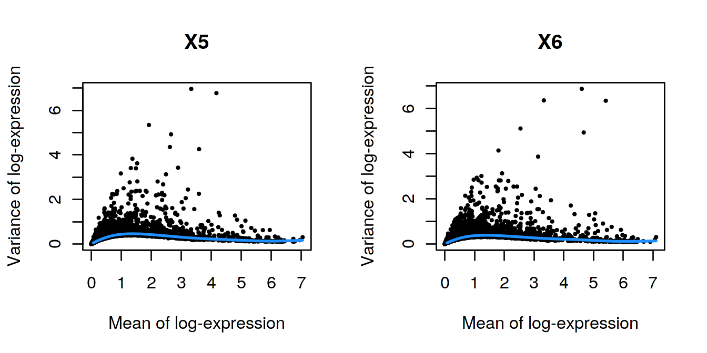
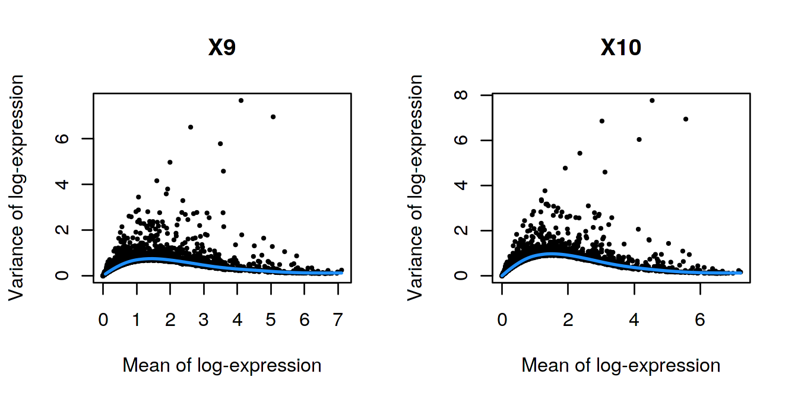
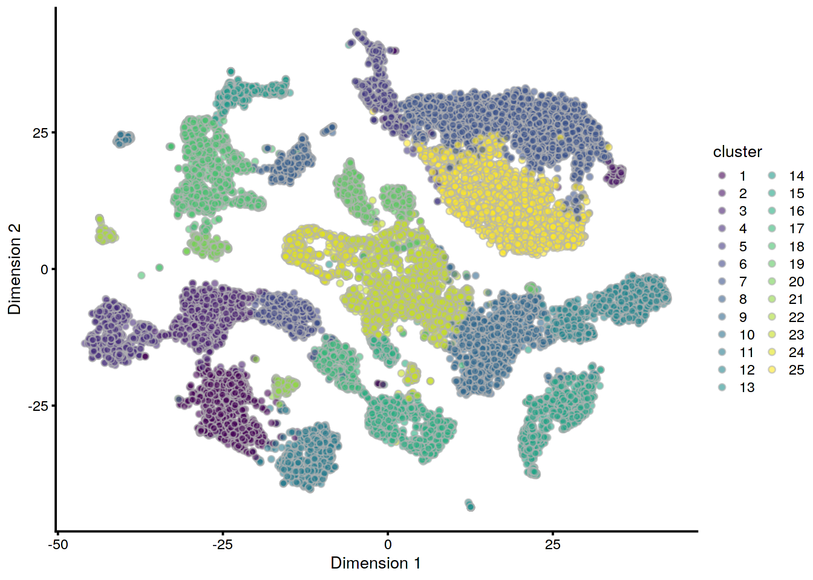
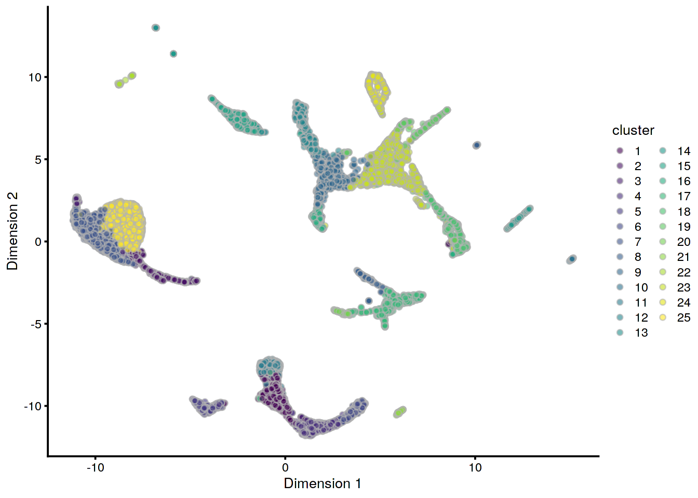

# Chimeric embryo 10X dataset

<script>
document.addEventListener("click", function (event) {
    if (event.target.classList.contains("aaron-collapse")) {
        event.target.classList.toggle("active");
        var content = event.target.nextElementSibling;
        if (content.style.display === "block") {
          content.style.display = "none";
        } else {
          content.style.display = "block";
        }
    }
})
</script>

<style>
.aaron-collapse {
  background-color: #eee;
  color: #444;
  cursor: pointer;
  padding: 18px;
  width: 100%;
  border: none;
  text-align: left;
  outline: none;
  font-size: 15px;
}

.aaron-content {
  padding: 0 18px;
  display: none;
  overflow: hidden;
  background-color: #f1f1f1;
}
</style>

## Introduction

This performs an analysis of the @pijuan2019singlcell dataset on mouse gastrulation.
Here, we examine chimeric embryos at the E7.5 stage of development 
where td-Tomato-positive embryonic stem cells (ESCs) were injected into a wild-type blastocyst.

## Analysis code

### Data loading


```r
library(MouseGastrulationData)
sce.chimera <- WTChimeraData(samples=5:10)
sce.chimera
```

```
## class: SingleCellExperiment 
## dim: 29453 20935 
## metadata(0):
## assays(1): counts
## rownames(29453): ENSMUSG00000051951 ENSMUSG00000089699 ...
##   ENSMUSG00000095742 tomato-td
## rowData names(2): ENSEMBL SYMBOL
## colnames(20935): cell_9769 cell_9770 ... cell_30702 cell_30703
## colData names(10): cell barcode ... closest.cell doub.density
## reducedDimNames(2): pca.corrected.E7.5 pca.corrected.E8.5
## spikeNames(0):
## altExpNames(0):
```


### Feature annotation


```r
library(scater)
rownames(sce.chimera) <- uniquifyFeatureNames(
    rowData(sce.chimera)$ENSEMBL, rowData(sce.chimera)$SYMBOL)
```

### Quality control

Quality control on the cells has already been performed by the authors, so we will not repeat it here.
We additionally remove cells that are labelled as stripped nuclei or doublets.


```r
drop <- sce.chimera$celltype.mapped %in% c("stripped", "Doublet")
sce.chimera <- sce.chimera[,!drop]
```

### Normalization

We use the pre-computed size factors in `sce.chimera`.


```r
sce.chimera <- logNormCounts(sce.chimera)
```

### Variance modelling

Retaining all genes with any positive biological component, to preserve as much signal as possible across many samples.


```r
library(scran)
dec.chimera <- modelGeneVar(sce.chimera, block=sce.chimera$sample)
chosen.hvgs <- dec.chimera$bio > 0
```

### Merging

We use a hierarchical merge to first merge together replicates with the same genotype, 
and then merge samples across different genotypes.


```r
library(batchelor)
merged <- correctExperiments(sce.chimera, 
    batch=sce.chimera$sample, 
    subset.row=chosen.hvgs,
    PARAM=FastMnnParam(
        merge.order=list(
            list(1,3,5), # WT (3 replicates)
            list(2,4,6)  # td-Tomato (3 replicates)
        )
    )
)
```

### Clustering


```r
g <- buildSNNGraph(merged, use.dimred="corrected")
clusters <- igraph::cluster_louvain(g)
merged$cluster <- factor(clusters$membership)
```

### Dimensionality reduction

We use an external algorithm to compute nearest neighbors for greater speed.


```r
merged <- runTSNE(merged, dimred="corrected", external_neighbors=TRUE)
merged <- runUMAP(merged, dimred="corrected", external_neighbors=TRUE)
```

## Results

### Variance modelling


```r
par(mfrow=c(1,2))
blocked.stats <- dec.chimera$per.block
for (i in colnames(blocked.stats)) {
    current <- blocked.stats[[i]]
    plot(current$mean, current$total, main=i, pch=16, cex=0.5,
        xlab="Mean of log-expression", ylab="Variance of log-expression")
    curfit <- metadata(current)
    curve(curfit$trend(x), col='dodgerblue', add=TRUE, lwd=2)
}
```



### Batch correction


```r
metadata(merged)$merge.info$lost.var
```

```
##              5         6         7         8        9       10
## [1,] 0.000e+00 0.0204433 0.000e+00 0.0169566 0.000000 0.000000
## [2,] 0.000e+00 0.0007387 0.000e+00 0.0004407 0.000000 0.015474
## [3,] 3.090e-02 0.0000000 2.012e-02 0.0000000 0.000000 0.000000
## [4,] 9.015e-05 0.0000000 8.259e-05 0.0000000 0.018047 0.000000
## [5,] 4.321e-03 0.0072542 4.124e-03 0.0078309 0.003832 0.007789
```

### Clustering


```r
table(Cluster=merged$cluster, Sample=merged$sample)
```

```
##        Sample
## Cluster   5   6   7   8   9  10
##      1  152  72  85  88 164 385
##      2   19   7  13  17  20  36
##      3  130  96 109  63 159 311
##      4   43  35  81  81  87 354
##      5   68  31 120 107  83 197
##      6  122  65  64  52  63 141
##      7  185 115 322 588 458 540
##      8   47  22  84  50  90 131
##      9  185  47 236 192 217 391
##      10   9   7  18  13  30  27
##      11 110  69  73  96 127 252
##      12  96  16 162 124 364 272
##      13   0   2   0  51   0   5
##      14  38  39  50  47 126 123
##      15 147  37 132 110 231 216
##      16 164  79 137 104 146 409
##      17 109  41  44  34  39 147
##      18  78  45 189 119 340 493
##      19 181  39  98  71 203 108
##      20   2   1   7   3  65 133
##      21  11  16  20   9  47  57
##      22   1   5   0  84   0  66
##      23 196  50 323 199 544 628
##      24  81  20  75  31 158 202
##      25 124  70 298 571 296 777
```


```r
plotTSNE(merged, colour_by="cluster")
```



```r
plotUMAP(merged, colour_by="cluster")
```




## Session Info {-}

<button class="aaron-collapse">View session info</button>
<div class="aaron-content">
```
R version 3.6.1 (2019-07-05)
Platform: x86_64-pc-linux-gnu (64-bit)
Running under: Ubuntu 14.04.6 LTS

Matrix products: default
BLAS:   /home/ramezqui/Rbuild/danbuild/R-3.6.1/lib/libRblas.so
LAPACK: /home/ramezqui/Rbuild/danbuild/R-3.6.1/lib/libRlapack.so

locale:
 [1] LC_CTYPE=en_US.UTF-8       LC_NUMERIC=C              
 [3] LC_TIME=en_US.UTF-8        LC_COLLATE=en_US.UTF-8    
 [5] LC_MONETARY=en_US.UTF-8    LC_MESSAGES=en_US.UTF-8   
 [7] LC_PAPER=en_US.UTF-8       LC_NAME=C                 
 [9] LC_ADDRESS=C               LC_TELEPHONE=C            
[11] LC_MEASUREMENT=en_US.UTF-8 LC_IDENTIFICATION=C       

attached base packages:
[1] parallel  stats4    stats     graphics  grDevices utils     datasets 
[8] methods   base     

other attached packages:
 [1] batchelor_1.1.15              scran_1.13.25                
 [3] scater_1.13.24                ggplot2_3.2.1                
 [5] MouseGastrulationData_0.99.12 SingleCellExperiment_1.7.11  
 [7] SummarizedExperiment_1.15.9   DelayedArray_0.11.6          
 [9] BiocParallel_1.19.3           matrixStats_0.55.0           
[11] Biobase_2.45.1                GenomicRanges_1.37.16        
[13] GenomeInfoDb_1.21.2           IRanges_2.19.16              
[15] S4Vectors_0.23.24             BiocGenerics_0.31.6          
[17] Cairo_1.5-10                  BiocStyle_2.13.2             
[19] OSCAUtils_0.0.1              

loaded via a namespace (and not attached):
 [1] bitops_1.0-6                  bit64_0.9-7                  
 [3] httr_1.4.1                    tools_3.6.1                  
 [5] backports_1.1.5               R6_2.4.0                     
 [7] irlba_2.3.3                   vipor_0.4.5                  
 [9] uwot_0.1.4                    DBI_1.0.0                    
[11] lazyeval_0.2.2                colorspace_1.4-1             
[13] withr_2.1.2                   tidyselect_0.2.5             
[15] gridExtra_2.3                 bit_1.1-14                   
[17] curl_4.2                      compiler_3.6.1               
[19] BiocNeighbors_1.3.5           labeling_0.3                 
[21] bookdown_0.14                 scales_1.0.0                 
[23] rappdirs_0.3.1                stringr_1.4.0                
[25] digest_0.6.21                 rmarkdown_1.16               
[27] XVector_0.25.0                pkgconfig_2.0.3              
[29] htmltools_0.3.6               limma_3.41.17                
[31] dbplyr_1.4.2                  rlang_0.4.0                  
[33] RSQLite_2.1.2                 shiny_1.3.2                  
[35] DelayedMatrixStats_1.7.2      dplyr_0.8.3                  
[37] RCurl_1.95-4.12               magrittr_1.5                 
[39] BiocSingular_1.1.7            GenomeInfoDbData_1.2.1       
[41] Matrix_1.2-17                 Rcpp_1.0.2                   
[43] ggbeeswarm_0.6.0              munsell_0.5.0                
[45] viridis_0.5.1                 edgeR_3.27.13                
[47] stringi_1.4.3                 yaml_2.2.0                   
[49] zlibbioc_1.31.0               Rtsne_0.15                   
[51] BiocFileCache_1.9.1           AnnotationHub_2.17.10        
[53] grid_3.6.1                    blob_1.2.0                   
[55] dqrng_0.2.1                   promises_1.0.1               
[57] ExperimentHub_1.11.6          crayon_1.3.4                 
[59] lattice_0.20-38               cowplot_1.0.0                
[61] locfit_1.5-9.1                zeallot_0.1.0                
[63] knitr_1.25                    pillar_1.4.2                 
[65] igraph_1.2.4.1                codetools_0.2-16             
[67] glue_1.3.1                    evaluate_0.14                
[69] RcppParallel_4.4.3            BiocManager_1.30.4           
[71] vctrs_0.2.0                   httpuv_1.5.2                 
[73] gtable_0.3.0                  purrr_0.3.2                  
[75] assertthat_0.2.1              xfun_0.10                    
[77] rsvd_1.0.2                    mime_0.7                     
[79] xtable_1.8-4                  later_0.8.0                  
[81] viridisLite_0.3.0             tibble_2.1.3                 
[83] AnnotationDbi_1.47.1          beeswarm_0.2.3               
[85] memoise_1.1.0                 statmod_1.4.32               
[87] interactiveDisplayBase_1.23.0
```
</div>
