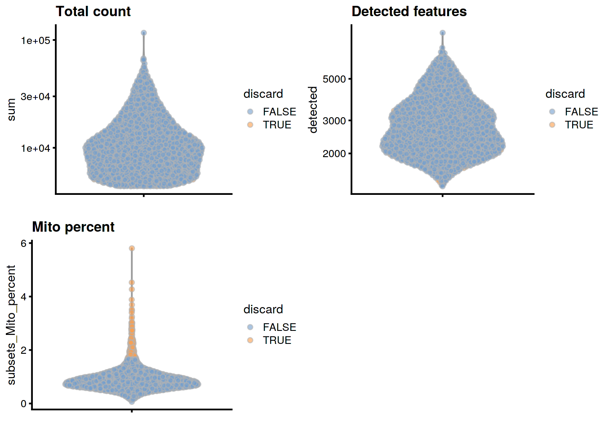
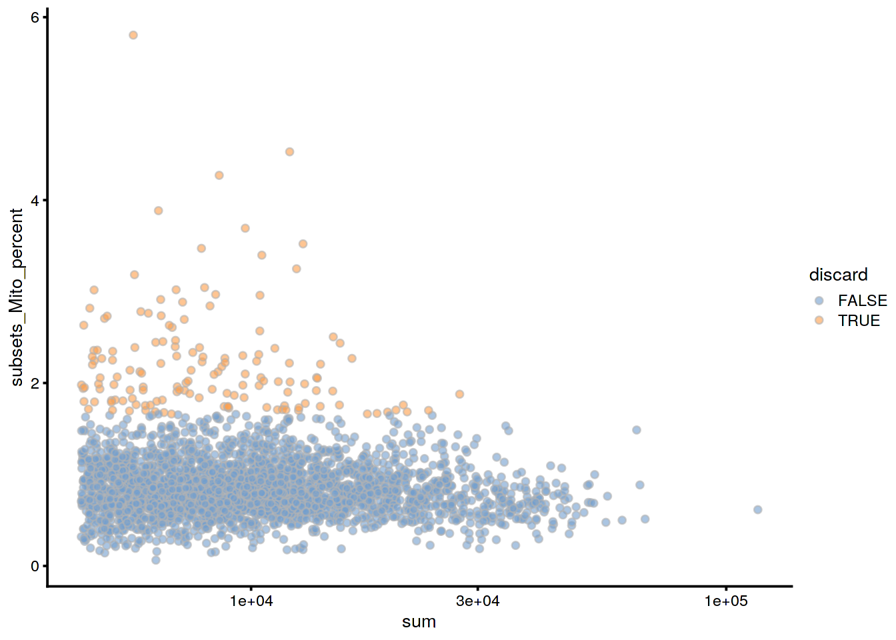
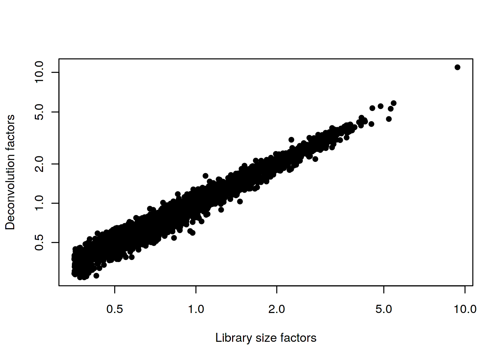
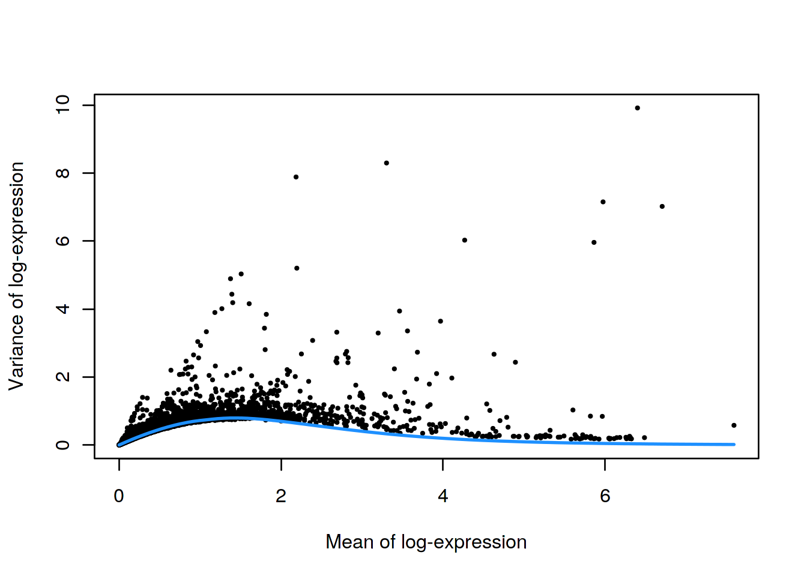
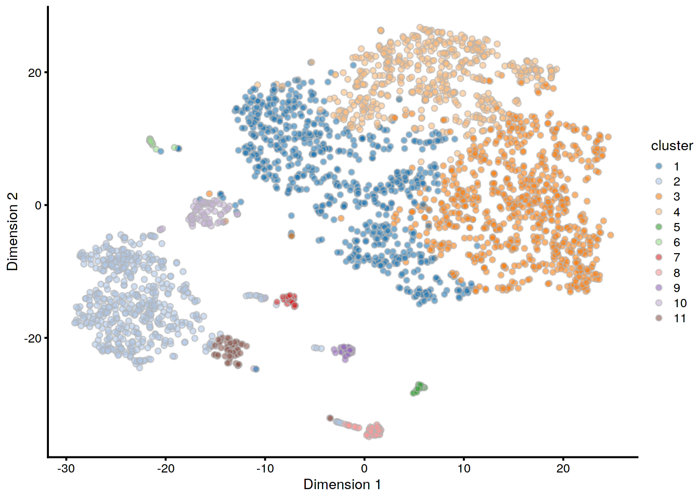

# Mammary gland dataset

<script>
document.addEventListener("click", function (event) {
    if (event.target.classList.contains("aaron-collapse")) {
        event.target.classList.toggle("active");
        var content = event.target.nextElementSibling;
        if (content.style.display === "block") {
          content.style.display = "none";
        } else {
          content.style.display = "block";
        }
    }
})
</script>

<style>
.aaron-collapse {
  background-color: #eee;
  color: #444;
  cursor: pointer;
  padding: 18px;
  width: 100%;
  border: none;
  text-align: left;
  outline: none;
  font-size: 15px;
}

.aaron-content {
  padding: 0 18px;
  display: none;
  overflow: hidden;
  background-color: #f1f1f1;
}
</style>

## Introduction

This performs an analysis of the @bach2017differentiation 10X Genomics dataset,
from which we will consider a single sample of epithelial cells from the mouse mammary gland during gestation.

## Analysis code

### Data loading


```r
library(scRNAseq)
sce.mam <- BachMammaryData(samples="G_1")
```

### Gene annotation


```r
library(scater)
rownames(sce.mam) <- uniquifyFeatureNames(
    rowData(sce.mam)$Ensembl, rowData(sce.mam)$Symbol)

library(AnnotationHub)
ens.mm.v97 <- AnnotationHub()[["AH73905"]]
rowData(sce.mam)$SEQNAME <- mapIds(ens.mm.v97, keys=rowData(sce.mam)$Ensembl,
    keytype="GENEID", column="SEQNAME")
```

### Quality control


```r
unfiltered <- sce.mam
```


```r
is.mito <- rowData(sce.mam)$SEQNAME == "MT"
stats <- perCellQCMetrics(sce.mam, subsets=list(Mito=which(is.mito)))
qc <- quickPerCellQC(stats, percent_subsets="subsets_Mito_percent")
sce.mam <- sce.mam[,!qc$discard]
```

### Normalization 


```r
library(scran)
set.seed(101000110)
clusters <- quickCluster(sce.mam)
sce.mam <- computeSumFactors(sce.mam, clusters=clusters)
sce.mam <- logNormCounts(sce.mam)
```

### Variance modelling

We use a Poisson-based technical trend to capture more genuine biological variation in the biological component.


```r
set.seed(00010101)
dec.mam <- modelGeneVarByPoisson(sce.mam)
top.mam <- getTopHVGs(dec.mam, prop=0.1)
```

### Dimensionality reduction


```r
library(BiocSingular)
set.seed(101010011)
sce.mam <- denoisePCA(sce.mam, technical=dec.mam, subset.row=top.mam)
sce.mam <- runTSNE(sce.mam, dimred="PCA")
```

### Clustering 

We use a higher `k` to obtain coarser clusters (for use in `doubletCluster()` later).


```r
snn.gr <- buildSNNGraph(sce.mam, use.dimred="PCA", k=25)
sce.mam$cluster <- factor(igraph::cluster_walktrap(snn.gr)$membership)
```

## Results

### Quality control statistics


```r
colData(unfiltered) <- cbind(colData(unfiltered), stats)
unfiltered$discard <- qc$discard

gridExtra::grid.arrange(
    plotColData(unfiltered, y="sum", colour_by="discard") + 
        scale_y_log10() + ggtitle("Total count"),
    plotColData(unfiltered, y="detected", colour_by="discard") + 
        scale_y_log10() + ggtitle("Detected features"),
    plotColData(unfiltered, y="subsets_Mito_percent", 
        colour_by="discard") + ggtitle("Mito percent"),
    ncol=2
)
```




```r
plotColData(unfiltered, x="sum", y="subsets_Mito_percent", 
    colour_by="discard") + scale_x_log10()
```




```r
colSums(as.matrix(qc))
```

```
##              low_lib_size            low_n_features 
##                         0                         0 
## high_subsets_Mito_percent                   discard 
##                       143                       143
```

### Normalization


```r
summary(sizeFactors(sce.mam))
```

```
##    Min. 1st Qu.  Median    Mean 3rd Qu.    Max. 
##   0.271   0.522   0.758   1.000   1.204  10.958
```


```r
plot(librarySizeFactors(sce.mam), sizeFactors(sce.mam), pch=16,
    xlab="Library size factors", ylab="Deconvolution factors", log="xy")     
```



### Variance modelling


```r
plot(dec.mam$mean, dec.mam$total, pch=16, cex=0.5,
    xlab="Mean of log-expression", ylab="Variance of log-expression")
curfit <- metadata(dec.mam)
curve(curfit$trend(x), col='dodgerblue', add=TRUE, lwd=2)
```



### Dimensionality reduction


```r
ncol(reducedDim(sce.mam, "PCA"))
```

```
## [1] 15
```

### Clustering


```r
table(sce.mam$cluster)
```

```
## 
##   1   2   3   4   5   6   7   8   9  10 
## 550 799 716 452  24  84  52  39  32  24
```


```r
plotTSNE(sce.mam, colour_by="cluster")
```



## Session Info {-}

<button class="aaron-collapse">View session info</button>
<div class="aaron-content">
```
R version 3.6.1 (2019-07-05)
Platform: x86_64-pc-linux-gnu (64-bit)
Running under: Ubuntu 14.04.5 LTS

Matrix products: default
BLAS:   /home/ramezqui/Rbuild/danbuild/R-3.6.1/lib/libRblas.so
LAPACK: /home/ramezqui/Rbuild/danbuild/R-3.6.1/lib/libRlapack.so

locale:
 [1] LC_CTYPE=en_US.UTF-8       LC_NUMERIC=C              
 [3] LC_TIME=en_US.UTF-8        LC_COLLATE=C              
 [5] LC_MONETARY=en_US.UTF-8    LC_MESSAGES=en_US.UTF-8   
 [7] LC_PAPER=en_US.UTF-8       LC_NAME=C                 
 [9] LC_ADDRESS=C               LC_TELEPHONE=C            
[11] LC_MEASUREMENT=en_US.UTF-8 LC_IDENTIFICATION=C       

attached base packages:
[1] parallel  stats4    stats     graphics  grDevices utils     datasets 
[8] methods   base     

other attached packages:
 [1] BiocSingular_1.1.7          scran_1.13.32              
 [3] ensembldb_2.9.6             AnnotationFilter_1.9.0     
 [5] GenomicFeatures_1.37.4      AnnotationDbi_1.47.1       
 [7] AnnotationHub_2.17.10       BiocFileCache_1.9.1        
 [9] dbplyr_1.4.2                scater_1.13.27             
[11] ggplot2_3.2.1               scRNAseq_1.99.8            
[13] SingleCellExperiment_1.7.11 SummarizedExperiment_1.15.9
[15] DelayedArray_0.11.8         BiocParallel_1.19.5        
[17] matrixStats_0.55.0          Biobase_2.45.1             
[19] GenomicRanges_1.37.17       GenomeInfoDb_1.21.2        
[21] IRanges_2.19.17             S4Vectors_0.23.25          
[23] BiocGenerics_0.31.6         Cairo_1.5-10               
[25] BiocStyle_2.13.2            OSCAUtils_0.0.1            

loaded via a namespace (and not attached):
 [1] Rtsne_0.15                    ggbeeswarm_0.6.0             
 [3] colorspace_1.4-1              XVector_0.25.0               
 [5] BiocNeighbors_1.3.5           bit64_0.9-7                  
 [7] interactiveDisplayBase_1.23.0 codetools_0.2-16             
 [9] knitr_1.25                    zeallot_0.1.0                
[11] Rsamtools_2.1.5               shiny_1.4.0                  
[13] BiocManager_1.30.8            compiler_3.6.1               
[15] httr_1.4.1                    dqrng_0.2.1                  
[17] backports_1.1.5               assertthat_0.2.1             
[19] Matrix_1.2-17                 fastmap_1.0.1                
[21] lazyeval_0.2.2                limma_3.41.18                
[23] later_1.0.0                   htmltools_0.4.0              
[25] prettyunits_1.0.2             tools_3.6.1                  
[27] rsvd_1.0.2                    igraph_1.2.4.1               
[29] gtable_0.3.0                  glue_1.3.1                   
[31] GenomeInfoDbData_1.2.1        dplyr_0.8.3                  
[33] rappdirs_0.3.1                Rcpp_1.0.2                   
[35] vctrs_0.2.0                   Biostrings_2.53.2            
[37] ExperimentHub_1.11.6          rtracklayer_1.45.6           
[39] DelayedMatrixStats_1.7.2      xfun_0.10                    
[41] stringr_1.4.0                 mime_0.7                     
[43] irlba_2.3.3                   statmod_1.4.32               
[45] XML_3.98-1.20                 edgeR_3.27.14                
[47] zlibbioc_1.31.0               scales_1.0.0                 
[49] hms_0.5.1                     promises_1.1.0               
[51] ProtGenerics_1.17.4           yaml_2.2.0                   
[53] curl_4.2                      memoise_1.1.0                
[55] gridExtra_2.3                 biomaRt_2.41.9               
[57] stringi_1.4.3                 RSQLite_2.1.2                
[59] rlang_0.4.0                   pkgconfig_2.0.3              
[61] bitops_1.0-6                  evaluate_0.14                
[63] lattice_0.20-38               purrr_0.3.3                  
[65] labeling_0.3                  GenomicAlignments_1.21.7     
[67] cowplot_1.0.0                 bit_1.1-14                   
[69] tidyselect_0.2.5              magrittr_1.5                 
[71] bookdown_0.14                 R6_2.4.0                     
[73] DBI_1.0.0                     pillar_1.4.2                 
[75] withr_2.1.2                   RCurl_1.95-4.12              
[77] tibble_2.1.3                  crayon_1.3.4                 
[79] rmarkdown_1.16                viridis_0.5.1                
[81] progress_1.2.2                locfit_1.5-9.1               
[83] grid_3.6.1                    blob_1.2.0                   
[85] digest_0.6.22                 xtable_1.8-4                 
[87] httpuv_1.5.2                  openssl_1.4.1                
[89] munsell_0.5.0                 beeswarm_0.2.3               
[91] viridisLite_0.3.0             vipor_0.4.5                  
[93] askpass_1.1                  
```
</div>
