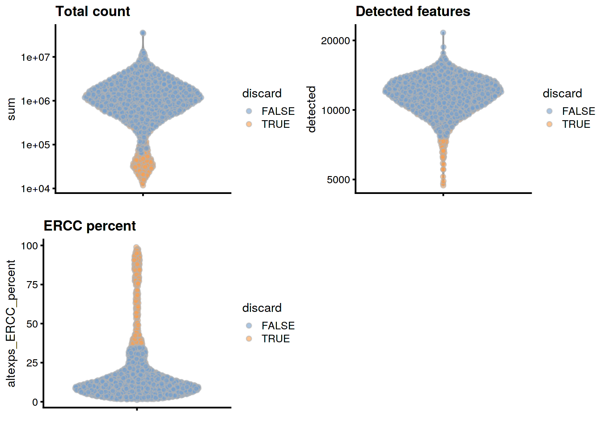
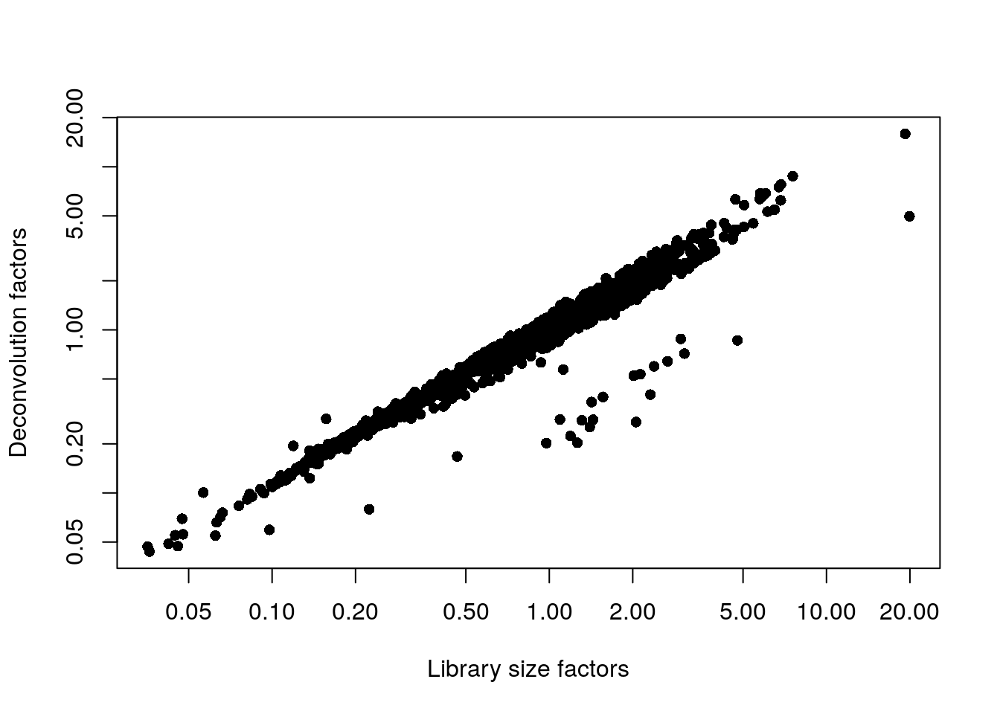
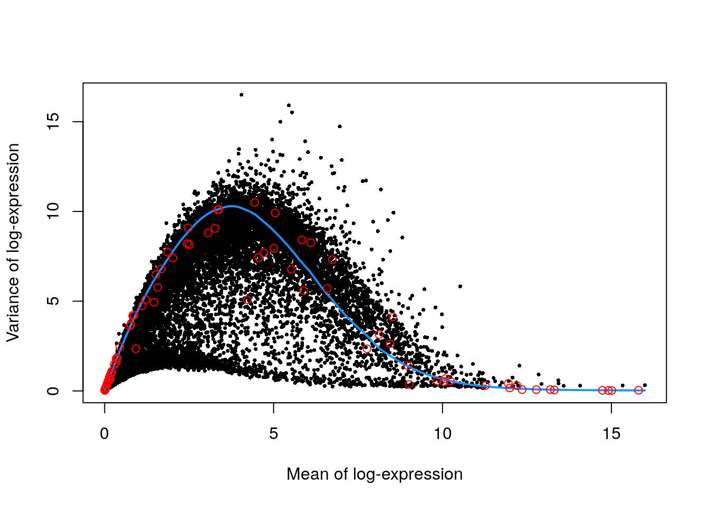
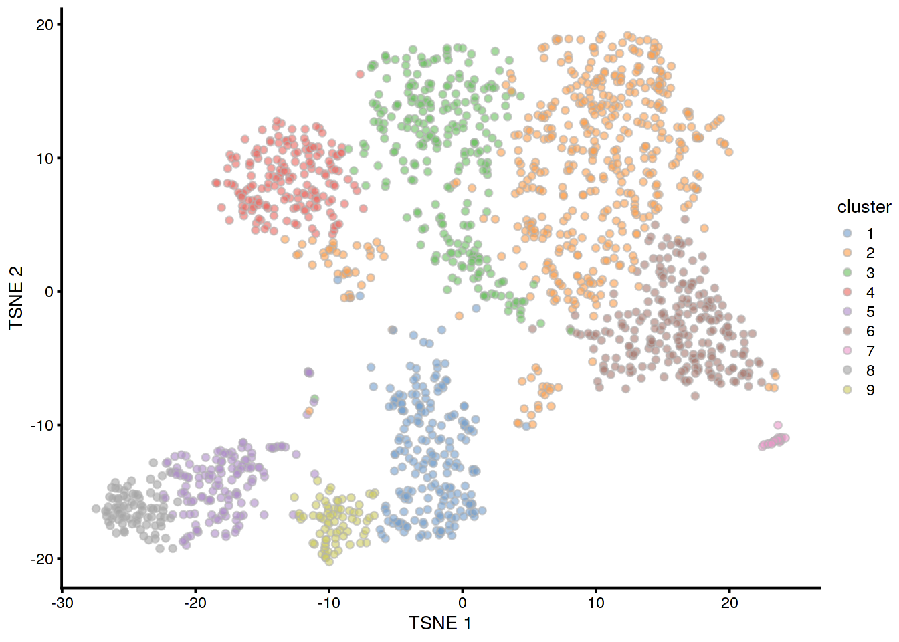
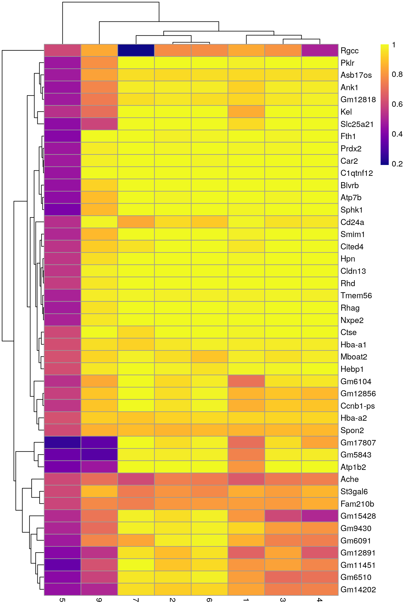
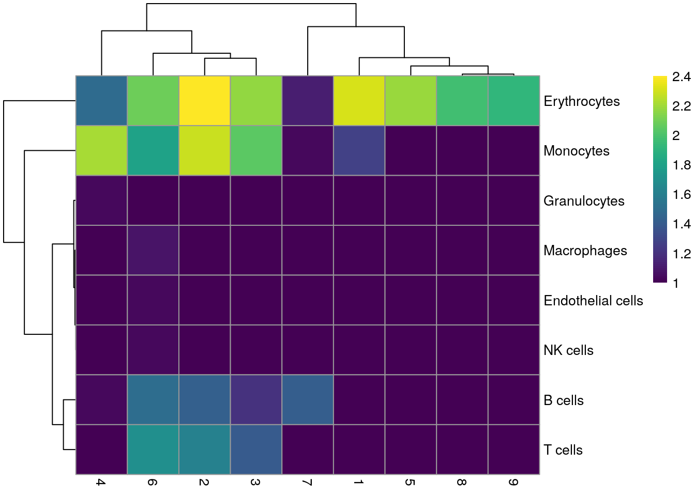

# Nestorowa mouse HSC (Smart-seq2) 

<script>
document.addEventListener("click", function (event) {
    if (event.target.classList.contains("aaron-collapse")) {
        event.target.classList.toggle("active");
        var content = event.target.nextElementSibling;
        if (content.style.display === "block") {
          content.style.display = "none";
        } else {
          content.style.display = "block";
        }
    }
})
</script>

<style>
.aaron-collapse {
  background-color: #eee;
  color: #444;
  cursor: pointer;
  padding: 18px;
  width: 100%;
  border: none;
  text-align: left;
  outline: none;
  font-size: 15px;
}

.aaron-content {
  padding: 0 18px;
  display: none;
  overflow: hidden;
  background-color: #f1f1f1;
}
</style>

## Introduction

This performs an analysis of the mouse haematopoietic stem cell (HSC) dataset generated with Smart-seq2 [@nestorowa2016singlecell].

## Data loading


```r
library(scRNAseq)
sce.nest <- NestorowaHSCData()
```


```r
library(AnnotationHub)
ens.mm.v97 <- AnnotationHub()[["AH73905"]]
anno <- select(ens.mm.v97, keys=rownames(sce.nest), 
    keytype="GENEID", columns=c("SYMBOL", "SEQNAME"))
rowData(sce.nest) <- anno[match(rownames(sce.nest), anno$GENEID),]
```

After loading and annotation, we inspect the resulting `SingleCellExperiment` object:


```r
sce.nest
```

```
## class: SingleCellExperiment 
## dim: 46078 1920 
## metadata(0):
## assays(1): counts
## rownames(46078): ENSMUSG00000000001 ENSMUSG00000000003 ...
##   ENSMUSG00000107391 ENSMUSG00000107392
## rowData names(3): GENEID SYMBOL SEQNAME
## colnames(1920): HSPC_007 HSPC_013 ... Prog_852 Prog_810
## colData names(2): cell.type FACS
## reducedDimNames(1): diffusion
## altExpNames(1): ERCC
```

## Quality control


```r
unfiltered <- sce.nest
```

For some reason, no mitochondrial transcripts are available, so we will perform quality control using the spike-in proportions only.


```r
library(scater)
stats <- perCellQCMetrics(sce.nest)
qc <- quickPerCellQC(stats, percent_subsets="altexps_ERCC_percent")
sce.nest <- sce.nest[,!qc$discard]
```

We examine the number of cells discarded for each reason.


```r
colSums(as.matrix(qc))
```

```
##              low_lib_size            low_n_features high_altexps_ERCC_percent 
##                       146                        28                       241 
##                   discard 
##                       264
```

We create some diagnostic plots for each metric (Figure \@ref(fig:unref-nest-qc-dist)).


```r
colData(unfiltered) <- cbind(colData(unfiltered), stats)
unfiltered$discard <- qc$discard

gridExtra::grid.arrange(
    plotColData(unfiltered, y="sum", colour_by="discard") +
        scale_y_log10() + ggtitle("Total count"),
    plotColData(unfiltered, y="detected", colour_by="discard") +
        scale_y_log10() + ggtitle("Detected features"),
    plotColData(unfiltered, y="altexps_ERCC_percent",
        colour_by="discard") + ggtitle("ERCC percent"),
    ncol=2
)
```

<div class="figure">

<p class="caption">(\#fig:unref-nest-qc-dist)Distribution of each QC metric across cells in the Nestorowa HSC dataset. Each point represents a cell and is colored according to whether that cell was discarded.</p>
</div>

## Normalization


```r
library(scran)
set.seed(101000110)
clusters <- quickCluster(sce.nest)
sce.nest <- computeSumFactors(sce.nest, clusters=clusters)
sce.nest <- logNormCounts(sce.nest)
```

We examine some key metrics for the distribution of size factors, and compare it to the library sizes as a sanity check (Figure \@ref(fig:unref-nest-norm)).


```r
summary(sizeFactors(sce.nest))
```

```
##    Min. 1st Qu.  Median    Mean 3rd Qu.    Max. 
##   0.044   0.422   0.748   1.000   1.249  15.927
```


```r
plot(librarySizeFactors(sce.nest), sizeFactors(sce.nest), pch=16,
    xlab="Library size factors", ylab="Deconvolution factors", log="xy")
```

<div class="figure">

<p class="caption">(\#fig:unref-nest-norm)Relationship between the library size factors and the deconvolution size factors in the Nestorowa HSC dataset.</p>
</div>

## Variance modelling

We use the spike-in transcripts to model the technical noise as a function of the mean (Figure \@ref(fig:unref-nest-var)).


```r
set.seed(00010101)
dec.nest <- modelGeneVarWithSpikes(sce.nest, "ERCC")
top.nest <- getTopHVGs(dec.nest, prop=0.1)
```


```r
plot(dec.nest$mean, dec.nest$total, pch=16, cex=0.5,
    xlab="Mean of log-expression", ylab="Variance of log-expression")
curfit <- metadata(dec.nest)
curve(curfit$trend(x), col='dodgerblue', add=TRUE, lwd=2)
points(curfit$mean, curfit$var, col="red")
```

<div class="figure">

<p class="caption">(\#fig:unref-nest-var)Per-gene variance as a function of the mean for the log-expression values in the Nestorowa HSC dataset. Each point represents a gene (black) with the mean-variance trend (blue) fitted to the spike-ins (red).</p>
</div>

## Dimensionality reduction


```r
set.seed(101010011)
sce.nest <- denoisePCA(sce.nest, technical=dec.nest, subset.row=top.nest)
sce.nest <- runTSNE(sce.nest, dimred="PCA")
```

We check that the number of retained PCs is sensible.


```r
ncol(reducedDim(sce.nest, "PCA"))
```

```
## [1] 9
```

## Clustering


```r
snn.gr <- buildSNNGraph(sce.nest, use.dimred="PCA")
colLabels(sce.nest) <- factor(igraph::cluster_walktrap(snn.gr)$membership)
```


```r
table(colLabels(sce.nest))
```

```
## 
##   1   2   3   4   5   6   7   8   9 
## 203 472 258 175 142 229  20  83  74
```


```r
plotTSNE(sce.nest, colour_by="label")
```

<div class="figure">

<p class="caption">(\#fig:unref-nest-tsne)Obligatory $t$-SNE plot of the Nestorowa HSC dataset, where each point represents a cell and is colored according to the assigned cluster.</p>
</div>

## Marker gene detection


```r
markers <- findMarkers(sce.nest, colLabels(sce.nest), 
    test.type="wilcox", direction="up", lfc=0.5,
    row.data=rowData(sce.nest)[,"SYMBOL",drop=FALSE])
```


To illustrate the manual annotation process, we examine the marker genes for one of the clusters.
Upregulation of _Car2_, _Hebp1_ amd hemoglobins indicates that cluster 8 contains erythroid precursors.


```r
chosen <- markers[['8']]
best <- chosen[chosen$Top <= 10,]
aucs <- getMarkerEffects(best, prefix="AUC")
rownames(aucs) <- best$SYMBOL

library(pheatmap)
pheatmap(aucs, color=viridis::plasma(100))
```

<div class="figure">

<p class="caption">(\#fig:unref-heat-nest-markers)Heatmap of the AUCs for the top marker genes in cluster 8 compared to all other clusters.</p>
</div>


## Cell type annotation


```r
library(SingleR)
mm.ref <- MouseRNAseqData()

# Renaming to symbols to match with reference row names.
renamed <- sce.nest
rownames(renamed) <- uniquifyFeatureNames(rownames(renamed),
    rowData(sce.nest)$SYMBOL)
labels <- SingleR(renamed, mm.ref, labels=mm.ref$label.fine)
```

Most clusters are not assigned to any single lineage (Figure \@ref(fig:unref-assignments-nest)), which is perhaps unsurprising given that HSCs are quite different from their terminal fates.
Cluster 8 is considered to contain erythrocytes, which is roughly consistent with our conclusions from the marker gene analysis above.


```r
tab <- table(labels$labels, colLabels(sce.nest))
pheatmap(log10(tab+10), color=viridis::viridis(100))
```

<div class="figure">

<p class="caption">(\#fig:unref-assignments-nest)Heatmap of the distribution of cells for each cluster in the Nestorowa HSC dataset, based on their assignment to each label in the mouse RNA-seq references from the _SingleR_ package.</p>
</div>


## Miscellaneous analyses

This dataset also contains information about the protein abundances in each cell from FACS.
There is barely any heterogeneity in the chosen markers across the clusters (Figure \@ref(fig:unref-nest-facs));
this is perhaps unsurprising given that all cells should be HSCs of some sort.


```r
Y <- colData(sce.nest)$FACS
keep <- rowSums(is.na(Y))==0 # Removing NA intensities.

se.averaged <- sumCountsAcrossCells(t(Y[keep,]), 
    colLabels(sce.nest)[keep], average=TRUE)
averaged <- assay(se.averaged)

log.intensities <- log2(averaged+1)
centered <- log.intensities - rowMeans(log.intensities)
pheatmap(centered, breaks=seq(-1, 1, length.out=101))
```

<div class="figure">

<p class="caption">(\#fig:unref-nest-facs)Heatmap of the centered log-average intensity for each target protein quantified by FACS in the Nestorowa HSC dataset.</p>
</div>


## Session Info {-}

<button class="aaron-collapse">View session info</button>
<div class="aaron-content">
```
R version 4.0.0 Patched (2020-05-01 r78341)
Platform: x86_64-pc-linux-gnu (64-bit)
Running under: Ubuntu 18.04.4 LTS

Matrix products: default
BLAS:   /home/luna/Software/R/R-4-0-branch/lib/libRblas.so
LAPACK: /home/luna/Software/R/R-4-0-branch/lib/libRlapack.so

locale:
 [1] LC_CTYPE=en_US.UTF-8       LC_NUMERIC=C              
 [3] LC_TIME=en_US.UTF-8        LC_COLLATE=en_US.UTF-8    
 [5] LC_MONETARY=en_US.UTF-8    LC_MESSAGES=en_US.UTF-8   
 [7] LC_PAPER=en_US.UTF-8       LC_NAME=C                 
 [9] LC_ADDRESS=C               LC_TELEPHONE=C            
[11] LC_MEASUREMENT=en_US.UTF-8 LC_IDENTIFICATION=C       

attached base packages:
[1] parallel  stats4    stats     graphics  grDevices utils     datasets 
[8] methods   base     

other attached packages:
 [1] SingleR_1.2.2               pheatmap_1.0.12            
 [3] scran_1.16.0                scater_1.16.0              
 [5] ggplot2_3.3.0               AnnotationHub_2.20.0       
 [7] BiocFileCache_1.12.0        dbplyr_1.4.3               
 [9] ensembldb_2.12.1            AnnotationFilter_1.12.0    
[11] GenomicFeatures_1.40.0      AnnotationDbi_1.50.0       
[13] scRNAseq_2.2.0              SingleCellExperiment_1.10.1
[15] SummarizedExperiment_1.18.1 DelayedArray_0.14.0        
[17] matrixStats_0.56.0          Biobase_2.48.0             
[19] GenomicRanges_1.40.0        GenomeInfoDb_1.24.0        
[21] IRanges_2.22.1              S4Vectors_0.26.0           
[23] BiocGenerics_0.34.0         BiocStyle_2.16.0           
[25] OSCAUtils_0.0.2            

loaded via a namespace (and not attached):
  [1] Rtsne_0.15                    ggbeeswarm_0.6.0             
  [3] colorspace_1.4-1              ellipsis_0.3.1               
  [5] XVector_0.28.0                BiocNeighbors_1.6.0          
  [7] farver_2.0.3                  bit64_0.9-7                  
  [9] interactiveDisplayBase_1.26.0 codetools_0.2-16             
 [11] knitr_1.28                    Rsamtools_2.4.0              
 [13] shiny_1.4.0.2                 BiocManager_1.30.10          
 [15] compiler_4.0.0                httr_1.4.1                   
 [17] dqrng_0.2.1                   assertthat_0.2.1             
 [19] Matrix_1.2-18                 fastmap_1.0.1                
 [21] lazyeval_0.2.2                limma_3.44.1                 
 [23] later_1.0.0                   BiocSingular_1.4.0           
 [25] htmltools_0.4.0               prettyunits_1.1.1            
 [27] tools_4.0.0                   igraph_1.2.5                 
 [29] rsvd_1.0.3                    gtable_0.3.0                 
 [31] glue_1.4.1                    GenomeInfoDbData_1.2.3       
 [33] dplyr_0.8.5                   rappdirs_0.3.1               
 [35] Rcpp_1.0.4.6                  vctrs_0.3.0                  
 [37] Biostrings_2.56.0             ExperimentHub_1.14.0         
 [39] rtracklayer_1.48.0            DelayedMatrixStats_1.10.0    
 [41] xfun_0.13                     stringr_1.4.0                
 [43] ps_1.3.3                      mime_0.9                     
 [45] lifecycle_0.2.0               irlba_2.3.3                  
 [47] statmod_1.4.34                XML_3.99-0.3                 
 [49] edgeR_3.30.0                  zlibbioc_1.34.0              
 [51] scales_1.1.1                  hms_0.5.3                    
 [53] promises_1.1.0                ProtGenerics_1.20.0          
 [55] RColorBrewer_1.1-2            yaml_2.2.1                   
 [57] curl_4.3                      memoise_1.1.0                
 [59] gridExtra_2.3                 biomaRt_2.44.0               
 [61] stringi_1.4.6                 RSQLite_2.2.0                
 [63] BiocVersion_3.11.1            highr_0.8                    
 [65] BiocParallel_1.22.0           rlang_0.4.6                  
 [67] pkgconfig_2.0.3               bitops_1.0-6                 
 [69] evaluate_0.14                 lattice_0.20-41              
 [71] purrr_0.3.4                   GenomicAlignments_1.24.0     
 [73] labeling_0.3                  cowplot_1.0.0                
 [75] bit_1.1-15.2                  processx_3.4.2               
 [77] tidyselect_1.1.0              magrittr_1.5                 
 [79] bookdown_0.19                 R6_2.4.1                     
 [81] DBI_1.1.0                     pillar_1.4.4                 
 [83] withr_2.2.0                   RCurl_1.98-1.2               
 [85] tibble_3.0.1                  crayon_1.3.4                 
 [87] rmarkdown_2.1                 viridis_0.5.1                
 [89] progress_1.2.2                locfit_1.5-9.4               
 [91] grid_4.0.0                    blob_1.2.1                   
 [93] callr_3.4.3                   digest_0.6.25                
 [95] xtable_1.8-4                  httpuv_1.5.2                 
 [97] openssl_1.4.1                 munsell_0.5.0                
 [99] beeswarm_0.2.3                viridisLite_0.3.0            
[101] vipor_0.4.5                   askpass_1.1                  
```
</div>
