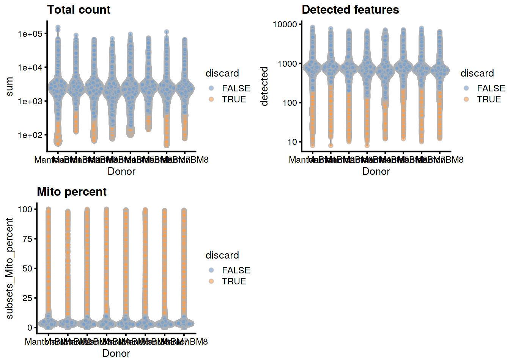
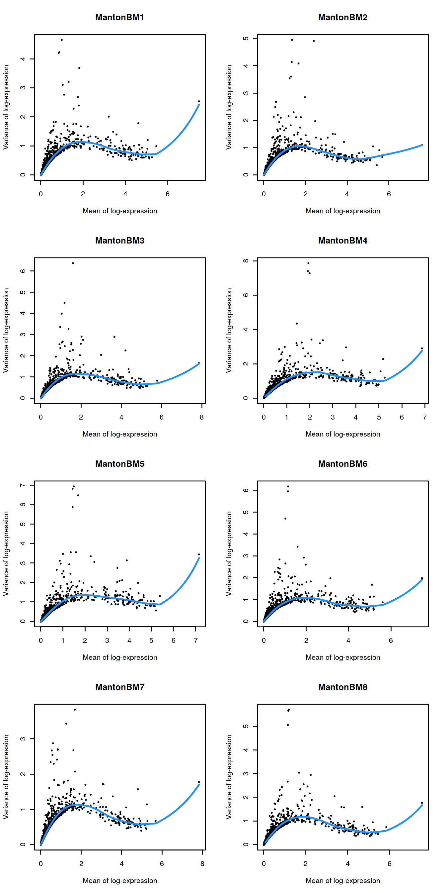
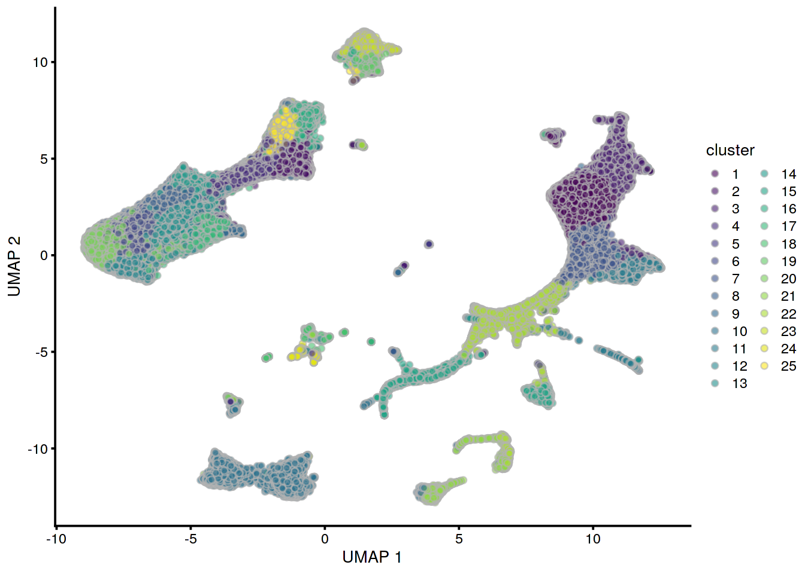
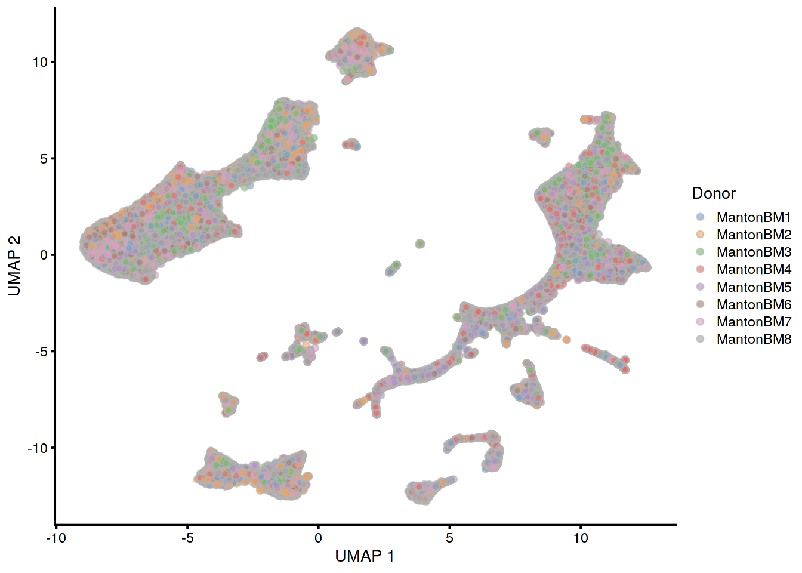
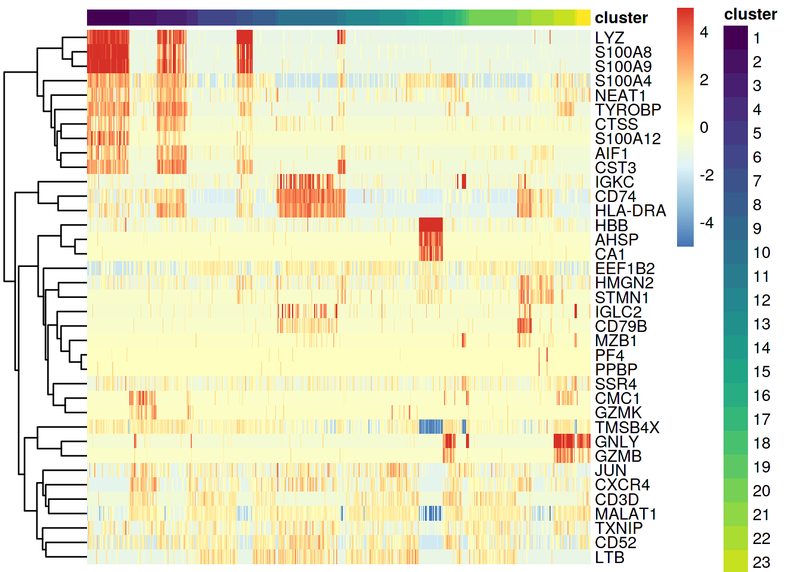
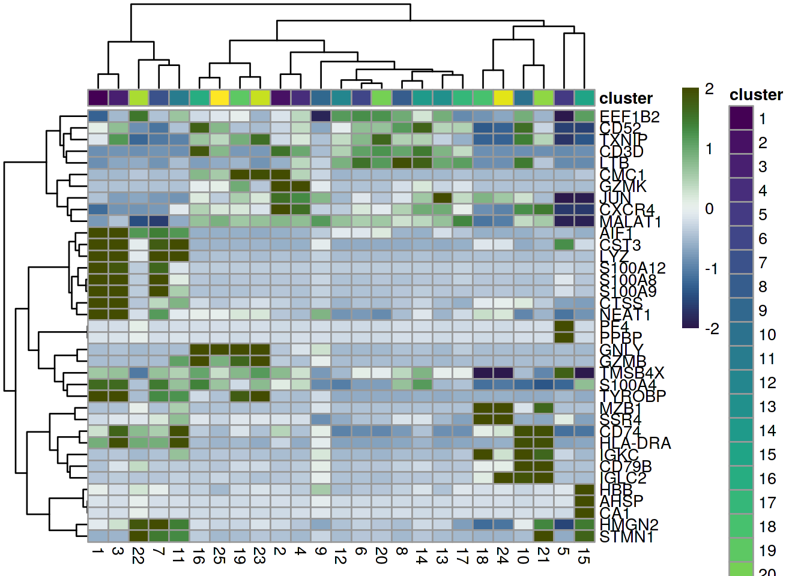
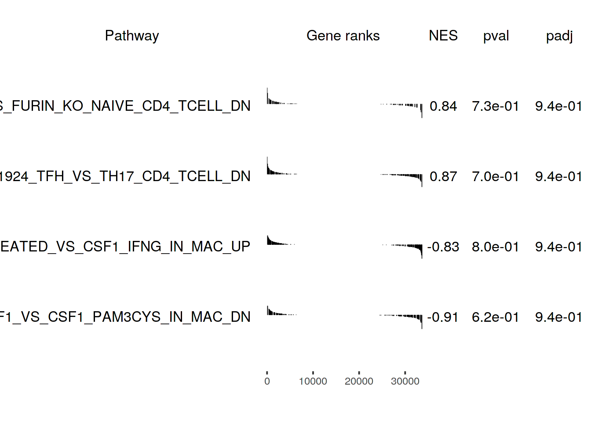
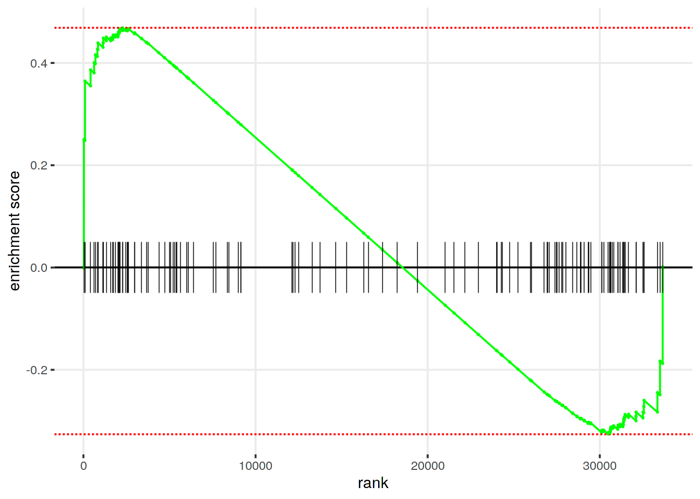

# Human Cell Atlas bone marrow dataset

<script>
document.addEventListener("click", function (event) {
    if (event.target.classList.contains("aaron-collapse")) {
        event.target.classList.toggle("active");
        var content = event.target.nextElementSibling;
        if (content.style.display === "block") {
          content.style.display = "none";
        } else {
          content.style.display = "block";
        }
    }
})
</script>

<style>
.aaron-collapse {
  background-color: #eee;
  color: #444;
  cursor: pointer;
  padding: 18px;
  width: 100%;
  border: none;
  text-align: left;
  outline: none;
  font-size: 15px;
}

.aaron-content {
  padding: 0 18px;
  display: none;
  overflow: hidden;
  background-color: #f1f1f1;
}
</style>

## Introduction

Here, we use an example dataset from the [Human Cell Atlas immune cell profiling project on bone marrow](https://preview.data.humancellatlas.org), which contains scRNA-seq data for 380,000 cells generated using the 10X Genomics technology.
This is a fairly big dataset that represents a good use case for the techniques in Chapter \@ref(dealing-with-big-data).

## Analysis code

### Data loading

This dataset is loaded via the *[HCAData](https://bioconductor.org/packages/3.10/HCAData)* package, which provides a ready-to-use `SingleCellExperiment` object. 


```r
library(HCAData)
sce.bone <- HCAData('ica_bone_marrow')
sce.bone$Donor <- sub("_.*", "", sce.bone$Barcode)
```


### Gene annotation

We use symbols in place of IDs for easier interpretation later.


```r
library(EnsDb.Hsapiens.v86)
rowData(sce.bone)$Chr <- mapIds(EnsDb.Hsapiens.v86, keys=rownames(sce.bone),
    column="SEQNAME", keytype="GENEID")

library(scater)
rownames(sce.bone) <- uniquifyFeatureNames(rowData(sce.bone)$ID,
    names = rowData(sce.bone)$Symbol)
```

### Quality control

Cell calling was not performed (see [here](https://s3.amazonaws.com/preview-ica-expression-data/Brief+ICA+Read+Me.pdf)) so we will perform QC using all metrics and block on the donor of origin during outlier detection.
We perform the calculation across multiple cores to speed things up.


```r
library(BiocParallel)
sce.bone <- addPerCellQC(sce.bone, subsets=list(
    Mito=which(rowData(sce.bone)$Chr=="MT")),
    BPPARAM=MulticoreParam())
unfiltered <- sce.bone

qc <- quickPerCellQC(colData(sce.bone), batch=sce.bone$Donor,
    percent_subset="subsets_Mito_percent")
sce.bone <- sce.bone[,!qc$discard]
```

### Normalization

For a minor speed-up, we piggy-back off the already-computed library sizes to avoid having to re-compute them as size factors.


```r
sce.bone <- logNormCounts(sce.bone, size_factors=sce.bone$sum)
```

### Variance modelling

Blocking on the donor to mitigate batch effects during HVG selection.


```r
library(scran)
dec.bone <- modelGeneVar(sce.bone, block=sce.bone$Donor,
    BPPARAM=MulticoreParam())
top.bone <- getTopHVGs(dec.bone, n=2000)
```

### Data integration

Here we use multiple cores, randomized SVD and approximate nearest-neighbor detection to speed up this step.


```r
library(batchelor)
library(BiocNeighbors)

set.seed(1010001)
merged.bone <- fastMNN(sce.bone, batch = sce.bone$Donor, subset.row = top.bone,
     BSPARAM=BiocSingular::RandomParam(deferred = TRUE),
     BNPARAM=AnnoyParam(),
     BPPARAM=MulticoreParam())

reducedDim(sce.bone, 'MNN') <- reducedDim(merged.bone, 'corrected')
```

### Dimensionality reduction

We set `external_neighbors=TRUE` to replace the internal NN search in the UMAP implementation with our parallelized approximate search.


```r
set.seed(01010100)
sce.bone <- runUMAP(sce.bone, dimred="MNN",
    external_neighbors=TRUE, 
    BNPARAM=AnnoyParam(),
    BPPARAM=MulticoreParam())
```

### Clustering

Graph-based clustering generates an excessively large intermediate graph, so we will switch to $k$-means instead.
Some parameter fiddling is required to improve convergence with such a large number of points.


```r
set.seed(1000)
kout.bone <- kmeans(reducedDim(sce.bone, "MNN"), 
    centers=25, iter.max=1000, algorithm="MacQueen") 
sce.bone$cluster <- factor(kout.bone$cluster)
```

### Differential expression

We identify marker genes for each cluster while blocking on the donor.


```r
markers.bone <- findMarkers(sce.bone, sce.bone$cluster,
    block = sce.bone$Donor, 
    direction = 'up', lfc = 1,
    BPPARAM = MulticoreParam())
```

## Results

### Quality control statistics


```r
unfiltered$discard <- qc$discard
gridExtra::grid.arrange(
    plotColData(unfiltered, x="Donor", y="sum", colour_by="discard") +
        scale_y_log10() + ggtitle("Total count"),
    plotColData(unfiltered, x="Donor", y="detected", colour_by="discard") +
        scale_y_log10() + ggtitle("Detected features"),
    plotColData(unfiltered, x="Donor", y="subsets_Mito_percent",
        colour_by="discard") + ggtitle("Mito percent"),
    ncol=2
)
```



### Normalization


```r
summary(sizeFactors(sce.bone))
```

```
##    Min. 1st Qu.  Median    Mean 3rd Qu.    Max. 
##    0.05    0.47    0.65    1.00    0.89   42.38
```

### Variance modelling


```r
par(mfrow=c(4,2))
blocked.stats <- dec.bone$per.block
for (i in colnames(blocked.stats)) {
    current <- blocked.stats[[i]]
    plot(current$mean, current$total, main=i, pch=16, cex=0.5,
        xlab="Mean of log-expression", ylab="Variance of log-expression")
    curfit <- metadata(current)
    curve(curfit$trend(x), col='dodgerblue', add=TRUE, lwd=2)
}
```



### Data integration


```r
metadata(merged.bone)$merge.info$lost.var
```

```
##      MantonBM1 MantonBM2 MantonBM3 MantonBM4 MantonBM5 MantonBM6 MantonBM7 MantonBM8
## [1,]  0.012256  0.008761  0.000000  0.000000  0.000000  0.000000  0.000000    0.0000
## [2,]  0.008980  0.008622  0.026541  0.000000  0.000000  0.000000  0.000000    0.0000
## [3,]  0.005772  0.003920  0.005370  0.027731  0.000000  0.000000  0.000000    0.0000
## [4,]  0.003920  0.002907  0.002771  0.003520  0.029597  0.000000  0.000000    0.0000
## [5,]  0.006138  0.003804  0.003783  0.006422  0.007867  0.035476  0.000000    0.0000
## [6,]  0.004596  0.004706  0.004205  0.004150  0.004697  0.005375  0.037082    0.0000
## [7,]  0.002547  0.002162  0.002839  0.002670  0.001953  0.002565  0.002319    0.0431
```

### Clustering


```r
table(Cluster=sce.bone$cluster, Donor=sce.bone$Donor)
```

```
##        Donor
## Cluster MantonBM1 MantonBM2 MantonBM3 MantonBM4 MantonBM5 MantonBM6 MantonBM7 MantonBM8
##      1       2927      1636      3513      7574      5578      3762      1500      4440
##      2       2455      1161      1322      2250       840      2153      1402      3198
##      3       1062      2530      5182      3499      1873       871      2002      1402
##      4       1317       977      2568       765      1022      1119      1674      2957
##      5         72        90        49        36        54        17        75        55
##      6       4674      3832      1731      1433      2017      5559      3979      2210
##      7       1219       253      1057      1874      2174       855       314      1119
##      8       1978      3863      1302      1302      1340      1054      2017      1399
##      9        317        46       455       524       271       261        98        87
##      10      5101     10838      2952      3770      5860      3384      5079      4065
##      11       505       319       973      1211       902       640       656       880
##      12      1802      1154      3763       719      3150      1068      4251      2450
##      13       573       146      3188       703      1497       509       428      5064
##      14      1325      1094       479      1173       425       521       692      1749
##      15      1725       706       709      2585      4832      1261      1271      1211
##      16       501      3183      1463       787       858      1048      1285      1205
##      17       570       277       711       776       849       782       354       709
##      18       265       201       283       218       434       213       179        94
##      19       512      1046       935      1170       347       484      1560       339
##      20      3504      2252       357      1974      1989      5248      5474      2239
##      21      2396      1408       133      1227       335       617      2286       668
##      22      1466       552      1005      2309      2024      1532      1382      1893
##      23       556      4943       530      2649       219      1281      1700       371
##      24       162       121       241       153       238       125        74       119
##      25       230      1268      4072       434       371       306      1111       592
```


```r
plotUMAP(sce.bone, colour_by="cluster")
```



```r
# TODO: add scrambling option in scater's plotting functions.
scrambled <- sample(ncol(sce.bone))
plotUMAP(sce.bone[,scrambled], colour_by="Donor")
```




## Downstream Analysis

### Marker Heatmaps

Visualizing the top markers is useful for the annotation of clusters. The top markers per cluster can be visualized as a heatmap at the single-cell level to ascertain expression variance of the discovered markers.


```r
## Grab top global markers per cluster; remove mito/RP* family genes
top_markers <- lapply(as.list(markers.bone), function(x) {
    rownames(x)[1:3]
})
top_markers <- sort(unique(unlist(top_markers)))
top_markers <- top_markers[!grepl('MT-|^RP', top_markers)]

## Draw heatmap - single-cell level
set.seed(1234)
dat <- sce.bone[, sample(ncol(sce.bone), 500)]

plotHeatmap(dat,
            features = top_markers,
            symmetric = TRUE, zlim = c(-5, 5), center = TRUE,
            order_columns_by = "cluster",
            show_colnames = FALSE)
```



To reduce plotting time and ease interpretation, the top markers per cluster can also be visualized at the cluster level by aggregating ("pseudobulking") by cluster.


```r
## Aggregate data to cluster level; average norm. gene expression
sce.agg <- aggregateAcrossCells(sce.bone,
                                ids = sce.bone$cluster,
                                subset_row = top_markers,
                                use_exprs_values = 'logcounts',
                                average = TRUE)


## Draw heatmap - aggregated by cluster level
plotHeatmap(sce.agg,
            features = top_markers,
            symmetric = TRUE, zlim = c(-2, 2), center = TRUE,
            scale = 'row',
            color = scico::scico(n = 101, palette = 'cork'),
            colour_columns_by = 'cluster',
            clustering_method = 'ward.D2',
            cluster_distance_cols = 'correlation',
            cluster_distance_rows = 'correlation',            
            show_colnames = TRUE)
```




## Gene set Enrichment Analysis

To interpret differential expression (DE) results, gene set enrichment analysis (GSEA) can be performed to annotate DE results. The first step is to acquire a mapping of ENTREZID to gene symbol.


```r
## Get mappings of ENTREZID to Symbol
library(org.Hs.eg.db)
keys_entrez <- keys(org.Hs.eg.db, 'ENTREZID')
mapping_es <- AnnotationDbi::select(org.Hs.eg.db,
                                    keys = keys_entrez,
                                    columns = c('ENTREZID', 'SYMBOL'),
                                    keytype = 'ENTREZID')
mapping_es$ENTREZID <- as.integer(mapping_es$ENTREZID)
```

The next is to parse the gene sets (here we use a "tidy" representation of MSigDB gene sets) and remap them.


```r
## Get pathways of interest - convert to list with symbol
## devtools::install_github('stephenturner/msigdf') # "tidy" MSigDB genesets
library(msigdf)
library(dplyr)
mdb <- dplyr::inner_join(msigdf.human, mapping_es,
                         by = c('entrez' = 'ENTREZID')) %>%
    dplyr::filter(collection == 'c7') %>%
    dplyr::select(-collection, -entrez) %>%
    dplyr::group_nest(geneset)
pathways <- purrr::map(mdb$data, function(x) {
    as.character(x$SYMBOL)
})
names(pathways) <- mdb$geneset
```

Finally, the DE results from the `findMarkers()` function are used to test for differential gene set enrichment using the `fgsea` package.


```r
## Get stats based on markers search
stats <- markers.bone[[1]]$logFC.2
names(stats) <- rownames(markers.bone[[1]])

## Run fast gene set enrichment analysis
## Returns a data.table object
library(fgsea)
gse <- fgsea(pathways = pathways, 
             stats = stats,
             minSize = 15,
             maxSize = 500,
             nperm = 5000)
```

The enrichment scores of the top up and down pathways can then be plotted as a table:


```r
## Get top pathways based on p-value
topPathwaysUp <- gse[gse$NES > 0][order(gse$pval)[1:2], ]$pathway
topPathwaysDown <- gse[gse$NES < 0][order(gse$pval)[1:2], ]$pathway
topPathways <- c(topPathwaysUp, rev(topPathwaysDown))

plotGseaTable(pathways[topPathways], stats,
              gse, 
              gseaParam = 0.5)
```



Or select pathways can also be plotted as a more traditional running score plot:


```r
## Traditional GSEA plot
plotEnrichment(pathways[[topPathways[1]]],
               stats)
```



### Trajectory analysis

Slingshot relies on providing a set of clusters on which to construct a trajectory.


```r
## Trajectory Analysis -------------------------------------
library(slingshot)
slc <- slingshot(sce.bone[, sce.bone$cluster %in% c(1, 2, 3)],
                 clusterLabels = 'cluster',
                 reducedDim = 'UMAP')
```


```r
## Interactive Exploration ---------------------------------
## library(iSEE)
## iSEE(sce) ## not run; opens a web browser GUI
```

The calculated principal curve can then be visualized on the UMAP space.


```r
## Trajectory analysis -------------------------------------
## Slingshot trajectory plot
library(RColorBrewer)
colors <- colorRampPalette(brewer.pal(11, 'Spectral')[-6])(100)
plotcol <- colors[cut(slc$slingPseudotime_1, breaks = 100)]
plot(reducedDims(slc)$UMAP, col = plotcol, pch=16, asp = 1)
lines(SlingshotDataSet(slc), lwd = 2, col = 'black')
```


## Session Info {-}

<button class="aaron-collapse">View session info</button>
<div class="aaron-content">
```
R version 3.6.1 (2019-07-05)
Platform: x86_64-pc-linux-gnu (64-bit)
Running under: Ubuntu 14.04.5 LTS

Matrix products: default
BLAS:   /home/ramezqui/Rbuild/danbuild/R-3.6.1/lib/libRblas.so
LAPACK: /home/ramezqui/Rbuild/danbuild/R-3.6.1/lib/libRlapack.so

locale:
 [1] LC_CTYPE=en_US.UTF-8       LC_NUMERIC=C               LC_TIME=en_US.UTF-8       
 [4] LC_COLLATE=C               LC_MONETARY=en_US.UTF-8    LC_MESSAGES=en_US.UTF-8   
 [7] LC_PAPER=en_US.UTF-8       LC_NAME=C                  LC_ADDRESS=C              
[10] LC_TELEPHONE=C             LC_MEASUREMENT=en_US.UTF-8 LC_IDENTIFICATION=C       

attached base packages:
[1] parallel  stats4    stats     graphics  grDevices utils     datasets  methods   base     

other attached packages:
 [1] fgsea_1.12.0                Rcpp_1.0.3                  dplyr_0.8.3                
 [4] msigdf_5.2                  org.Hs.eg.db_3.10.0         BiocNeighbors_1.4.0        
 [7] batchelor_1.2.2             scran_1.14.3                scater_1.14.3              
[10] ggplot2_3.2.1               EnsDb.Hsapiens.v86_2.99.0   ensembldb_2.10.0           
[13] AnnotationFilter_1.10.0     GenomicFeatures_1.38.0      AnnotationDbi_1.48.0       
[16] rhdf5_2.30.0                HCAData_1.2.0               SingleCellExperiment_1.8.0 
[19] SummarizedExperiment_1.16.0 DelayedArray_0.12.0         BiocParallel_1.20.0        
[22] matrixStats_0.55.0          Biobase_2.46.0              GenomicRanges_1.38.0       
[25] GenomeInfoDb_1.22.0         IRanges_2.20.0              S4Vectors_0.24.0           
[28] BiocGenerics_0.32.0         Cairo_1.5-10                BiocStyle_2.14.0           
[31] OSCAUtils_0.0.1            

loaded via a namespace (and not attached):
  [1] ggbeeswarm_0.6.0              colorspace_1.4-1              XVector_0.26.0               
  [4] scico_1.1.0                   bit64_0.9-7                   RSpectra_0.15-0              
  [7] interactiveDisplayBase_1.24.0 codetools_0.2-16              knitr_1.26                   
 [10] zeallot_0.1.0                 Rsamtools_2.2.0               dbplyr_1.4.2                 
 [13] pheatmap_1.0.12               uwot_0.1.4                    shiny_1.4.0                  
 [16] HDF5Array_1.14.0              BiocManager_1.30.9            compiler_3.6.1               
 [19] httr_1.4.1                    dqrng_0.2.1                   backports_1.1.5              
 [22] assertthat_0.2.1              Matrix_1.2-17                 fastmap_1.0.1                
 [25] lazyeval_0.2.2                limma_3.42.0                  later_1.0.0                  
 [28] BiocSingular_1.2.0            htmltools_0.4.0               prettyunits_1.0.2            
 [31] tools_3.6.1                   igraph_1.2.4.1                rsvd_1.0.2                   
 [34] gtable_0.3.0                  glue_1.3.1                    GenomeInfoDbData_1.2.2       
 [37] rappdirs_0.3.1                fastmatch_1.1-0               vctrs_0.2.0                  
 [40] Biostrings_2.54.0             ExperimentHub_1.12.0          rtracklayer_1.46.0           
 [43] DelayedMatrixStats_1.8.0      xfun_0.11                     stringr_1.4.0                
 [46] mime_0.7                      irlba_2.3.3                   statmod_1.4.32               
 [49] XML_3.98-1.20                 AnnotationHub_2.18.0          edgeR_3.28.0                 
 [52] zlibbioc_1.32.0               scales_1.0.0                  hms_0.5.2                    
 [55] promises_1.1.0                ProtGenerics_1.18.0           RColorBrewer_1.1-2           
 [58] yaml_2.2.0                    curl_4.2                      memoise_1.1.0                
 [61] gridExtra_2.3                 biomaRt_2.42.0                stringi_1.4.3                
 [64] RSQLite_2.1.2                 BiocVersion_3.10.1            rlang_0.4.1                  
 [67] pkgconfig_2.0.3               bitops_1.0-6                  evaluate_0.14                
 [70] lattice_0.20-38               purrr_0.3.3                   Rhdf5lib_1.8.0               
 [73] labeling_0.3                  GenomicAlignments_1.22.1      cowplot_1.0.0                
 [76] bit_1.1-14                    tidyselect_0.2.5              magrittr_1.5                 
 [79] bookdown_0.15                 R6_2.4.1                      DBI_1.0.0                    
 [82] pillar_1.4.2                  withr_2.1.2                   RCurl_1.95-4.12              
 [85] tibble_2.1.3                  crayon_1.3.4                  BiocFileCache_1.10.2         
 [88] rmarkdown_1.17                viridis_0.5.1                 progress_1.2.2               
 [91] locfit_1.5-9.1                grid_3.6.1                    data.table_1.12.6            
 [94] blob_1.2.0                    digest_0.6.22                 xtable_1.8-4                 
 [97] httpuv_1.5.2                  RcppParallel_4.4.4            openssl_1.4.1                
[100] munsell_0.5.0                 beeswarm_0.2.3                viridisLite_0.3.0            
[103] vipor_0.4.5                   askpass_1.1                  
```
</div>
