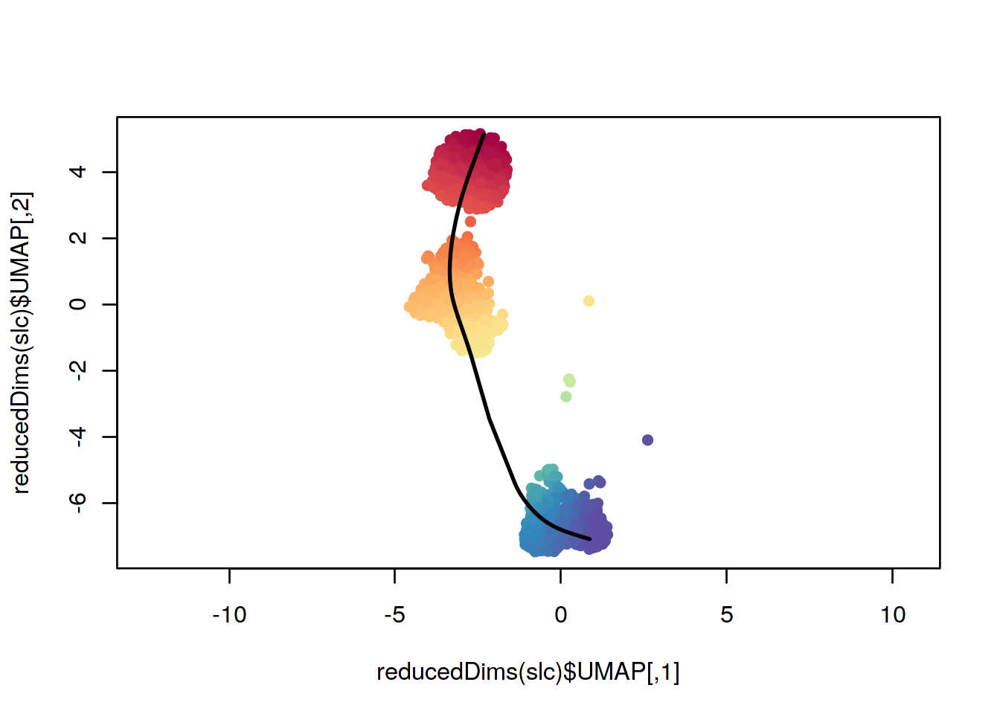
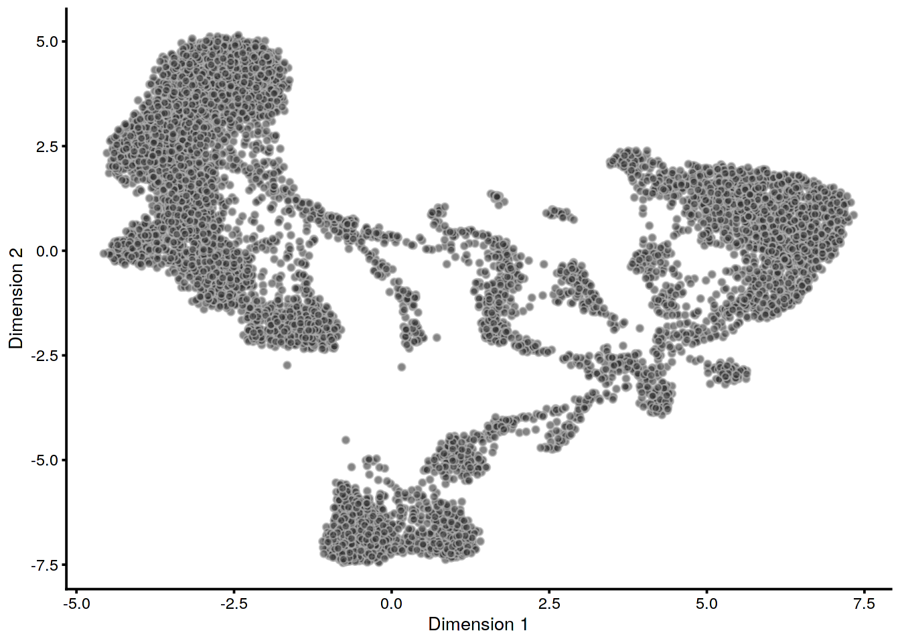
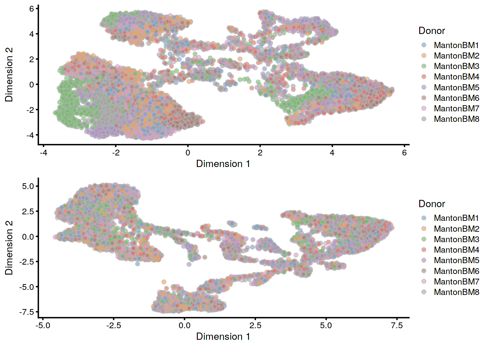
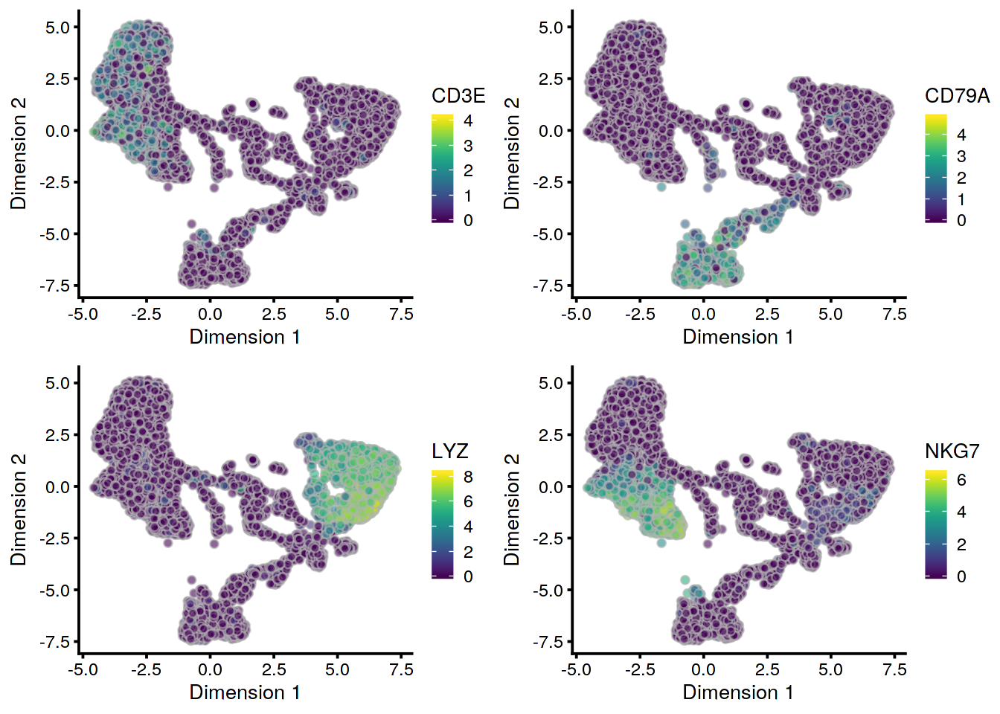
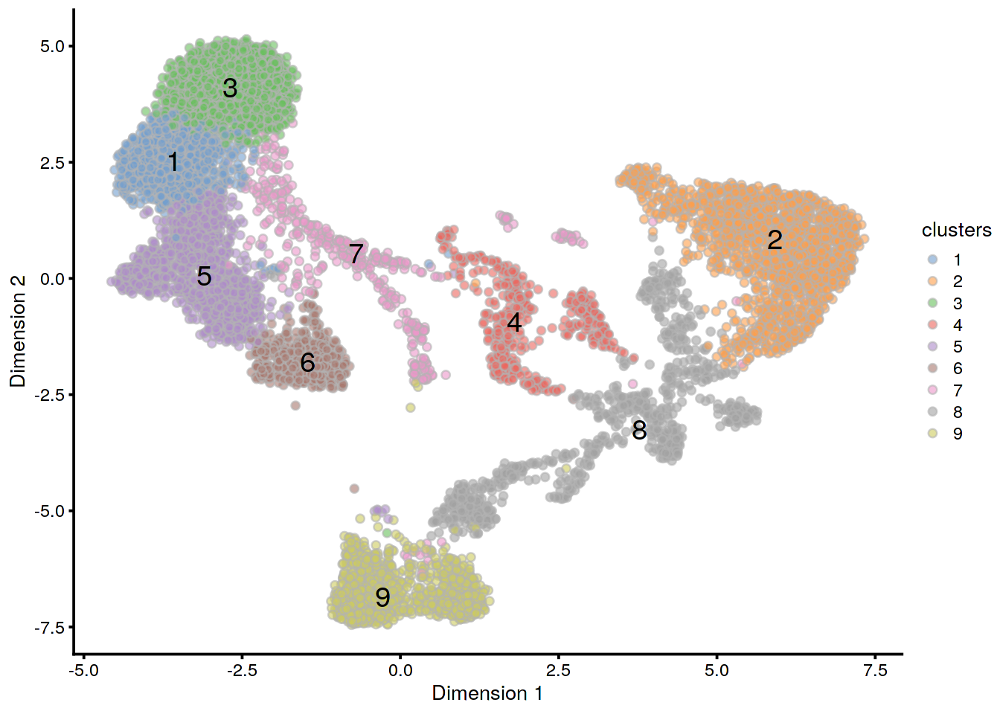
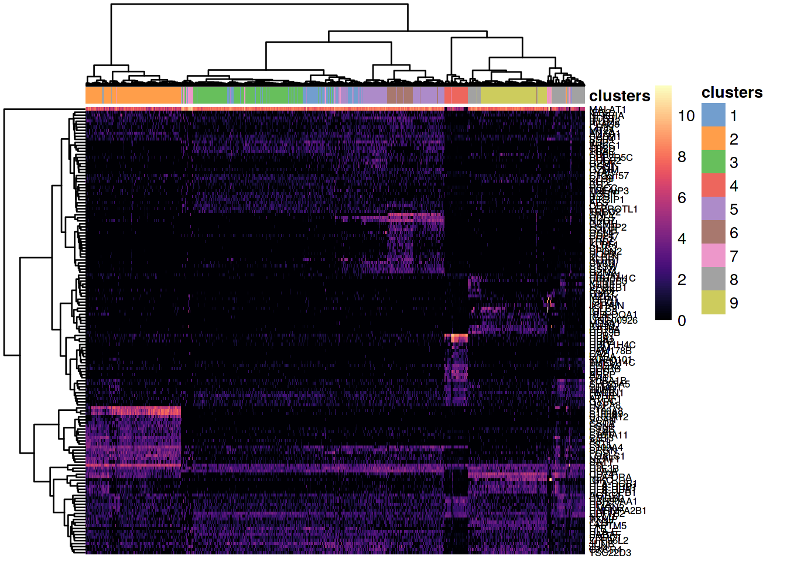
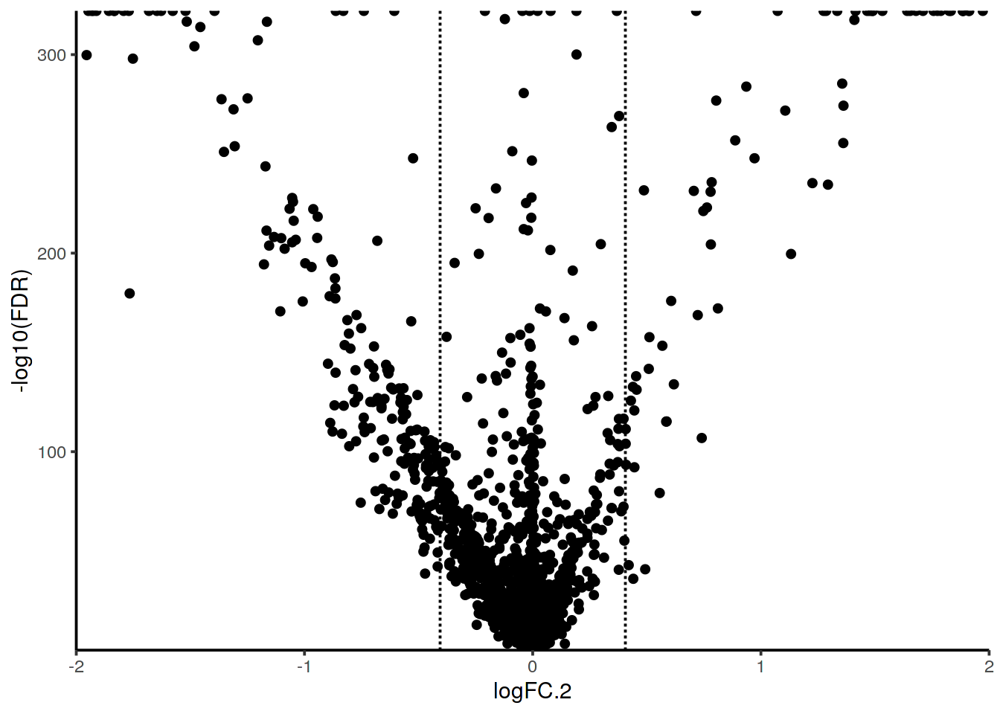
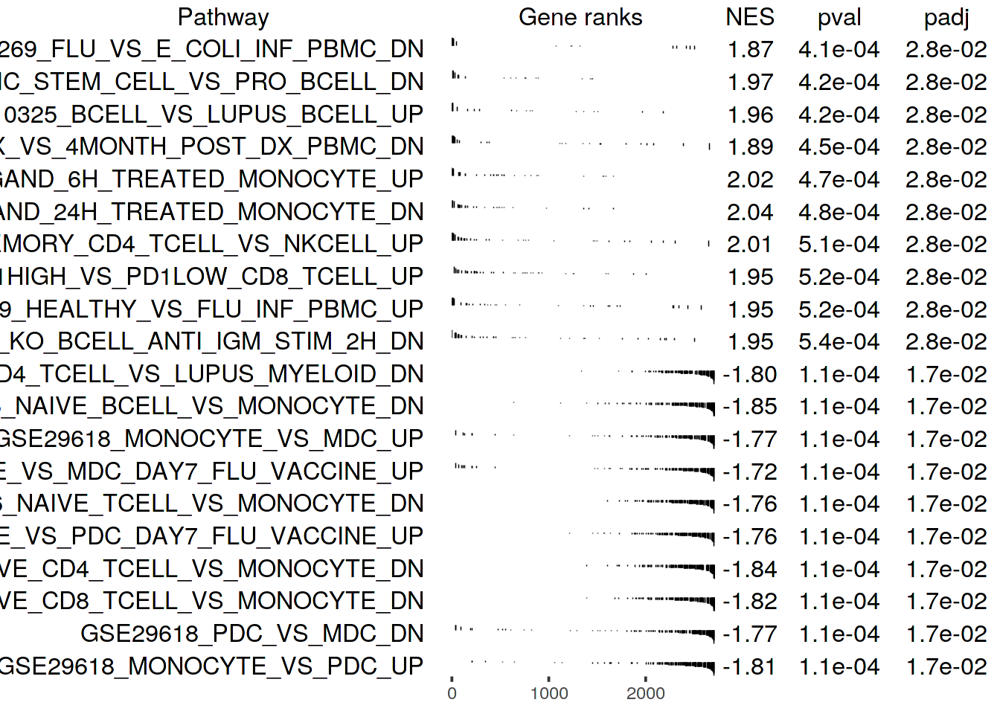
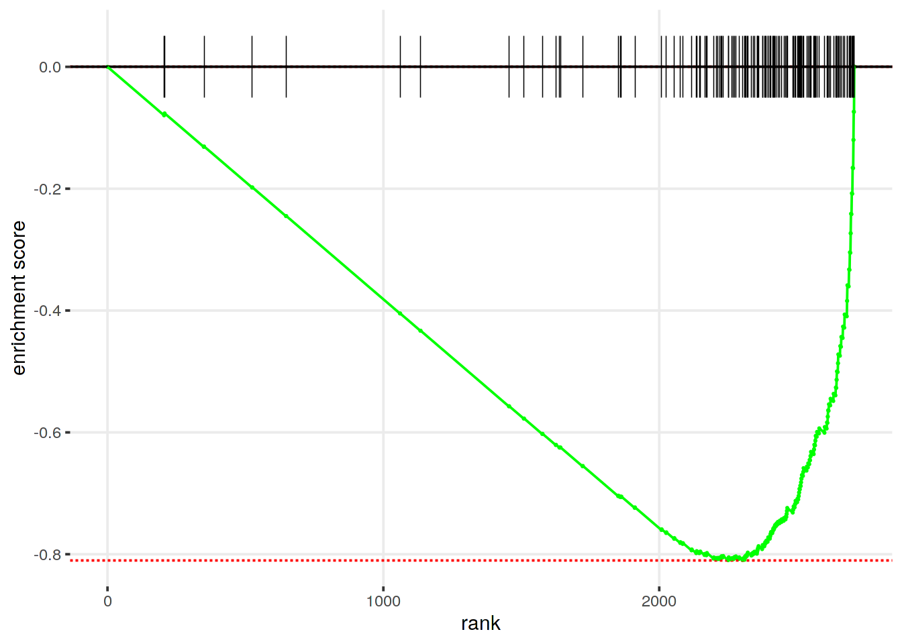

# Human Cell Atlas bone marrow dataset

<script>
document.addEventListener("click", function (event) {
    if (event.target.classList.contains("aaron-collapse")) {
        event.target.classList.toggle("active");
        var content = event.target.nextElementSibling;
        if (content.style.display === "block") {
          content.style.display = "none";
        } else {
          content.style.display = "block";
        }
    }
})
</script>

<style>
.aaron-collapse {
  background-color: #eee;
  color: #444;
  cursor: pointer;
  padding: 18px;
  width: 100%;
  border: none;
  text-align: left;
  outline: none;
  font-size: 15px;
}

.aaron-content {
  padding: 0 18px;
  display: none;
  overflow: hidden;
  background-color: #f1f1f1;
}
</style>

## Introduction

To make it as easy as possible to get started, here we simply provide a script that walks through a typical, basic scRNA-seq analysis in code, with prose as comments (`#`), and all visualization held until the end of the script. 

Here, we use an example dataset from the [*Human Cell Atlas* immune cell profiling project on bone marrow](https://preview.data.humancellatlas.org). This dataset is loaded via the *HCAData* package, which provides a ready to use *SingleCellExperiment* object. 

Note that the *HCAData* bone marrow dataset is comprised of 8 donors, so we have added an integration step to ameliorate batch effects caused by different donors. However, for use cases where integration is not necessary (e.g. no expected batch effects), we note in the code what to skip and relevant arguments to replace.

Lastly, note that some arguments are added for the sake of reducing computational runtime and can be modified or removed. These include parallelization via `BPPARAM`, and different algorithms for SVD and nearest-neighbor via `BSPARAM` and `BNPARAM`. See the "Adaptations for Large-scale Data" chapter for more information on these arguments.


## Code


```r
## Setup ---------------------------------------------------
## not run - uncomment these lines to install necessary pkgs
## install.packages('BiocManager')
## BiocManager::install(version = 'devel') # devel=3.10
## BiocManager::install(c(
##   'HCAData',                       # dataset
##   'scater', 'scran', 'batchelor',  # processing + DE + batch correction
##   'igraph',                        # clustering
##   'slingshot',                     # Trajectory
##   'iSEE'                           # interactive viz
## ))
```


```r
## Import data into R --------------------------------------
## For reading in data directly from CellRanger output
## use the lines below and replace with proper paths to data
## append any cell metadata as needed to colData()
## library(DropletUtils)
## sce <- read10xCounts('/path/to/cellranger/outs/')
## For this quick-start: Human Cell Atlas (HCA) data
library(HCAData)
sce <- HCAData('ica_bone_marrow')
## subsample for better brevity of compilation
set.seed(1234)
sce <- sce[, sample(ncol(sce), 10000)]
## Split out donor based on barcode
Donor <- lapply(sce$Barcode, strsplit, '_')
Donor <- unlist(lapply(Donor, function(x) { x[[1]][1] }))
sce$Donor <- Donor
## Convert DelayedArray to regular matrix
counts(sce) <- as.matrix(counts(sce))
```


```r
## Quality Control -----------------------------------------
library(scater)
sce <- calculateQCMetrics(sce,
                          BPPARAM = BiocParallel::MulticoreParam())
## remove "bad" cells by total counts/features per cell
filt <- sce$total_counts > 500 & sce$total_features_by_counts > 100
sce <- sce[, filt]
## to ease computation, remove low frequency genes from `sce`
num_reads <- 1                  # minimum 1 read
num_cells <- 0.025 * ncol(sce)   # in at least 2.5% of all cells
keep <- rowSums(counts(sce) >= num_reads) >= num_cells
sce <- sce[keep, ]
## for readability, use Symbols in lieu of IDs as rownames
uniq_feats <- uniquifyFeatureNames(ID = rowData(sce)$ID,
                                   names = rowData(sce)$Symbol)
rownames(sce) <- uniq_feats
```


```r
## Normalization -------------------------------------------
sce <- normalize(sce)
```


```r
## Feature Selection ---------------------------------------
library(scran)
fit <- trendVar(sce, use.spikes = FALSE)
dec <- decomposeVar(sce, fit)
hvg <- rownames(dec)[dec$bio > 0] # save gene names
```


```r
## Integration ---------------------------------------------
## only perform this section if there is a batch effect
library(batchelor)
set.seed(1234)
mnn <- fastMNN(sce, batch = sce$Donor,
               subset.row = hvg,
               BSPARAM = BiocSingular::IrlbaParam(deferred = TRUE),
               BNPARAM = BiocNeighbors::AnnoyParam(),
               BPPARAM = BiocParallel::MulticoreParam())
reducedDim(sce, 'MNN') <- reducedDim(mnn, 'corrected')
```


```r
## Dimensionality Reduction --------------------------------
## note on `use_dimred` arg: specifies which precomputed
## dimension reduction to use in `sce`; if there is none,
## it will first calculate and save PCA to `sce` then UMAP
set.seed(1234)
sce <- runUMAP(sce,
               use_dimred = 'MNN', # omit if `fastMNN()` not run
               BNPARAM = BiocNeighbors::AnnoyParam(),
               BPPARAM = BiocParallel::MulticoreParam(),
               ## unnecessary options, only used to make a pretty graph
               min_dist = 0.5, repulsion_strength = 0.25,
               spread = 0.7,
               n_neighbors = 15)
```


```r
## Clustering ----------------------------------------------
library(igraph)
## replace `use.dimred` with 'PCA' if no integration was performed
## this will be automatically added via `runUMAP` above
set.seed(1234)
g <- buildSNNGraph(sce, use.dimred = 'MNN',
                   k = 30,  # higher = bigger clusters
                   BNPARAM = BiocNeighbors::AnnoyParam(),
                   BPPARAM = BiocParallel::MulticoreParam())
clusters <- as.factor(igraph::cluster_louvain(g)$membership)
sce$clusters <- clusters
```


```r
## Differential Expression ---------------------------------
## pval.type = 'all' : only get globally unique markers
markers <- findMarkers(sce, clusters = sce$clusters,
                       block = sce$Donor, # use to get within-donor DE
                       direction = 'up', lfc = 1.5,
                       pval.type = "all", # get cluster-unique markers
                       subset.row = hvg,
                       BPPARAM = BiocParallel::MulticoreParam())
## pval.type = 'any' : get all potential markers of any direction/comparison
markers_any <- findMarkers(sce, clusters = sce$clusters,
                           block = sce$Donor, # use to get within-donor DE
                           direction = 'any', lfc = 0,
                           pval.type = "any", # get all potential markers
                           subset.row = hvg,
                           BPPARAM = BiocParallel::MulticoreParam())
```


```r
## Annotation ----------------------------------------------
## Get mappings of ENTREZID to Symbol
library(org.Hs.eg.db)
keys_entrez <- keys(org.Hs.eg.db, 'ENTREZID')
mapping_es <- AnnotationDbi::select(org.Hs.eg.db,
                                    keys = keys_entrez,
                                    columns = c('ENTREZID', 'SYMBOL'),
                                    keytype = 'ENTREZID')
mapping_es$ENTREZID <- as.integer(mapping_es$ENTREZID)
## Get pathways of interest - convert to list with symbol
## devtools::install_github('stephenturner/msigdf')
library(msigdf)
library(dplyr)
mdb <- dplyr::inner_join(msigdf.human, mapping_es,
                         by = c('entrez' = 'ENTREZID')) %>%
    dplyr::filter(collection == 'c7') %>%
    dplyr::select(-collection, -entrez) %>%
    dplyr::group_nest(geneset)
pathways <- purrr::map(mdb$data, function(x) {
    as.character(x$SYMBOL)
})
names(pathways) <- mdb$geneset
## Get stats based on markers search - compare clusters 3 vs 2
stats <- markers_any[[3]]$logFC.2
names(stats) <- rownames(markers_any[[3]])
## Run fast gene set enrichment analysis (see plot at bottom)
library(fgsea)
fgseaRes <- fgsea(pathways = pathways, 
                  stats = stats,
                  minSize = 15,
                  maxSize = 500,
                  nperm = 10000)
```


```r
## Trajectory Analysis -------------------------------------
library(slingshot)
slc <- slingshot(sce[, sce$clusters %in% c(3, 5, 9)],
                 clusterLabels = 'clusters',
                 reducedDim = 'UMAP')
```


```r
## Interactive Exploration ---------------------------------
## library(iSEE)
## iSEE(sce) ## not run; opens a web browser GUI
```

## Visualizations


```r
## Trajectory analysis -------------------------------------
## Slingshot trajectory plot
library(RColorBrewer)
colors <- colorRampPalette(brewer.pal(11, 'Spectral')[-6])(100)
plotcol <- colors[cut(slc$slingPseudotime_1, breaks = 100)]
plot(reducedDims(slc)$UMAP, col = plotcol, pch=16, asp = 1)
lines(SlingshotDataSet(slc), lwd = 2, col = 'black')
```




```r
## UMAP based plots ----------------------------------------
## UMAP (no colours)
plotUMAP(sce)
```



```r
## Pre vs post batch correction
tmp <- runPCA(sce,
              BSPARAM = BiocSingular::IrlbaParam(),
              BPPARAM = BiocParallel::MulticoreParam())
tmp <- runUMAP(tmp,
               BNPARAM = BiocNeighbors::AnnoyParam(),
               BPPARAM = BiocParallel::MulticoreParam(),
               ## unnecessary options, only used to make a pretty graph
               min_dist = 0.5, repulsion_strength = 0.25,
               spread = 0.7,
               n_neighbors = 15)
p0 <- plotUMAP(tmp, colour_by = 'Donor')
p1 <- plotUMAP(sce, colour_by = 'Donor')
patchwork::wrap_plots(p0, p1, nrow = 2)
```



```r
## Gene expression on UMAP plots
p2 <- plotUMAP(sce, colour_by = 'CD3E')
p3 <- plotUMAP(sce, colour_by = 'CD79A')
p4 <- plotUMAP(sce, colour_by = 'LYZ')
p5 <- plotUMAP(sce, colour_by = 'NKG7')
patchwork::wrap_plots(p2, p3, p4, p5, nrow = 2)
```



```r
## Clusters on UMAP
plotUMAP(sce, colour_by = 'clusters', text_by = 'clusters')
```




```r
## Gene expression plots -----------------------------------
## Heatmap: Top global markers per cluster
top_markers <- lapply(markers, function(x) {
    rownames(x)[1:20]
})
top_markers <- sort(unique(unlist(top_markers)))
top_markers <- top_markers[!grepl('MT-|^RP', top_markers)]
set.seed(1234)
plotHeatmap(sce[, sample(ncol(sce), 5000)],
            features = top_markers,
            color = viridis::viridis(101, option = 'A'),
##            symmetric = TRUE, zlim = c(-5, 5),
            colour_columns_by = 'clusters',
            clustering_method = 'ward.D2',
            show_colnames = FALSE,
            fontsize_row = 6
            )
```



```r
## Volcano plot
marker_tbl_3 <- as.data.frame(markers_any[[3]])
marker_tbl_3 %>%
    ggplot(aes(x = logFC.2, y = -log10(FDR))) +
    geom_point() +
    geom_vline(xintercept = c(-log(1.5), log(1.5)), linetype = 'dashed') +
    theme_classic() +
    coord_cartesian(xlim = c(-2, 2), expand = FALSE)
```




```r
## Gene set enrichment -------------------------------------
## Plot multiple pathways enrichment plots
topPathwaysUp <- fgseaRes[ES > 0][head(order(pval), n=10), pathway]
topPathwaysDown <- fgseaRes[ES < 0][head(order(pval), n=10), pathway]
topPathways <- c(topPathwaysUp, rev(topPathwaysDown))
plotGseaTable(pathways[topPathways], stats,
              fgseaRes, 
              gseaParam = 0.5)
```



```r
## Traditional GSEA plot
plotEnrichment(pathways[["GSE29618_MONOCYTE_VS_PDC_UP"]],
               stats)
```




## Session Info {-}

<button class="aaron-collapse">View session info</button>
<div class="aaron-content">
```
R version 3.6.1 (2019-07-05)
Platform: x86_64-pc-linux-gnu (64-bit)
Running under: Ubuntu 14.04.5 LTS

Matrix products: default
BLAS:   /home/ramezqui/Rbuild/danbuild/R-3.6.1/lib/libRblas.so
LAPACK: /home/ramezqui/Rbuild/danbuild/R-3.6.1/lib/libRlapack.so

locale:
 [1] LC_CTYPE=en_US.UTF-8       LC_NUMERIC=C              
 [3] LC_TIME=en_US.UTF-8        LC_COLLATE=C              
 [5] LC_MONETARY=en_US.UTF-8    LC_MESSAGES=en_US.UTF-8   
 [7] LC_PAPER=en_US.UTF-8       LC_NAME=C                 
 [9] LC_ADDRESS=C               LC_TELEPHONE=C            
[11] LC_MEASUREMENT=en_US.UTF-8 LC_IDENTIFICATION=C       

attached base packages:
[1] parallel  stats4    stats     graphics  grDevices utils     datasets 
[8] methods   base     

other attached packages:
 [1] RColorBrewer_1.1-2          slingshot_1.3.2            
 [3] princurve_2.1.4             fgsea_1.11.1               
 [5] Rcpp_1.0.2                  dplyr_0.8.3                
 [7] msigdf_5.2                  org.Hs.eg.db_3.8.2         
 [9] AnnotationDbi_1.47.1        igraph_1.2.4.1             
[11] batchelor_1.1.18            scran_1.13.32              
[13] scater_1.13.27              ggplot2_3.2.1              
[15] rhdf5_2.29.6                HCAData_1.1.1              
[17] SingleCellExperiment_1.7.11 SummarizedExperiment_1.15.9
[19] DelayedArray_0.11.8         BiocParallel_1.19.5        
[21] matrixStats_0.55.0          Biobase_2.45.1             
[23] GenomicRanges_1.37.17       GenomeInfoDb_1.21.2        
[25] IRanges_2.19.17             S4Vectors_0.23.25          
[27] BiocGenerics_0.31.6         Cairo_1.5-10               
[29] BiocStyle_2.13.2            OSCAUtils_0.0.1            

loaded via a namespace (and not attached):
 [1] ggbeeswarm_0.6.0              colorspace_1.4-1             
 [3] XVector_0.25.0                BiocNeighbors_1.3.5          
 [5] bit64_0.9-7                   interactiveDisplayBase_1.23.0
 [7] RSpectra_0.15-0               codetools_0.2-16             
 [9] knitr_1.25                    zeallot_0.1.0                
[11] dbplyr_1.4.2                  pheatmap_1.0.12              
[13] uwot_0.1.4                    shiny_1.4.0                  
[15] HDF5Array_1.13.11             BiocManager_1.30.8           
[17] compiler_3.6.1                httr_1.4.1                   
[19] dqrng_0.2.1                   backports_1.1.5              
[21] assertthat_0.2.1              Matrix_1.2-17                
[23] fastmap_1.0.1                 lazyeval_0.2.2               
[25] limma_3.41.18                 later_1.0.0                  
[27] BiocSingular_1.1.7            htmltools_0.4.0              
[29] tools_3.6.1                   rsvd_1.0.2                   
[31] gtable_0.3.0                  glue_1.3.1                   
[33] GenomeInfoDbData_1.2.1        rappdirs_0.3.1               
[35] fastmatch_1.1-0               vctrs_0.2.0                  
[37] ape_5.3                       nlme_3.1-141                 
[39] ExperimentHub_1.11.6          DelayedMatrixStats_1.7.2     
[41] xfun_0.10                     stringr_1.4.0                
[43] mime_0.7                      irlba_2.3.3                  
[45] statmod_1.4.32                AnnotationHub_2.17.10        
[47] edgeR_3.27.14                 zlibbioc_1.31.0              
[49] scales_1.0.0                  promises_1.1.0               
[51] yaml_2.2.0                    curl_4.2                     
[53] memoise_1.1.0                 gridExtra_2.3                
[55] stringi_1.4.3                 RSQLite_2.1.2                
[57] rlang_0.4.0                   pkgconfig_2.0.3              
[59] bitops_1.0-6                  evaluate_0.14                
[61] lattice_0.20-38               purrr_0.3.3                  
[63] Rhdf5lib_1.7.6                patchwork_0.0.1              
[65] labeling_0.3                  cowplot_1.0.0                
[67] bit_1.1-14                    tidyselect_0.2.5             
[69] RcppAnnoy_0.0.13              magrittr_1.5                 
[71] bookdown_0.14                 R6_2.4.0                     
[73] DBI_1.0.0                     pillar_1.4.2                 
[75] withr_2.1.2                   RCurl_1.95-4.12              
[77] tibble_2.1.3                  crayon_1.3.4                 
[79] BiocFileCache_1.9.1           rmarkdown_1.16               
[81] viridis_0.5.1                 locfit_1.5-9.1               
[83] grid_3.6.1                    data.table_1.12.2            
[85] blob_1.2.0                    digest_0.6.22                
[87] xtable_1.8-4                  httpuv_1.5.2                 
[89] RcppParallel_4.4.3            munsell_0.5.0                
[91] beeswarm_0.2.3                viridisLite_0.3.0            
[93] vipor_0.4.5                  
```
</div>
