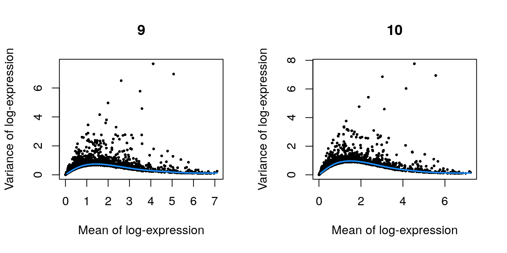

# Pijuan-Sala chimeric mouse embryo (10X Genomics)

<script>
document.addEventListener("click", function (event) {
    if (event.target.classList.contains("aaron-collapse")) {
        event.target.classList.toggle("active");
        var content = event.target.nextElementSibling;
        if (content.style.display === "block") {
          content.style.display = "none";
        } else {
          content.style.display = "block";
        }
    }
})
</script>

<style>
.aaron-collapse {
  background-color: #eee;
  color: #444;
  cursor: pointer;
  padding: 18px;
  width: 100%;
  border: none;
  text-align: left;
  outline: none;
  font-size: 15px;
}

.aaron-content {
  padding: 0 18px;
  display: none;
  overflow: hidden;
  background-color: #f1f1f1;
}
</style>

## Introduction

This performs an analysis of the @pijuansala2019single dataset on mouse gastrulation.
Here, we examine chimeric embryos at the E8.5 stage of development 
where td-Tomato-positive embryonic stem cells (ESCs) were injected into a wild-type blastocyst.

## Data loading


```r
library(MouseGastrulationData)
sce.chimera <- WTChimeraData(samples=5:10)
sce.chimera
```

```
## class: SingleCellExperiment 
## dim: 29453 20935 
## metadata(0):
## assays(1): counts
## rownames(29453): ENSMUSG00000051951 ENSMUSG00000089699 ...
##   ENSMUSG00000095742 tomato-td
## rowData names(2): ENSEMBL SYMBOL
## colnames(20935): cell_9769 cell_9770 ... cell_30702 cell_30703
## colData names(11): cell barcode ... doub.density sizeFactor
## reducedDimNames(2): pca.corrected.E7.5 pca.corrected.E8.5
## altExpNames(0):
```


```r
library(scater)
rownames(sce.chimera) <- uniquifyFeatureNames(
    rowData(sce.chimera)$ENSEMBL, rowData(sce.chimera)$SYMBOL)
```

## Quality control

Quality control on the cells has already been performed by the authors, so we will not repeat it here.
We additionally remove cells that are labelled as stripped nuclei or doublets.


```r
drop <- sce.chimera$celltype.mapped %in% c("stripped", "Doublet")
sce.chimera <- sce.chimera[,!drop]
```

## Normalization

We use the pre-computed size factors in `sce.chimera`.


```r
sce.chimera <- logNormCounts(sce.chimera)
```

## Variance modelling

We retain all genes with any positive biological component, to preserve as much signal as possible across a very heterogeneous dataset.


```r
library(scran)
dec.chimera <- modelGeneVar(sce.chimera, block=sce.chimera$sample)
chosen.hvgs <- dec.chimera$bio > 0
```


```r
par(mfrow=c(1,2))
blocked.stats <- dec.chimera$per.block
for (i in colnames(blocked.stats)) {
    current <- blocked.stats[[i]]
    plot(current$mean, current$total, main=i, pch=16, cex=0.5,
        xlab="Mean of log-expression", ylab="Variance of log-expression")
    curfit <- metadata(current)
    curve(curfit$trend(x), col='dodgerblue', add=TRUE, lwd=2)
}
```

<div class="figure">

<p class="caption">(\#fig:unref-pijuan-var1)Per-gene variance as a function of the mean for the log-expression values in the Pijuan-Sala chimeric mouse embryo dataset. Each point represents a gene (black) with the mean-variance trend (blue) fitted to the variances.</p>
</div><div class="figure">

<p class="caption">(\#fig:unref-pijuan-var2)Per-gene variance as a function of the mean for the log-expression values in the Pijuan-Sala chimeric mouse embryo dataset. Each point represents a gene (black) with the mean-variance trend (blue) fitted to the variances.</p>
</div><div class="figure">

<p class="caption">(\#fig:unref-pijuan-var3)Per-gene variance as a function of the mean for the log-expression values in the Pijuan-Sala chimeric mouse embryo dataset. Each point represents a gene (black) with the mean-variance trend (blue) fitted to the variances.</p>
</div>

## Merging

We use a hierarchical merge to first merge together replicates with the same genotype, 
and then merge samples across different genotypes.


```r
library(batchelor)
set.seed(01001001)
merged <- correctExperiments(sce.chimera, 
    batch=sce.chimera$sample, 
    subset.row=chosen.hvgs,
    PARAM=FastMnnParam(
        merge.order=list(
            list(1,3,5), # WT (3 replicates)
            list(2,4,6)  # td-Tomato (3 replicates)
        )
    )
)
```

We use the percentage of variance lost as a diagnostic:


```r
metadata(merged)$merge.info$lost.var
```

```
##              5         6         7         8        9       10
## [1,] 0.000e+00 0.0204433 0.000e+00 0.0169567 0.000000 0.000000
## [2,] 0.000e+00 0.0007389 0.000e+00 0.0004409 0.000000 0.015474
## [3,] 3.090e-02 0.0000000 2.012e-02 0.0000000 0.000000 0.000000
## [4,] 9.024e-05 0.0000000 8.272e-05 0.0000000 0.018047 0.000000
## [5,] 4.321e-03 0.0072518 4.124e-03 0.0078280 0.003831 0.007786
```

## Clustering


```r
g <- buildSNNGraph(merged, use.dimred="corrected")
clusters <- igraph::cluster_louvain(g)
colLabels(merged) <- factor(clusters$membership)
```

We examine the distribution of cells across clusters and samples.


```r
table(Cluster=colLabels(merged), Sample=merged$sample)
```

```
##        Sample
## Cluster   5   6   7   8   9  10
##      1  152  72  85  88 164 386
##      2   19   7  13  17  20  36
##      3  130  96 109  63 159 311
##      4   43  35  81  81  87 353
##      5   68  31 120 107  83 197
##      6  122  65  64  52  63 141
##      7  187 113 322 587 458 541
##      8   47  22  84  50  90 131
##      9  182  47 231 192 216 391
##      10  95  19  36  18  50  34
##      11   9   7  18  13  30  27
##      12 110  69  73  96 127 252
##      13   0   2   0  51   0   5
##      14  38  39  50  47 126 123
##      15  98  16 164 125 368 273
##      16 146  37 132 110 231 216
##      17 114  43  44  37  40 154
##      18  78  45 189 119 340 493
##      19  86  20  64  54 153  77
##      20 159  77 137 101 147 401
##      21   2   1   7   3  65 133
##      22  11  16  20   9  47  57
##      23   1   5   0  84   0  66
##      24 170  47 282 173 426 542
##      25 109  23 117  55 271 285
##      26 122  72 298 572 296 776
```

## Dimensionality reduction

We use an external algorithm to compute nearest neighbors for greater speed.


```r
merged <- runTSNE(merged, dimred="corrected", external_neighbors=TRUE)
merged <- runUMAP(merged, dimred="corrected", external_neighbors=TRUE)
```


```r
gridExtra::grid.arrange(
    plotTSNE(merged, colour_by="label", text_by="label", text_col="red"),
    plotTSNE(merged, colour_by="batch")
)
```

<div class="figure">

<p class="caption">(\#fig:unref-pijuan-tsne)Obligatory $t$-SNE plots of the Pijuan-Sala chimeric mouse embryo dataset, where each point represents a cell and is colored according to the assigned cluster (top) or sample of origin (bottom).</p>
</div>

## Session Info {-}

<button class="aaron-collapse">View session info</button>
<div class="aaron-content">
```
R Under development (unstable) (2020-03-23 r78035)
Platform: x86_64-pc-linux-gnu (64-bit)
Running under: Ubuntu 18.04.4 LTS

Matrix products: default
BLAS:   /home/luna/Software/R/trunk/lib/libRblas.so
LAPACK: /home/luna/Software/R/trunk/lib/libRlapack.so

locale:
 [1] LC_CTYPE=en_US.UTF-8       LC_NUMERIC=C              
 [3] LC_TIME=en_US.UTF-8        LC_COLLATE=en_US.UTF-8    
 [5] LC_MONETARY=en_US.UTF-8    LC_MESSAGES=en_US.UTF-8   
 [7] LC_PAPER=en_US.UTF-8       LC_NAME=C                 
 [9] LC_ADDRESS=C               LC_TELEPHONE=C            
[11] LC_MEASUREMENT=en_US.UTF-8 LC_IDENTIFICATION=C       

attached base packages:
[1] stats4    parallel  stats     graphics  grDevices utils     datasets 
[8] methods   base     

other attached packages:
 [1] batchelor_1.3.14            scran_1.15.26              
 [3] scater_1.15.29              ggplot2_3.3.0              
 [5] MouseGastrulationData_1.1.0 SingleCellExperiment_1.9.3 
 [7] SummarizedExperiment_1.17.5 DelayedArray_0.13.8        
 [9] matrixStats_0.56.0          Biobase_2.47.3             
[11] GenomicRanges_1.39.3        GenomeInfoDb_1.23.16       
[13] IRanges_2.21.8              S4Vectors_0.25.14          
[15] BiocGenerics_0.33.3         OSCAUtils_0.0.2            
[17] BiocStyle_2.15.6           

loaded via a namespace (and not attached):
 [1] bitops_1.0-6                  bit64_0.9-7                  
 [3] httr_1.4.1                    tools_4.0.0                  
 [5] R6_2.4.1                      irlba_2.3.3                  
 [7] vipor_0.4.5                   DBI_1.1.0                    
 [9] colorspace_1.4-1              withr_2.1.2                  
[11] gridExtra_2.3                 tidyselect_1.0.0             
[13] processx_3.4.2                bit_1.1-15.2                 
[15] curl_4.3                      compiler_4.0.0               
[17] cli_2.0.2                     BiocNeighbors_1.5.2          
[19] labeling_0.3                  bookdown_0.18                
[21] scales_1.1.0                  callr_3.4.3                  
[23] rappdirs_0.3.1                stringr_1.4.0                
[25] digest_0.6.25                 rmarkdown_2.1                
[27] XVector_0.27.2                pkgconfig_2.0.3              
[29] htmltools_0.4.0               highr_0.8                    
[31] limma_3.43.5                  dbplyr_1.4.2                 
[33] fastmap_1.0.1                 rlang_0.4.5                  
[35] RSQLite_2.2.0                 shiny_1.4.0.2                
[37] DelayedMatrixStats_1.9.1      farver_2.0.3                 
[39] BiocParallel_1.21.2           dplyr_0.8.5                  
[41] RCurl_1.98-1.1                magrittr_1.5                 
[43] BiocSingular_1.3.2            GenomeInfoDbData_1.2.2       
[45] Matrix_1.2-18                 Rcpp_1.0.4                   
[47] ggbeeswarm_0.6.0              munsell_0.5.0                
[49] fansi_0.4.1                   viridis_0.5.1                
[51] lifecycle_0.2.0               edgeR_3.29.1                 
[53] stringi_1.4.6                 yaml_2.2.1                   
[55] zlibbioc_1.33.1               BiocFileCache_1.11.4         
[57] AnnotationHub_2.19.8          grid_4.0.0                   
[59] blob_1.2.1                    dqrng_0.2.1                  
[61] promises_1.1.0                ExperimentHub_1.13.5         
[63] crayon_1.3.4                  lattice_0.20-40              
[65] cowplot_1.0.0                 locfit_1.5-9.4               
[67] knitr_1.28                    ps_1.3.2                     
[69] pillar_1.4.3                  igraph_1.2.5                 
[71] codetools_0.2-16              glue_1.3.2                   
[73] BiocVersion_3.11.1            evaluate_0.14                
[75] BiocManager_1.30.10           vctrs_0.2.4                  
[77] httpuv_1.5.2                  gtable_0.3.0                 
[79] purrr_0.3.3                   assertthat_0.2.1             
[81] xfun_0.12                     rsvd_1.0.3                   
[83] mime_0.9                      xtable_1.8-4                 
[85] later_1.0.0                   viridisLite_0.3.0            
[87] tibble_3.0.0                  AnnotationDbi_1.49.1         
[89] beeswarm_0.2.3                memoise_1.1.0                
[91] statmod_1.4.34                ellipsis_0.3.0               
[93] interactiveDisplayBase_1.25.0
```
</div>
