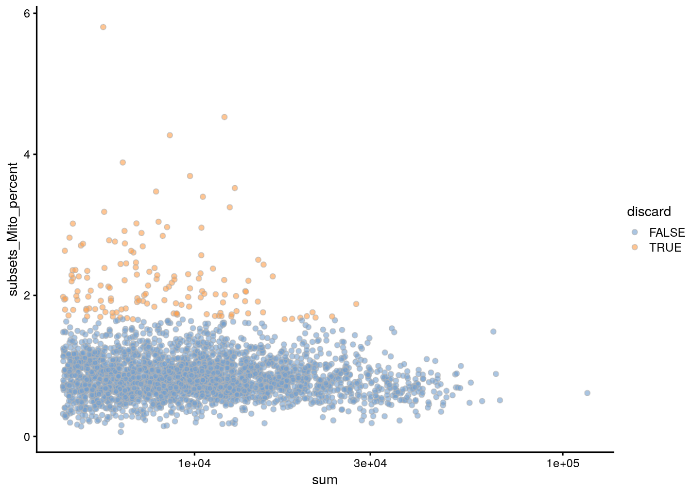

# Bach mouse mammary gland (10X Genomics)

<script>
document.addEventListener("click", function (event) {
    if (event.target.classList.contains("aaron-collapse")) {
        event.target.classList.toggle("active");
        var content = event.target.nextElementSibling;
        if (content.style.display === "block") {
          content.style.display = "none";
        } else {
          content.style.display = "block";
        }
    }
})
</script>

<style>
.aaron-collapse {
  background-color: #eee;
  color: #444;
  cursor: pointer;
  padding: 18px;
  width: 100%;
  border: none;
  text-align: left;
  outline: none;
  font-size: 15px;
}

.aaron-content {
  padding: 0 18px;
  display: none;
  overflow: hidden;
  background-color: #f1f1f1;
}
</style>

## Introduction

This performs an analysis of the @bach2017differentiation 10X Genomics dataset,
from which we will consider a single sample of epithelial cells from the mouse mammary gland during gestation.

## Data loading


```r
library(scRNAseq)
sce.mam <- BachMammaryData(samples="G_1")
```


```r
library(scater)
rownames(sce.mam) <- uniquifyFeatureNames(
    rowData(sce.mam)$Ensembl, rowData(sce.mam)$Symbol)

library(AnnotationHub)
ens.mm.v97 <- AnnotationHub()[["AH73905"]]
rowData(sce.mam)$SEQNAME <- mapIds(ens.mm.v97, keys=rowData(sce.mam)$Ensembl,
    keytype="GENEID", column="SEQNAME")
```

## Quality control


```r
unfiltered <- sce.mam
```


```r
is.mito <- rowData(sce.mam)$SEQNAME == "MT"
stats <- perCellQCMetrics(sce.mam, subsets=list(Mito=which(is.mito)))
qc <- quickPerCellQC(stats, percent_subsets="subsets_Mito_percent")
sce.mam <- sce.mam[,!qc$discard]
```


```r
colData(unfiltered) <- cbind(colData(unfiltered), stats)
unfiltered$discard <- qc$discard

gridExtra::grid.arrange(
    plotColData(unfiltered, y="sum", colour_by="discard") + 
        scale_y_log10() + ggtitle("Total count"),
    plotColData(unfiltered, y="detected", colour_by="discard") + 
        scale_y_log10() + ggtitle("Detected features"),
    plotColData(unfiltered, y="subsets_Mito_percent", 
        colour_by="discard") + ggtitle("Mito percent"),
    ncol=2
)
```

<div class="figure">

<p class="caption">(\#fig:unref-bach-qc-dist)Distribution of each QC metric across cells in the Bach mammary gland dataset. Each point represents a cell and is colored according to whether that cell was discarded.</p>
</div>


```r
plotColData(unfiltered, x="sum", y="subsets_Mito_percent", 
    colour_by="discard") + scale_x_log10()
```

<div class="figure">

<p class="caption">(\#fig:unref-bach-qc-comp)Percentage of mitochondrial reads in each cell in the Bach mammary gland dataset compared to its total count. Each point represents a cell and is colored according to whether that cell was discarded.</p>
</div>


```r
colSums(as.matrix(qc))
```

```
##              low_lib_size            low_n_features high_subsets_Mito_percent 
##                         0                         0                       143 
##                   discard 
##                       143
```

## Normalization 


```r
library(scran)
set.seed(101000110)
clusters <- quickCluster(sce.mam)
sce.mam <- computeSumFactors(sce.mam, clusters=clusters)
sce.mam <- logNormCounts(sce.mam)
```


```r
summary(sizeFactors(sce.mam))
```

```
##    Min. 1st Qu.  Median    Mean 3rd Qu.    Max. 
##   0.271   0.522   0.758   1.000   1.204  10.958
```


```r
plot(librarySizeFactors(sce.mam), sizeFactors(sce.mam), pch=16,
    xlab="Library size factors", ylab="Deconvolution factors", log="xy")
```

<div class="figure">

<p class="caption">(\#fig:unref-bach-norm)Relationship between the library size factors and the deconvolution size factors in the Bach mammary gland dataset.</p>
</div>

## Variance modelling

We use a Poisson-based technical trend to capture more genuine biological variation in the biological component.


```r
set.seed(00010101)
dec.mam <- modelGeneVarByPoisson(sce.mam)
top.mam <- getTopHVGs(dec.mam, prop=0.1)
```


```r
plot(dec.mam$mean, dec.mam$total, pch=16, cex=0.5,
    xlab="Mean of log-expression", ylab="Variance of log-expression")
curfit <- metadata(dec.mam)
curve(curfit$trend(x), col='dodgerblue', add=TRUE, lwd=2)
```

<div class="figure">

<p class="caption">(\#fig:unref-bach-var)Per-gene variance as a function of the mean for the log-expression values in the Bach mammary gland dataset. Each point represents a gene (black) with the mean-variance trend (blue) fitted to simulated Poisson counts.</p>
</div>

## Dimensionality reduction


```r
library(BiocSingular)
set.seed(101010011)
sce.mam <- denoisePCA(sce.mam, technical=dec.mam, subset.row=top.mam)
sce.mam <- runTSNE(sce.mam, dimred="PCA")
```


```r
ncol(reducedDim(sce.mam, "PCA"))
```

```
## [1] 15
```

## Clustering 

We use a higher `k` to obtain coarser clusters (for use in `doubletCluster()` later).


```r
snn.gr <- buildSNNGraph(sce.mam, use.dimred="PCA", k=25)
colLabels(sce.mam) <- factor(igraph::cluster_walktrap(snn.gr)$membership)
```


```r
table(colLabels(sce.mam))
```

```
## 
##   1   2   3   4   5   6   7   8   9  10 
## 550 799 716 452  24  84  52  39  32  24
```


```r
plotTSNE(sce.mam, colour_by="label")
```

<div class="figure">

<p class="caption">(\#fig:unref-bach-tsne)Obligatory $t$-SNE plot of the Bach mammary gland dataset, where each point represents a cell and is colored according to the assigned cluster.</p>
</div>

## Session Info {-}

<button class="aaron-collapse">View session info</button>
<div class="aaron-content">
```
R Under development (unstable) (2020-03-23 r78035)
Platform: x86_64-pc-linux-gnu (64-bit)
Running under: Ubuntu 18.04.4 LTS

Matrix products: default
BLAS:   /home/luna/Software/R/trunk/lib/libRblas.so
LAPACK: /home/luna/Software/R/trunk/lib/libRlapack.so

locale:
 [1] LC_CTYPE=en_US.UTF-8       LC_NUMERIC=C              
 [3] LC_TIME=en_US.UTF-8        LC_COLLATE=en_US.UTF-8    
 [5] LC_MONETARY=en_US.UTF-8    LC_MESSAGES=en_US.UTF-8   
 [7] LC_PAPER=en_US.UTF-8       LC_NAME=C                 
 [9] LC_ADDRESS=C               LC_TELEPHONE=C            
[11] LC_MEASUREMENT=en_US.UTF-8 LC_IDENTIFICATION=C       

attached base packages:
[1] parallel  stats4    stats     graphics  grDevices utils     datasets 
[8] methods   base     

other attached packages:
 [1] BiocSingular_1.3.2          scran_1.15.24              
 [3] AnnotationHub_2.19.8        BiocFileCache_1.11.4       
 [5] dbplyr_1.4.2                scater_1.15.29             
 [7] ggplot2_3.3.0               ensembldb_2.11.3           
 [9] AnnotationFilter_1.11.0     GenomicFeatures_1.39.7     
[11] AnnotationDbi_1.49.1        scRNAseq_2.1.7             
[13] SingleCellExperiment_1.9.2  SummarizedExperiment_1.17.5
[15] DelayedArray_0.13.8         matrixStats_0.56.0         
[17] Biobase_2.47.3              GenomicRanges_1.39.3       
[19] GenomeInfoDb_1.23.16        IRanges_2.21.8             
[21] S4Vectors_0.25.14           BiocGenerics_0.33.3        
[23] BiocStyle_2.15.6            OSCAUtils_0.0.2            

loaded via a namespace (and not attached):
  [1] Rtsne_0.15                    ggbeeswarm_0.6.0             
  [3] colorspace_1.4-1              ellipsis_0.3.0               
  [5] XVector_0.27.2                BiocNeighbors_1.5.2          
  [7] farver_2.0.3                  bit64_0.9-7                  
  [9] interactiveDisplayBase_1.25.0 fansi_0.4.1                  
 [11] codetools_0.2-16              knitr_1.28                   
 [13] Rsamtools_2.3.7               shiny_1.4.0.2                
 [15] BiocManager_1.30.10           compiler_4.0.0               
 [17] httr_1.4.1                    dqrng_0.2.1                  
 [19] assertthat_0.2.1              Matrix_1.2-18                
 [21] fastmap_1.0.1                 lazyeval_0.2.2               
 [23] limma_3.43.5                  cli_2.0.2                    
 [25] later_1.0.0                   htmltools_0.4.0              
 [27] prettyunits_1.1.1             tools_4.0.0                  
 [29] igraph_1.2.5                  rsvd_1.0.3                   
 [31] gtable_0.3.0                  glue_1.3.2                   
 [33] GenomeInfoDbData_1.2.2        dplyr_0.8.5                  
 [35] rappdirs_0.3.1                Rcpp_1.0.4                   
 [37] vctrs_0.2.4                   Biostrings_2.55.7            
 [39] ExperimentHub_1.13.5          rtracklayer_1.47.0           
 [41] DelayedMatrixStats_1.9.1      xfun_0.12                    
 [43] stringr_1.4.0                 ps_1.3.2                     
 [45] mime_0.9                      lifecycle_0.2.0              
 [47] irlba_2.3.3                   statmod_1.4.34               
 [49] XML_3.99-0.3                  edgeR_3.29.1                 
 [51] zlibbioc_1.33.1               scales_1.1.0                 
 [53] hms_0.5.3                     promises_1.1.0               
 [55] ProtGenerics_1.19.3           yaml_2.2.1                   
 [57] curl_4.3                      memoise_1.1.0                
 [59] gridExtra_2.3                 biomaRt_2.43.4               
 [61] stringi_1.4.6                 RSQLite_2.2.0                
 [63] BiocVersion_3.11.1            highr_0.8                    
 [65] BiocParallel_1.21.2           rlang_0.4.5                  
 [67] pkgconfig_2.0.3               bitops_1.0-6                 
 [69] evaluate_0.14                 lattice_0.20-40              
 [71] purrr_0.3.3                   GenomicAlignments_1.23.2     
 [73] labeling_0.3                  cowplot_1.0.0                
 [75] bit_1.1-15.2                  processx_3.4.2               
 [77] tidyselect_1.0.0              magrittr_1.5                 
 [79] bookdown_0.18                 R6_2.4.1                     
 [81] DBI_1.1.0                     pillar_1.4.3                 
 [83] withr_2.1.2                   RCurl_1.98-1.1               
 [85] tibble_3.0.0                  crayon_1.3.4                 
 [87] rmarkdown_2.1                 viridis_0.5.1                
 [89] progress_1.2.2                locfit_1.5-9.4               
 [91] grid_4.0.0                    blob_1.2.1                   
 [93] callr_3.4.3                   digest_0.6.25                
 [95] xtable_1.8-4                  httpuv_1.5.2                 
 [97] openssl_1.4.1                 munsell_0.5.0                
 [99] beeswarm_0.2.3                viridisLite_0.3.0            
[101] vipor_0.4.5                   askpass_1.1                  
```
</div>
