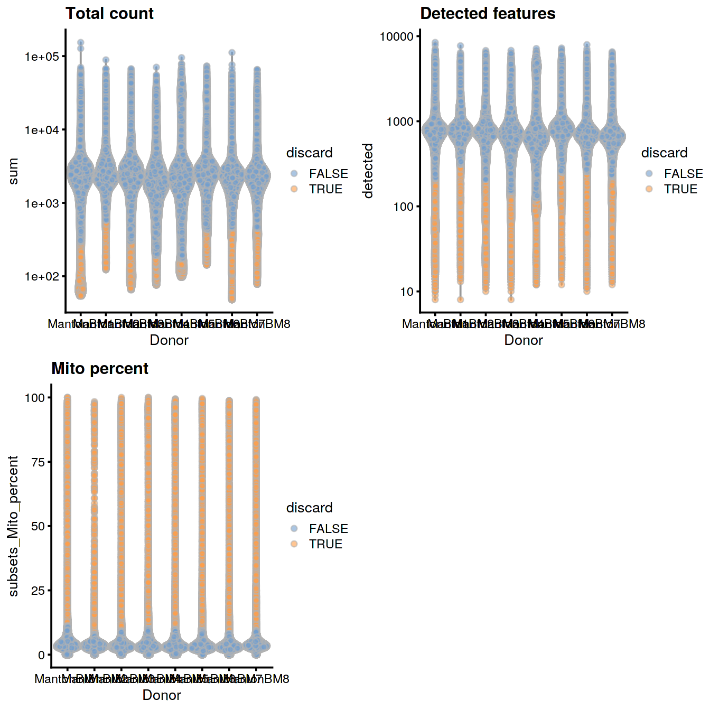
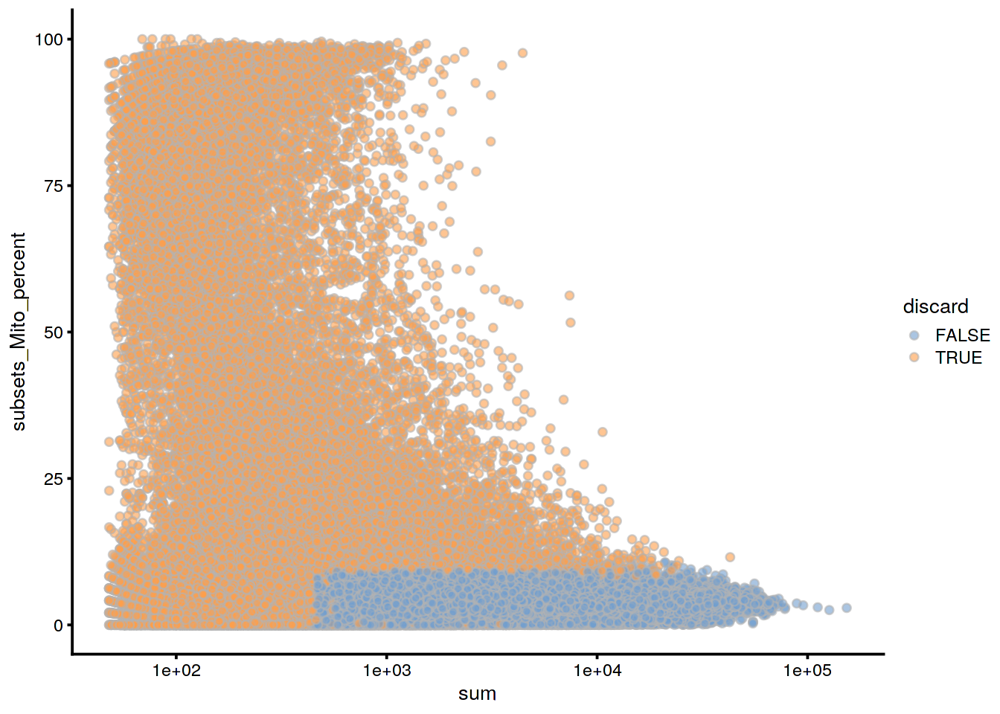
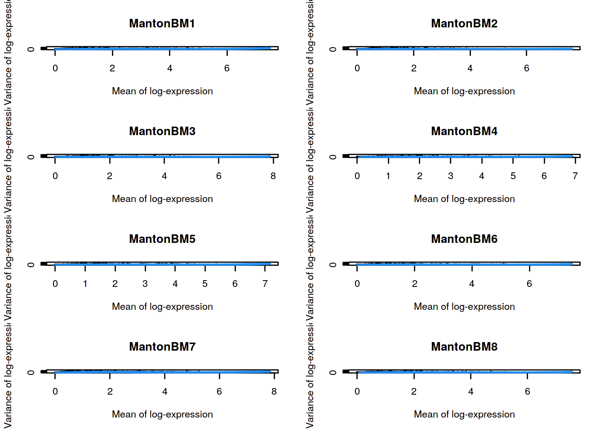
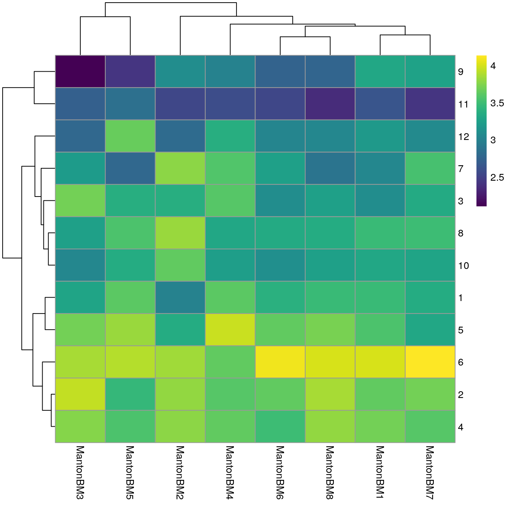
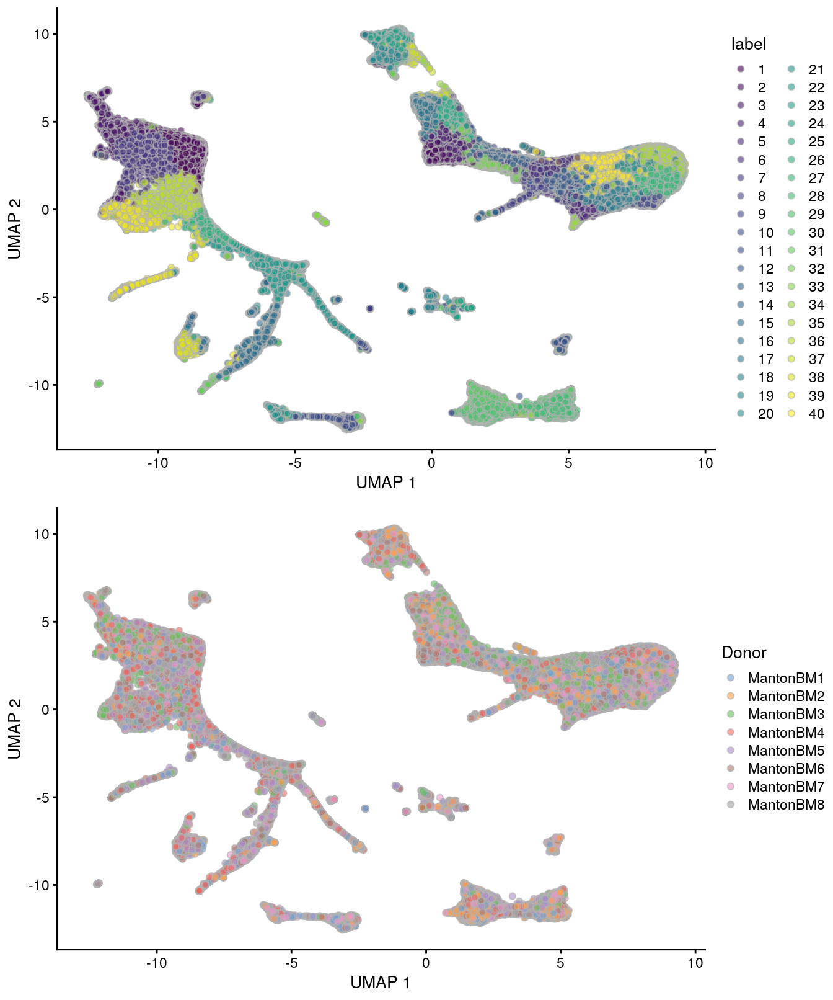
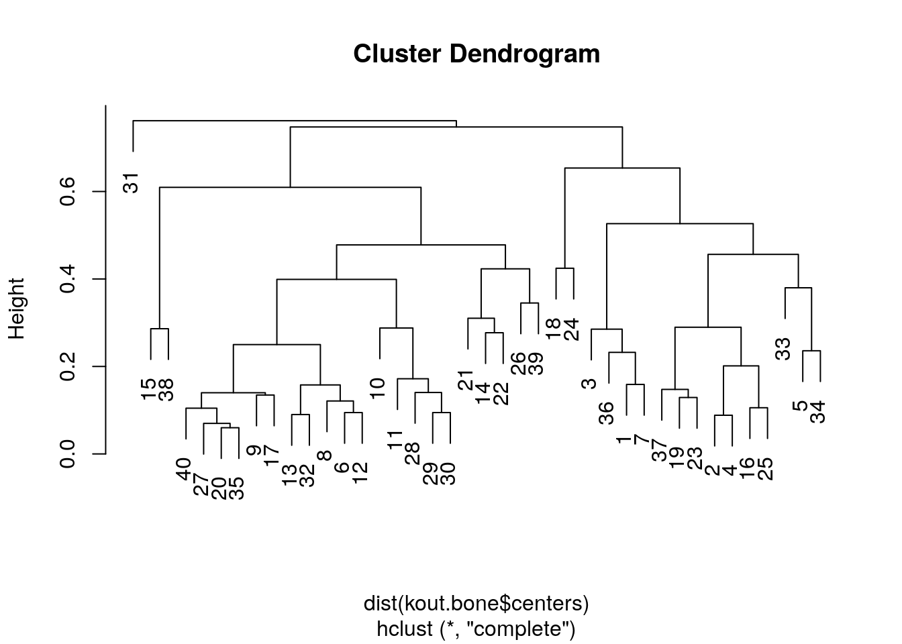
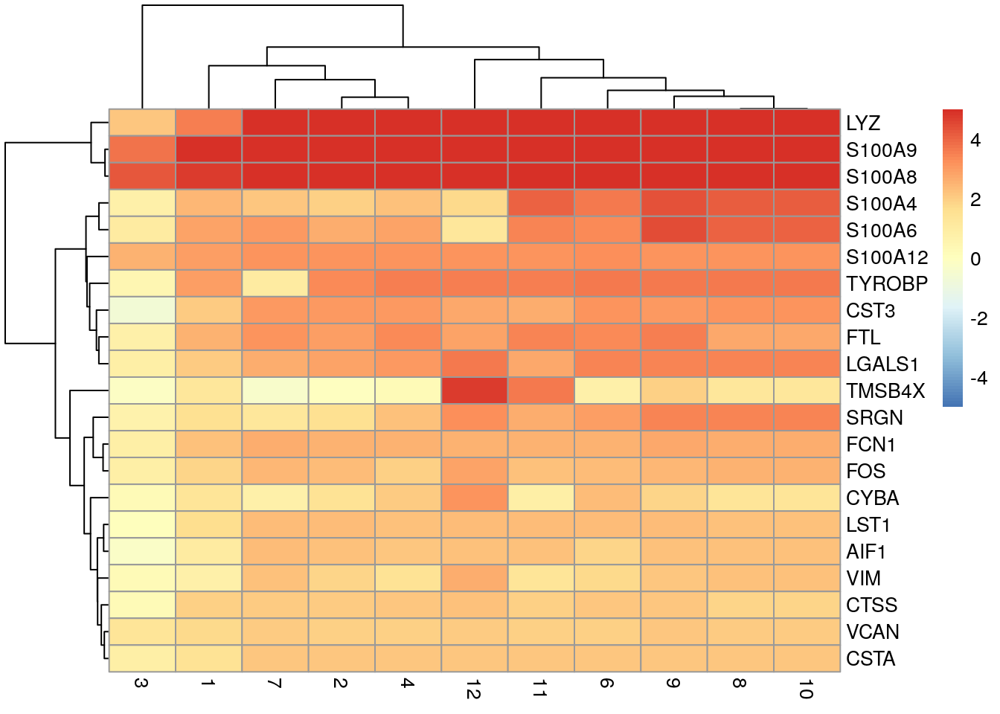

# HCA human bone marrow (10X Genomics) 

<script>
document.addEventListener("click", function (event) {
    if (event.target.classList.contains("aaron-collapse")) {
        event.target.classList.toggle("active");
        var content = event.target.nextElementSibling;
        if (content.style.display === "block") {
          content.style.display = "none";
        } else {
          content.style.display = "block";
        }
    }
})
</script>

<style>
.aaron-collapse {
  background-color: #eee;
  color: #444;
  cursor: pointer;
  padding: 18px;
  width: 100%;
  border: none;
  text-align: left;
  outline: none;
  font-size: 15px;
}

.aaron-content {
  padding: 0 18px;
  display: none;
  overflow: hidden;
  background-color: #f1f1f1;
}
</style>

## Introduction

Here, we use an example dataset from the [Human Cell Atlas immune cell profiling project on bone marrow](https://preview.data.humancellatlas.org), which contains scRNA-seq data for 380,000 cells generated using the 10X Genomics technology.
This is a fairly big dataset that represents a good use case for the techniques in Chapter \@ref(dealing-with-big-data).

## Data loading

This dataset is loaded via the *[HCAData](https://bioconductor.org/packages/3.11/HCAData)* package, which provides a ready-to-use `SingleCellExperiment` object. 


```r
library(HCAData)
sce.bone <- HCAData('ica_bone_marrow')
sce.bone$Donor <- sub("_.*", "", sce.bone$Barcode)
```


We use symbols in place of IDs for easier interpretation later.


```r
library(EnsDb.Hsapiens.v86)
rowData(sce.bone)$Chr <- mapIds(EnsDb.Hsapiens.v86, keys=rownames(sce.bone),
    column="SEQNAME", keytype="GENEID")

library(scater)
rownames(sce.bone) <- uniquifyFeatureNames(rowData(sce.bone)$ID,
    names = rowData(sce.bone)$Symbol)
```

## Quality control

Cell calling was not performed (see [here](https://s3.amazonaws.com/preview-ica-expression-data/Brief+ICA+Read+Me.pdf)) so we will perform QC using all metrics and block on the donor of origin during outlier detection.
We perform the calculation across multiple cores to speed things up.


```r
library(BiocParallel)
bpp <- MulticoreParam(8)
sce.bone <- unfiltered <- addPerCellQC(sce.bone, BPPARAM=bpp,
    subsets=list(Mito=which(rowData(sce.bone)$Chr=="MT")))

qc <- quickPerCellQC(colData(sce.bone), batch=sce.bone$Donor,
    percent_subset="subsets_Mito_percent")
sce.bone <- sce.bone[,!qc$discard]
```


```r
unfiltered$discard <- qc$discard

gridExtra::grid.arrange(
    plotColData(unfiltered, x="Donor", y="sum", colour_by="discard") +
        scale_y_log10() + ggtitle("Total count"),
    plotColData(unfiltered, x="Donor", y="detected", colour_by="discard") +
        scale_y_log10() + ggtitle("Detected features"),
    plotColData(unfiltered, x="Donor", y="subsets_Mito_percent",
        colour_by="discard") + ggtitle("Mito percent"),
    ncol=2
)
```

<div class="figure">

<p class="caption">(\#fig:unref-hca-bone-qc)Distribution of QC metrics in the HCA bone marrow dataset. Each point represents a cell and is colored according to whether it was discarded.</p>
</div>


```r
plotColData(unfiltered, x="sum", y="subsets_Mito_percent", 
    colour_by="discard") + scale_x_log10()
```

<div class="figure">

<p class="caption">(\#fig:unref-hca-bone-mito)Percentage of mitochondrial reads in each cell in the Bach mammary gland dataset compared to its total count. Each point represents a cell and is colored according to whether that cell was discarded.</p>
</div>

## Normalization

For a minor speed-up, we use already-computed library sizes rather than re-computing them from the column sums.


```r
sce.bone <- logNormCounts(sce.bone, size_factors = sce.bone$sum)
```


```r
summary(sizeFactors(sce.bone))
```

```
##    Min. 1st Qu.  Median    Mean 3rd Qu.    Max. 
##    0.05    0.47    0.65    1.00    0.89   42.38
```

### Variance modeling

We block on the donor of origin to mitigate batch effects during HVG selection.
We select a larger number of HVGs to capture any batch-specific variation that might be present.


```r
library(scran)
dec.bone <- modelGeneVar(sce.bone, block=sce.bone$Donor, BPPARAM=bpp)
top.bone <- getTopHVGs(dec.bone, n=5000)
```


```r
par(mfrow=c(4,2))
blocked.stats <- dec.bone$per.block
for (i in colnames(blocked.stats)) {
    current <- blocked.stats[[i]]
    plot(current$mean, current$total, main=i, pch=16, cex=0.5,
        xlab="Mean of log-expression", ylab="Variance of log-expression")
    curfit <- metadata(current)
    curve(curfit$trend(x), col='dodgerblue', add=TRUE, lwd=2)
}
```

<div class="figure">

<p class="caption">(\#fig:unref-nest-var)Per-gene variance as a function of the mean for the log-expression values in the Bach mammary gland dataset. Each point represents a gene (black) with the mean-variance trend (blue) fitted to the variances.</p>
</div>

## Data integration

Here we use multiple cores, randomized SVD and approximate nearest-neighbor detection to speed up this step.


```r
library(batchelor)
library(BiocNeighbors)

set.seed(1010001)
merged.bone <- fastMNN(sce.bone, batch = sce.bone$Donor, subset.row = top.bone,
     BSPARAM=BiocSingular::RandomParam(deferred = TRUE), 
     BNPARAM=AnnoyParam(),
     BPPARAM=bpp)

reducedDim(sce.bone, 'MNN') <- reducedDim(merged.bone, 'corrected')
```

We use the percentage of variance lost as a diagnostic measure:


```r
metadata(merged.bone)$merge.info$lost.var
```

```
##      MantonBM1 MantonBM2 MantonBM3 MantonBM4 MantonBM5 MantonBM6 MantonBM7 MantonBM8
## [1,]  0.011726  0.009007  0.000000  0.000000  0.000000  0.000000  0.000000   0.00000
## [2,]  0.008174  0.008151  0.025108  0.000000  0.000000  0.000000  0.000000   0.00000
## [3,]  0.005773  0.003770  0.005159  0.025857  0.000000  0.000000  0.000000   0.00000
## [4,]  0.003498  0.002782  0.002612  0.003059  0.028205  0.000000  0.000000   0.00000
## [5,]  0.005713  0.003595  0.003571  0.005905  0.007077  0.033551  0.000000   0.00000
## [6,]  0.004375  0.004482  0.003974  0.003903  0.004650  0.005169  0.035335   0.00000
## [7,]  0.002400  0.001970  0.002765  0.002469  0.001756  0.002389  0.002168   0.04198
```

## Dimensionality reduction

We set `external_neighbors=TRUE` to replace the internal nearest neighbor search in the UMAP implementation with our parallelized approximate search.
We also set the number of threads to be used in the UMAP iterations.


```r
set.seed(01010100)
sce.bone <- runUMAP(sce.bone, dimred="MNN",
    external_neighbors=TRUE, 
    BNPARAM=AnnoyParam(),
    BPPARAM=bpp,
    n_threads=bpnworkers(bpp))
```

## Clustering

Graph-based clustering generates an excessively large intermediate graph, so we will switch to $k$-means instead.
We err on the side of overclustering to ensure that the major cell types are distinguished; in fact, this is actually useful for resolving fine structure with such a large number of cells.
Some parameter fiddling is required to improve convergence with a large number of points.


```r
set.seed(1000)
kout.bone <- kmeans(reducedDim(sce.bone, "MNN"), 
    centers=40, iter.max=1000, algorithm="MacQueen") 
sce.bone$cluster <- factor(kout.bone$cluster)
```

We observe mostly balanced contributions from different samples to each cluster (Figure \@ref(fig:unref-hca-bone-ab)), consistent with the expectation that all samples are replicates from different donors.


```r
tab <- table(Cluster=sce.bone$cluster, Donor=sce.bone$Donor)
library(pheatmap)
pheatmap(log10(tab+10), color=viridis::viridis(100))
```

<div class="figure">

<p class="caption">(\#fig:unref-hca-bone-ab)Heatmap of log~10~-number of cells in each cluster (row) from each sample (column).</p>
</div>


```r
# TODO: add scrambling option in scater's plotting functions.
scrambled <- sample(ncol(sce.bone))

gridExtra::grid.arrange(
    plotUMAP(sce.bone, colour_by="cluster"),
    plotUMAP(sce.bone[,scrambled], colour_by="Donor")
)
```

<div class="figure">

<p class="caption">(\#fig:unref-hca-bone-umap)UMAP plots of the HCA bone marrow dataset after merging. Each point represents a cell and is colored according to the assigned cluster (top) or the donor of origin (bottom).</p>
</div>

We end up with quite a few clusters, several of which are likely to be closely related to each other and thus redundant.
These can be easily identified by further clustering on the cluster centroids in `kout.bone` (Figure \@ref(fig:unref-hca-bone-hclust)), with the aim being to avoid unnecessary manual annotation of close relatives.


```r
bone.clust <- hclust(dist(kout.bone$centers))
plot(bone.clust)
```

<div class="figure">

<p class="caption">(\#fig:unref-hca-bone-hclust)Hierarchical clustering of the $k$-means cluster centroids from the PBMC dataset.</p>
</div>

## Differential expression

We identify marker genes for each cluster while blocking on the donor.


```r
markers.bone <- findMarkers(sce.bone, sce.bone$cluster,
    block = sce.bone$Donor, 
    direction = 'up', lfc = 1,
    BPPARAM=bpp)
```

We visualize the top markers for a randomly chosen cluster using a "dot plot" in Figure \@ref(fig:unref-hca-bone-dotplot).
The presence of upregulated genes like _LYZ_, _S100A8_ and _VCAN_ is consistent with a monocyte identity for this cluster.


```r
top.markers <- markers.bone[["1"]]
best <- top.markers[top.markers$Top <= 5,]
lfcs <- getMarkerEffects(best)

library(pheatmap)
pheatmap(lfcs, breaks=seq(-5, 5, length.out=101))
```

<div class="figure">

<p class="caption">(\#fig:unref-hca-bone-dotplot)Heatmap of log~2~-fold changes for the top marker genes (rows) of cluster 1 compared to all other clusters (columns).</p>
</div>


## Cell type classification

We perform automated cell type classification using a reference dataset to annotate each cluster based on its pseudo-bulk profile. 
This is faster than the per-cell approaches described in Chapter \@ref(cell-type-annotation), but sacrifices resolution for detecting heterogeneity inside a cluster.
Nonetheless, it is often sufficient for a quick assignment of cluster identity, and indeed, cluster 1 is also identified as consisting of monocytes from this analysis.


```r
# TODO: have SingleR use sumCountsAcrossCells to benefit from 
# parallelized summation as well.
aggregated <- sumCountsAcrossCells(sce.bone, id=sce.bone$cluster)

library(SingleR)
hpc <- HumanPrimaryCellAtlasData()
anno.single <- SingleR(aggregated, ref = hpc, labels = hpc$label.main)
anno.single
```

```
## DataFrame with 40 rows and 5 columns
##                             scores     first.labels         tuning.scores           labels
##                           <matrix>      <character>           <DataFrame>      <character>
## 1   0.716864:0.347252:0.421488:... Pre-B_cell_CD34-     0.543019:0.286695         Monocyte
## 2   0.568879:0.351125:0.393918:...          NK_cell     0.465763:0.391508          T_cells
## 3   0.742036:0.353321:0.428157:... Pre-B_cell_CD34-     0.611069:0.166815         Monocyte
## 4   0.572306:0.334790:0.393977:...          NK_cell     0.546806:0.396790          T_cells
## 5   0.551343:0.344866:0.387720:...          T_cells     0.576622:0.424378          T_cells
## ...                            ...              ...                   ...              ...
## 36  0.692143:0.379790:0.426240:... Pre-B_cell_CD34- 0.482509:-0.000122278 Pre-B_cell_CD34-
## 37  0.553602:0.321066:0.373070:...          NK_cell 0.819197: 0.749865965          NK_cell
## 38  0.504649:0.386480:0.426791:...              MEP 0.384879: 0.355725448       BM & Prog.
## 39  0.695130:0.371602:0.432913:... Pre-B_cell_CD34- 0.298607: 0.217096816 Pre-B_cell_CD34-
## 40  0.556241:0.347183:0.406732:...          T_cells 0.746055:-0.195894839          T_cells
##        pruned.labels
##          <character>
## 1           Monocyte
## 2            T_cells
## 3           Monocyte
## 4            T_cells
## 5            T_cells
## ...              ...
## 36  Pre-B_cell_CD34-
## 37           NK_cell
## 38        BM & Prog.
## 39  Pre-B_cell_CD34-
## 40           T_cells
```


<!-- ```{r saveRDS, include=FALSE} -->
<!-- ## TEMP FIX -->
<!-- saveRDS(sce.bone, 'sce.bone.rds') -->
<!-- saveRDS(markers.bone, 'markers.bone.rds') -->

<!-- sce.bone <- readRDS('sce.bone.rds') -->
<!-- markers.bone <- readRDS('markers.bone.rds') -->
<!-- ``` -->

<!--
## Gene set Enrichment Analysis

To interpret differential expression (DE) results, gene set enrichment analysis (GSEA) can be performed to annotate DE results. The first step is to acquire a mapping of ENTREZID to gene symbol.


```r
## Get mappings of ENTREZID to Symbol
library(org.Hs.eg.db)
keys_entrez <- keys(org.Hs.eg.db, 'ENTREZID')
mapping_es <- AnnotationDbi::select(org.Hs.eg.db,
                                    keys = keys_entrez,
                                    columns = c('ENTREZID', 'SYMBOL'),
                                    keytype = 'ENTREZID')
mapping_es$ENTREZID <- as.integer(mapping_es$ENTREZID)
```

The next is to parse the gene sets (here we use a "tidy" representation of MSigDB gene sets) and remap them.


```r
## Get pathways of interest - convert to list with symbol
## devtools::install_github('stephenturner/msigdf') # "tidy" MSigDB genesets
library(msigdf)
library(dplyr)
mdb <- dplyr::inner_join(msigdf.human, mapping_es,
                         by = c('entrez' = 'ENTREZID')) %>%
    dplyr::filter(collection == 'c7') %>%
    dplyr::select(-collection, -entrez) %>%
    dplyr::group_nest(geneset)
pathways <- purrr::map(mdb$data, function(x) {
    as.character(x$SYMBOL)
})
names(pathways) <- mdb$geneset
```

Finally, the DE results from the `findMarkers()` function are used to test for differential gene set enrichment using the `fgsea` package. Here we compare cluster 3 against cluster 15, which are at opposite ends of a UMAP group.


```r
## Get stats based on markers search
## Compare cluster 3 (Dendritic cells) and 15 (HSCs)
stats <- markers.bone[[3]]$logFC.15
names(stats) <- rownames(markers.bone[[3]])

## Run fast gene set enrichment analysis
## Returns a data.table object
library(fgsea)
gse <- fgsea(pathways = pathways, 
             stats = stats,
             minSize = 15,
             maxSize = 500,
             nperm = 5000)
```

The enrichment scores of the top up and down pathways can then be plotted as a table:


```r
## Get top up and down pathways based on NES
gse.up <- gse[order(gse$NES, decreasing = TRUE)[1:2], ]$pathway
gse.dn <- gse[order(gse$NES)[1:2], ]$pathway
topPathways <- c(gse.up, rev(gse.dn))

## Plot the GSEA table
plotGseaTable(pathways[topPathways], stats,
              gse, 
              gseaParam = 0.5)
```

Or select pathways can also be plotted as a more traditional running score plot:


```r
## Traditional GSEA plot
plotEnrichment(pathways[[topPathways[1]]],
               stats)
```

### Trajectory analysis

Slingshot relies on providing a set of clusters on which to construct a trajectory.


```r
library(slingshot)

## Clusters to attempt trajectory on:
slc.clusters <- c(15, 22, 11, 7, 1, 3)

## Subsample dataset for speed
slc.dat <- sce.bone[, sce.bone$cluster %in% slc.clusters]
slc.subdat <- slc.dat[, sample(ncol(slc.dat), 20000)]

## Run slingshot
slc <- slingshot(slc.subdat,
                 clusterLabels = 'cluster',
                 reducedDim = 'UMAP')
```

The calculated principal curve can then be visualized on the UMAP space.


```r
## Slingshot trajectory plot
library(RColorBrewer)
colors <- colorRampPalette(brewer.pal(11, 'Spectral')[-6])(100)
plotcol <- colors[cut(slc$slingPseudotime_1, breaks = 100)]
plot(reducedDims(slc)$UMAP, col = plotcol, pch=16, asp = 1)
lines(SlingshotDataSet(slc), lwd = 2, col = 'black')
```
-->

## Session Info {-}

<button class="aaron-collapse">View session info</button>
<div class="aaron-content">
```
R Under development (unstable) (2019-12-29 r77627)
Platform: x86_64-pc-linux-gnu (64-bit)
Running under: Ubuntu 14.04.6 LTS

Matrix products: default
BLAS/LAPACK: /app/easybuild/software/OpenBLAS/0.2.18-GCC-5.4.0-2.26-LAPACK-3.6.1/lib/libopenblas_prescottp-r0.2.18.so

locale:
 [1] LC_CTYPE=en_US.UTF-8       LC_NUMERIC=C               LC_TIME=en_US.UTF-8       
 [4] LC_COLLATE=C               LC_MONETARY=en_US.UTF-8    LC_MESSAGES=en_US.UTF-8   
 [7] LC_PAPER=en_US.UTF-8       LC_NAME=C                  LC_ADDRESS=C              
[10] LC_TELEPHONE=C             LC_MEASUREMENT=en_US.UTF-8 LC_IDENTIFICATION=C       

attached base packages:
[1] stats4    parallel  stats     graphics  grDevices utils     datasets  methods   base     

other attached packages:
 [1] SingleR_1.1.6               pheatmap_1.0.12             BiocNeighbors_1.5.1        
 [4] batchelor_1.3.8             scran_1.15.14               scater_1.15.12             
 [7] ggplot2_3.2.1               EnsDb.Hsapiens.v86_2.99.0   ensembldb_2.11.2           
[10] AnnotationFilter_1.11.0     GenomicFeatures_1.39.2      AnnotationDbi_1.49.0       
[13] rhdf5_2.31.1                HCAData_1.3.0               SingleCellExperiment_1.9.1 
[16] SummarizedExperiment_1.17.1 DelayedArray_0.13.2         BiocParallel_1.21.2        
[19] matrixStats_0.55.0          Biobase_2.47.2              GenomicRanges_1.39.1       
[22] GenomeInfoDb_1.23.1         IRanges_2.21.2              S4Vectors_0.25.8           
[25] BiocGenerics_0.33.0         Cairo_1.5-10                BiocStyle_2.15.3           
[28] OSCAUtils_0.0.1            

loaded via a namespace (and not attached):
  [1] ggbeeswarm_0.6.0              colorspace_1.4-1              XVector_0.27.0               
  [4] farver_2.0.1                  bit64_0.9-7                   RSpectra_0.16-0              
  [7] interactiveDisplayBase_1.25.0 codetools_0.2-16              knitr_1.26                   
 [10] zeallot_0.1.0                 Rsamtools_2.3.2               dbplyr_1.4.2                 
 [13] uwot_0.1.5                    shiny_1.4.0                   HDF5Array_1.15.2             
 [16] BiocManager_1.30.10           compiler_4.0.0                httr_1.4.1                   
 [19] dqrng_0.2.1                   backports_1.1.5               assertthat_0.2.1             
 [22] Matrix_1.2-18                 fastmap_1.0.1                 lazyeval_0.2.2               
 [25] limma_3.43.0                  later_1.0.0                   BiocSingular_1.3.1           
 [28] htmltools_0.4.0               prettyunits_1.0.2             tools_4.0.0                  
 [31] igraph_1.2.4.2                rsvd_1.0.2                    gtable_0.3.0                 
 [34] glue_1.3.1                    GenomeInfoDbData_1.2.2        dplyr_0.8.3                  
 [37] rappdirs_0.3.1                Rcpp_1.0.3                    vctrs_0.2.1                  
 [40] Biostrings_2.55.4             ExperimentHub_1.13.5          rtracklayer_1.47.0           
 [43] DelayedMatrixStats_1.9.0      xfun_0.11                     stringr_1.4.0                
 [46] ps_1.3.0                      mime_0.8                      lifecycle_0.1.0              
 [49] irlba_2.3.3                   statmod_1.4.32                XML_3.98-1.20                
 [52] edgeR_3.29.0                  AnnotationHub_2.19.3          zlibbioc_1.33.0              
 [55] scales_1.1.0                  hms_0.5.2                     promises_1.1.0               
 [58] ProtGenerics_1.19.3           RColorBrewer_1.1-2            yaml_2.2.0                   
 [61] curl_4.3                      memoise_1.1.0                 gridExtra_2.3                
 [64] biomaRt_2.43.0                stringi_1.4.3                 RSQLite_2.2.0                
 [67] highr_0.8                     BiocVersion_3.11.1            rlang_0.4.2                  
 [70] pkgconfig_2.0.3               bitops_1.0-6                  evaluate_0.14                
 [73] lattice_0.20-38               purrr_0.3.3                   Rhdf5lib_1.9.0               
 [76] labeling_0.3                  GenomicAlignments_1.23.1      cowplot_1.0.0                
 [79] bit_1.1-14                    processx_3.4.1                tidyselect_0.2.5             
 [82] magrittr_1.5                  bookdown_0.16                 R6_2.4.1                     
 [85] DBI_1.1.0                     pillar_1.4.3                  withr_2.1.2                  
 [88] RCurl_1.95-4.12               tibble_2.1.3                  crayon_1.3.4                 
 [91] BiocFileCache_1.11.4          rmarkdown_2.0                 viridis_0.5.1                
 [94] progress_1.2.2                locfit_1.5-9.1                grid_4.0.0                   
 [97] blob_1.2.0                    callr_3.4.0                   digest_0.6.23                
[100] xtable_1.8-4                  httpuv_1.5.2                  RcppParallel_4.4.4           
[103] openssl_1.4.1                 munsell_0.5.0                 beeswarm_0.2.3               
[106] viridisLite_0.3.0             vipor_0.4.5                   askpass_1.1                  
```
</div>
