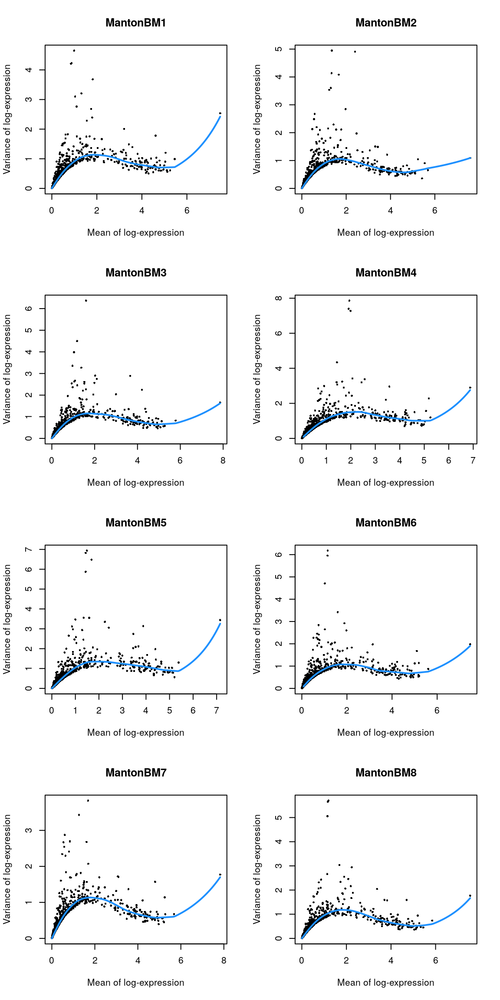
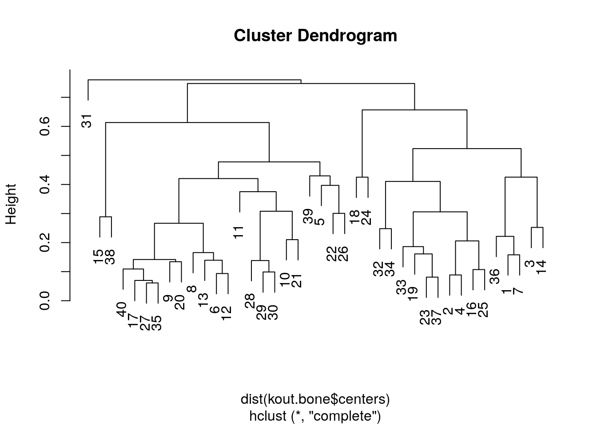

# HCA human bone marrow (10X Genomics) 

<script>
document.addEventListener("click", function (event) {
    if (event.target.classList.contains("aaron-collapse")) {
        event.target.classList.toggle("active");
        var content = event.target.nextElementSibling;
        if (content.style.display === "block") {
          content.style.display = "none";
        } else {
          content.style.display = "block";
        }
    }
})
</script>

<style>
.aaron-collapse {
  background-color: #eee;
  color: #444;
  cursor: pointer;
  padding: 18px;
  width: 100%;
  border: none;
  text-align: left;
  outline: none;
  font-size: 15px;
}

.aaron-content {
  padding: 0 18px;
  display: none;
  overflow: hidden;
  background-color: #f1f1f1;
}
</style>

## Introduction

Here, we use an example dataset from the [Human Cell Atlas immune cell profiling project on bone marrow](https://preview.data.humancellatlas.org), which contains scRNA-seq data for 380,000 cells generated using the 10X Genomics technology.
This is a fairly big dataset that represents a good use case for the techniques in Chapter \@ref(dealing-with-big-data).

## Data loading

This dataset is loaded via the *[HCAData](https://bioconductor.org/packages/3.11/HCAData)* package, which provides a ready-to-use `SingleCellExperiment` object. 


```r
library(HCAData)
sce.bone <- HCAData('ica_bone_marrow')
sce.bone$Donor <- sub("_.*", "", sce.bone$Barcode)
```


We use symbols in place of IDs for easier interpretation later.


```r
library(EnsDb.Hsapiens.v86)
rowData(sce.bone)$Chr <- mapIds(EnsDb.Hsapiens.v86, keys=rownames(sce.bone),
    column="SEQNAME", keytype="GENEID")

library(scater)
rownames(sce.bone) <- uniquifyFeatureNames(rowData(sce.bone)$ID,
    names = rowData(sce.bone)$Symbol)
```

## Quality control

Cell calling was not performed (see [here](https://s3.amazonaws.com/preview-ica-expression-data/Brief+ICA+Read+Me.pdf)) so we will perform QC using all metrics and block on the donor of origin during outlier detection.
We perform the calculation across multiple cores to speed things up.


```r
library(BiocParallel)
bpp <- MulticoreParam(8)
sce.bone <- unfiltered <- addPerCellQC(sce.bone, BPPARAM=bpp,
    subsets=list(Mito=which(rowData(sce.bone)$Chr=="MT")))

qc <- quickPerCellQC(colData(sce.bone), batch=sce.bone$Donor,
    percent_subset="subsets_Mito_percent")
sce.bone <- sce.bone[,!qc$discard]
```


```r
unfiltered$discard <- qc$discard

gridExtra::grid.arrange(
    plotColData(unfiltered, x="Donor", y="sum", colour_by="discard") +
        scale_y_log10() + ggtitle("Total count"),
    plotColData(unfiltered, x="Donor", y="detected", colour_by="discard") +
        scale_y_log10() + ggtitle("Detected features"),
    plotColData(unfiltered, x="Donor", y="subsets_Mito_percent",
        colour_by="discard") + ggtitle("Mito percent"),
    ncol=2
)
```

<div class="figure">

<p class="caption">(\#fig:unref-hca-bone-qc)Distribution of QC metrics in the HCA bone marrow dataset. Each point represents a cell and is colored according to whether it was discarded.</p>
</div>


```r
plotColData(unfiltered, x="sum", y="subsets_Mito_percent", 
    colour_by="discard") + scale_x_log10()
```

<div class="figure">

<p class="caption">(\#fig:unref-hca-bone-mito)Percentage of mitochondrial reads in each cell in the HCA bone marrow dataset compared to its total count. Each point represents a cell and is colored according to whether that cell was discarded.</p>
</div>

## Normalization

For a minor speed-up, we use already-computed library sizes rather than re-computing them from the column sums.


```r
sce.bone <- logNormCounts(sce.bone, size_factors = sce.bone$sum)
```


```r
summary(sizeFactors(sce.bone))
```

```
##    Min. 1st Qu.  Median    Mean 3rd Qu.    Max. 
##    0.05    0.47    0.65    1.00    0.89   42.38
```

### Variance modeling

We block on the donor of origin to mitigate batch effects during HVG selection.
We select a larger number of HVGs to capture any batch-specific variation that might be present.


```r
library(scran)
dec.bone <- modelGeneVar(sce.bone, block=sce.bone$Donor, BPPARAM=bpp)
top.bone <- getTopHVGs(dec.bone, n=5000)
```


```r
par(mfrow=c(4,2))
blocked.stats <- dec.bone$per.block
for (i in colnames(blocked.stats)) {
    current <- blocked.stats[[i]]
    plot(current$mean, current$total, main=i, pch=16, cex=0.5,
        xlab="Mean of log-expression", ylab="Variance of log-expression")
    curfit <- metadata(current)
    curve(curfit$trend(x), col='dodgerblue', add=TRUE, lwd=2)
}
```

<div class="figure">

<p class="caption">(\#fig:unref-hca-bone-var)Per-gene variance as a function of the mean for the log-expression values in the HCA bone marrow dataset. Each point represents a gene (black) with the mean-variance trend (blue) fitted to the variances.</p>
</div>

## Data integration

Here we use multiple cores, randomized SVD and approximate nearest-neighbor detection to speed up this step.


```r
library(batchelor)
library(BiocNeighbors)

set.seed(1010001)
merged.bone <- fastMNN(sce.bone, batch = sce.bone$Donor, subset.row = top.bone,
     BSPARAM=BiocSingular::RandomParam(deferred = TRUE), 
     BNPARAM=AnnoyParam(),
     BPPARAM=bpp)

reducedDim(sce.bone, 'MNN') <- reducedDim(merged.bone, 'corrected')
```

We use the percentage of variance lost as a diagnostic measure:


```r
metadata(merged.bone)$merge.info$lost.var
```

```
##      MantonBM1 MantonBM2 MantonBM3 MantonBM4 MantonBM5 MantonBM6 MantonBM7
## [1,]  0.011771  0.009005  0.000000  0.000000  0.000000  0.000000  0.000000
## [2,]  0.008164  0.008109  0.025064  0.000000  0.000000  0.000000  0.000000
## [3,]  0.005816  0.003822  0.005191  0.025852  0.000000  0.000000  0.000000
## [4,]  0.003571  0.002846  0.002638  0.003116  0.028307  0.000000  0.000000
## [5,]  0.005729  0.003579  0.003574  0.005897  0.007096  0.033634  0.000000
## [6,]  0.004438  0.004547  0.004075  0.003954  0.004717  0.005246  0.035492
## [7,]  0.002402  0.001981  0.002808  0.002471  0.001755  0.002404  0.002177
##      MantonBM8
## [1,]    0.0000
## [2,]    0.0000
## [3,]    0.0000
## [4,]    0.0000
## [5,]    0.0000
## [6,]    0.0000
## [7,]    0.0421
```

## Dimensionality reduction

We set `external_neighbors=TRUE` to replace the internal nearest neighbor search in the UMAP implementation with our parallelized approximate search.
We also set the number of threads to be used in the UMAP iterations.


```r
set.seed(01010100)
sce.bone <- runUMAP(sce.bone, dimred="MNN",
    external_neighbors=TRUE, 
    BNPARAM=AnnoyParam(),
    BPPARAM=bpp,
    n_threads=bpnworkers(bpp))
```

## Clustering

Graph-based clustering generates an excessively large intermediate graph, so we will switch to $k$-means instead.
We err on the side of overclustering to ensure that the major cell types are distinguished; in fact, this is actually useful for resolving fine structure with such a large number of cells.
Some parameter fiddling is required to improve convergence with a large number of points.


```r
set.seed(1000)
kout.bone <- kmeans(reducedDim(sce.bone, "MNN"), 
    centers=40, iter.max=1000, algorithm="MacQueen") 
colLabels(sce.bone) <- factor(kout.bone$cluster)
```

We observe mostly balanced contributions from different samples to each cluster (Figure \@ref(fig:unref-hca-bone-ab)), consistent with the expectation that all samples are replicates from different donors.


```r
tab <- table(Cluster=colLabels(sce.bone), Donor=sce.bone$Donor)
library(pheatmap)
pheatmap(log10(tab+10), color=viridis::viridis(100))
```

<div class="figure">

<p class="caption">(\#fig:unref-hca-bone-ab)Heatmap of log~10~-number of cells in each cluster (row) from each sample (column).</p>
</div>


```r
# TODO: add scrambling option in scater's plotting functions.
scrambled <- sample(ncol(sce.bone))

gridExtra::grid.arrange(
    plotUMAP(sce.bone, colour_by="label"),
    plotUMAP(sce.bone[,scrambled], colour_by="Donor")
)
```

<div class="figure">

<p class="caption">(\#fig:unref-hca-bone-umap)UMAP plots of the HCA bone marrow dataset after merging. Each point represents a cell and is colored according to the assigned cluster (top) or the donor of origin (bottom).</p>
</div>

We end up with quite a few clusters, several of which are likely to be closely related to each other and thus redundant.
These can be easily identified by further clustering on the cluster centroids in `kout.bone` (Figure \@ref(fig:unref-hca-bone-hclust)), with the aim being to avoid unnecessary manual annotation of close relatives.


```r
bone.clust <- hclust(dist(kout.bone$centers))
plot(bone.clust)
```

<div class="figure">

<p class="caption">(\#fig:unref-hca-bone-hclust)Hierarchical clustering of the $k$-means cluster centroids from the PBMC dataset.</p>
</div>

## Differential expression

We identify marker genes for each cluster while blocking on the donor.


```r
markers.bone <- findMarkers(sce.bone, block = sce.bone$Donor, 
    direction = 'up', lfc = 1, BPPARAM=bpp)
```

We visualize the top markers for a randomly chosen cluster using a "dot plot" in Figure \@ref(fig:unref-hca-bone-dotplot).
The presence of upregulated genes like _LYZ_, _S100A8_ and _VCAN_ is consistent with a monocyte identity for this cluster.


```r
top.markers <- markers.bone[["1"]]
best <- top.markers[top.markers$Top <= 5,]
lfcs <- getMarkerEffects(best)

library(pheatmap)
pheatmap(lfcs, breaks=seq(-5, 5, length.out=101))
```

<div class="figure">

<p class="caption">(\#fig:unref-hca-bone-dotplot)Heatmap of log~2~-fold changes for the top marker genes (rows) of cluster 1 compared to all other clusters (columns).</p>
</div>


## Cell type classification

We perform automated cell type classification using a reference dataset to annotate each cluster based on its pseudo-bulk profile. 
This is faster than the per-cell approaches described in Chapter \@ref(cell-type-annotation) at the cost of the resolution required to detect heterogeneity inside a cluster.
Nonetheless, it is often sufficient for a quick assignment of cluster identity, and indeed, cluster 1 is also identified as consisting of monocytes from this analysis.


```r
se.aggregated <- sumCountsAcrossCells(sce.bone, id=colLabels(sce.bone))

library(SingleR)
hpc <- HumanPrimaryCellAtlasData()
anno.single <- SingleR(se.aggregated, ref = hpc, labels = hpc$label.main,
    assay.type.test="sum")
anno.single
```

```
## DataFrame with 40 rows and 5 columns
##                             scores     first.labels        tuning.scores
##                           <matrix>      <character>          <DataFrame>
## 1   0.286290:0.626118:0.750143:... Pre-B_cell_CD34-    0.543124:0.286794
## 2   0.319041:0.675789:0.637672:...          NK_cell    0.463983:0.387769
## 3   0.297106:0.656044:0.716935:... Pre-B_cell_CD34-    0.610524:0.165978
## 4   0.313621:0.678179:0.644918:...          NK_cell    0.547542:0.398819
## 5   0.300462:0.659138:0.630369:...          T_cells    0.578320:0.424222
## ...                            ...              ...                  ...
## 36  0.336985:0.640257:0.766026:... Pre-B_cell_CD34- 0.482373: 0.00230347
## 37  0.299233:0.659105:0.631902:...          NK_cell 0.819550: 0.74846912
## 38  0.381278:0.586561:0.677143:...              MEP 0.385537: 0.35480881
## 39  0.346657:0.676400:0.732443:... Pre-B_cell_CD34- 0.296045: 0.21948029
## 40  0.326593:0.672479:0.633715:...          T_cells 0.746045:-0.19929472
##               labels    pruned.labels
##          <character>      <character>
## 1           Monocyte         Monocyte
## 2            T_cells               NA
## 3           Monocyte         Monocyte
## 4            T_cells          T_cells
## 5            T_cells          T_cells
## ...              ...              ...
## 36  Pre-B_cell_CD34- Pre-B_cell_CD34-
## 37           NK_cell          NK_cell
## 38        BM & Prog.       BM & Prog.
## 39  Pre-B_cell_CD34- Pre-B_cell_CD34-
## 40           T_cells          T_cells
```


<!-- ```{r saveRDS, include=FALSE} -->
<!-- ## TEMP FIX -->
<!-- saveRDS(sce.bone, 'sce.bone.rds') -->
<!-- saveRDS(markers.bone, 'markers.bone.rds') -->

<!-- sce.bone <- readRDS('sce.bone.rds') -->
<!-- markers.bone <- readRDS('markers.bone.rds') -->
<!-- ``` -->

<!--
## Gene set Enrichment Analysis

To interpret differential expression (DE) results, gene set enrichment analysis (GSEA) can be performed to annotate DE results. The first step is to acquire a mapping of ENTREZID to gene symbol.


```r
## Get mappings of ENTREZID to Symbol
library(org.Hs.eg.db)
keys_entrez <- keys(org.Hs.eg.db, 'ENTREZID')
mapping_es <- AnnotationDbi::select(org.Hs.eg.db,
                                    keys = keys_entrez,
                                    columns = c('ENTREZID', 'SYMBOL'),
                                    keytype = 'ENTREZID')
mapping_es$ENTREZID <- as.integer(mapping_es$ENTREZID)
```

The next is to parse the gene sets (here we use a "tidy" representation of MSigDB gene sets) and remap them.


```r
## Get pathways of interest - convert to list with symbol
## devtools::install_github('stephenturner/msigdf') # "tidy" MSigDB genesets
library(msigdf)
library(dplyr)
mdb <- dplyr::inner_join(msigdf.human, mapping_es,
                         by = c('entrez' = 'ENTREZID')) %>%
    dplyr::filter(collection == 'c7') %>%
    dplyr::select(-collection, -entrez) %>%
    dplyr::group_nest(geneset)
pathways <- purrr::map(mdb$data, function(x) {
    as.character(x$SYMBOL)
})
names(pathways) <- mdb$geneset
```

Finally, the DE results from the `findMarkers()` function are used to test for differential gene set enrichment using the `fgsea` package. Here we compare cluster 3 against cluster 15, which are at opposite ends of a UMAP group.


```r
## Get stats based on markers search
## Compare cluster 3 (Dendritic cells) and 15 (HSCs)
stats <- markers.bone[[3]]$logFC.15
names(stats) <- rownames(markers.bone[[3]])

## Run fast gene set enrichment analysis
## Returns a data.table object
library(fgsea)
gse <- fgsea(pathways = pathways, 
             stats = stats,
             minSize = 15,
             maxSize = 500,
             nperm = 5000)
```

The enrichment scores of the top up and down pathways can then be plotted as a table:


```r
## Get top up and down pathways based on NES
gse.up <- gse[order(gse$NES, decreasing = TRUE)[1:2], ]$pathway
gse.dn <- gse[order(gse$NES)[1:2], ]$pathway
topPathways <- c(gse.up, rev(gse.dn))

## Plot the GSEA table
plotGseaTable(pathways[topPathways], stats,
              gse, 
              gseaParam = 0.5)
```

Or select pathways can also be plotted as a more traditional running score plot:


```r
## Traditional GSEA plot
plotEnrichment(pathways[[topPathways[1]]],
               stats)
```

### Trajectory analysis

Slingshot relies on providing a set of clusters on which to construct a trajectory.


```r
library(slingshot)

## Clusters to attempt trajectory on:
slc.clusters <- c(15, 22, 11, 7, 1, 3)

## Subsample dataset for speed
slc.dat <- sce.bone[, sce.bone$cluster %in% slc.clusters]
slc.subdat <- slc.dat[, sample(ncol(slc.dat), 20000)]

## Run slingshot
slc <- slingshot(slc.subdat,
                 clusterLabels = 'cluster',
                 reducedDim = 'UMAP')
```

The calculated principal curve can then be visualized on the UMAP space.


```r
## Slingshot trajectory plot
library(RColorBrewer)
colors <- colorRampPalette(brewer.pal(11, 'Spectral')[-6])(100)
plotcol <- colors[cut(slc$slingPseudotime_1, breaks = 100)]
plot(reducedDims(slc)$UMAP, col = plotcol, pch=16, asp = 1)
lines(SlingshotDataSet(slc), lwd = 2, col = 'black')
```
-->

## Session Info {-}

<button class="aaron-collapse">View session info</button>
<div class="aaron-content">
```
R Under development (unstable) (2020-03-23 r78035)
Platform: x86_64-pc-linux-gnu (64-bit)
Running under: Ubuntu 18.04.4 LTS

Matrix products: default
BLAS:   /home/luna/Software/R/trunk/lib/libRblas.so
LAPACK: /home/luna/Software/R/trunk/lib/libRlapack.so

locale:
 [1] LC_CTYPE=en_US.UTF-8       LC_NUMERIC=C              
 [3] LC_TIME=en_US.UTF-8        LC_COLLATE=en_US.UTF-8    
 [5] LC_MONETARY=en_US.UTF-8    LC_MESSAGES=en_US.UTF-8   
 [7] LC_PAPER=en_US.UTF-8       LC_NAME=C                 
 [9] LC_ADDRESS=C               LC_TELEPHONE=C            
[11] LC_MEASUREMENT=en_US.UTF-8 LC_IDENTIFICATION=C       

attached base packages:
[1] parallel  stats4    stats     graphics  grDevices utils     datasets 
[8] methods   base     

other attached packages:
 [1] SingleR_1.1.14              pheatmap_1.0.12            
 [3] BiocNeighbors_1.5.5         batchelor_1.3.16           
 [5] scran_1.15.29               BiocParallel_1.21.2        
 [7] scater_1.15.31              ggplot2_3.3.0              
 [9] EnsDb.Hsapiens.v86_2.99.0   ensembldb_2.11.4           
[11] AnnotationFilter_1.11.0     GenomicFeatures_1.39.7     
[13] AnnotationDbi_1.49.1        rhdf5_2.31.10              
[15] HCAData_1.3.1               SingleCellExperiment_1.9.3 
[17] SummarizedExperiment_1.17.5 DelayedArray_0.13.12       
[19] matrixStats_0.56.0          Biobase_2.47.3             
[21] GenomicRanges_1.39.3        GenomeInfoDb_1.23.17       
[23] IRanges_2.21.8              S4Vectors_0.25.15          
[25] BiocGenerics_0.33.3         OSCAUtils_0.0.2            
[27] BiocStyle_2.15.8           

loaded via a namespace (and not attached):
  [1] ggbeeswarm_0.6.0              colorspace_1.4-1             
  [3] ellipsis_0.3.0                XVector_0.27.2               
  [5] farver_2.0.3                  bit64_0.9-7                  
  [7] RSpectra_0.16-0               interactiveDisplayBase_1.25.0
  [9] codetools_0.2-16              knitr_1.28                   
 [11] Rsamtools_2.3.7               dbplyr_1.4.3                 
 [13] uwot_0.1.8                    shiny_1.4.0.2                
 [15] HDF5Array_1.15.18             BiocManager_1.30.10          
 [17] compiler_4.0.0                httr_1.4.1                   
 [19] dqrng_0.2.1                   assertthat_0.2.1             
 [21] Matrix_1.2-18                 fastmap_1.0.1                
 [23] lazyeval_0.2.2                limma_3.43.8                 
 [25] later_1.0.0                   BiocSingular_1.3.2           
 [27] htmltools_0.4.0               prettyunits_1.1.1            
 [29] tools_4.0.0                   igraph_1.2.5                 
 [31] rsvd_1.0.3                    gtable_0.3.0                 
 [33] glue_1.4.0                    GenomeInfoDbData_1.2.3       
 [35] dplyr_0.8.5                   rappdirs_0.3.1               
 [37] Rcpp_1.0.4.6                  vctrs_0.2.4                  
 [39] Biostrings_2.55.7             ExperimentHub_1.13.7         
 [41] rtracklayer_1.47.0            DelayedMatrixStats_1.9.1     
 [43] xfun_0.13                     stringr_1.4.0                
 [45] ps_1.3.2                      mime_0.9                     
 [47] lifecycle_0.2.0               irlba_2.3.3                  
 [49] statmod_1.4.34                XML_3.99-0.3                 
 [51] edgeR_3.29.1                  AnnotationHub_2.19.11        
 [53] zlibbioc_1.33.1               scales_1.1.0                 
 [55] hms_0.5.3                     promises_1.1.0               
 [57] ProtGenerics_1.19.3           RColorBrewer_1.1-2           
 [59] yaml_2.2.1                    curl_4.3                     
 [61] memoise_1.1.0                 gridExtra_2.3                
 [63] biomaRt_2.43.5                stringi_1.4.6                
 [65] RSQLite_2.2.0                 highr_0.8                    
 [67] BiocVersion_3.11.1            rlang_0.4.5                  
 [69] pkgconfig_2.0.3               bitops_1.0-6                 
 [71] evaluate_0.14                 lattice_0.20-41              
 [73] purrr_0.3.4                   Rhdf5lib_1.9.3               
 [75] GenomicAlignments_1.23.2      labeling_0.3                 
 [77] cowplot_1.0.0                 bit_1.1-15.2                 
 [79] processx_3.4.2                tidyselect_1.0.0             
 [81] magrittr_1.5                  bookdown_0.18                
 [83] R6_2.4.1                      DBI_1.1.0                    
 [85] pillar_1.4.3                  withr_2.2.0                  
 [87] RCurl_1.98-1.2                tibble_3.0.1                 
 [89] crayon_1.3.4                  BiocFileCache_1.11.6         
 [91] rmarkdown_2.1                 viridis_0.5.1                
 [93] progress_1.2.2                locfit_1.5-9.4               
 [95] grid_4.0.0                    blob_1.2.1                   
 [97] callr_3.4.3                   digest_0.6.25                
 [99] xtable_1.8-4                  httpuv_1.5.2                 
[101] openssl_1.4.1                 munsell_0.5.0                
[103] beeswarm_0.2.3                viridisLite_0.3.0            
[105] vipor_0.4.5                   askpass_1.1                  
```
</div>
